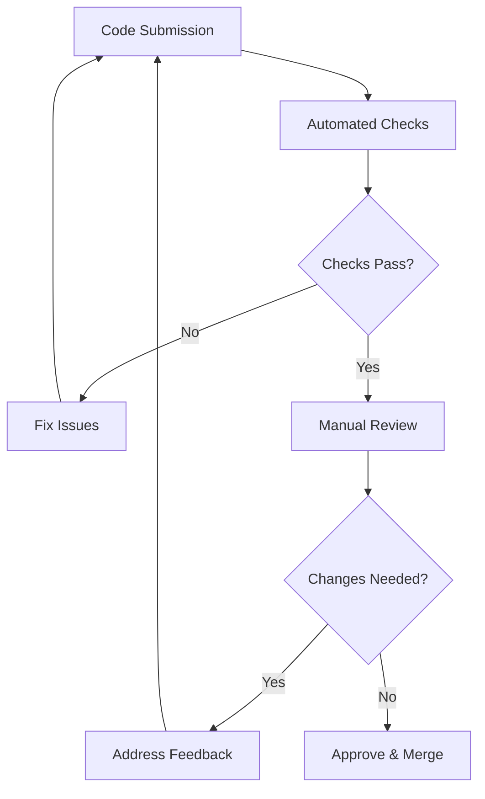

# Code Review Guidelines

## Table of Contents
- [Introduction](#introduction)
- [Code Review Principles](#code-review-principles)
- [What to Look For](#what-to-look-for)
- [How to Give Feedback](#how-to-give-feedback)
- [How to Receive Feedback](#how-to-receive-feedback)
- [Code Review Checklist](#code-review-checklist)
- [Best Practices](#best-practices)

## Introduction

Code reviews are a systematic examination of code changes to improve code quality, share knowledge, and ensure consistency across the codebase. This guide provides best practices for both reviewers and authors.

## Code Review Principles

### Core Values
1. **Respect** - Treat all code and comments with respect
2. **Constructive** - Focus on improvement, not criticism
3. **Educational** - Use reviews as learning opportunities
4. **Timely** - Review code promptly to maintain momentum

### Goals
- Catch bugs early
- Ensure code quality
- Share knowledge
- Maintain consistency
- Improve team collaboration

## What to Look For

### 1. Code Quality
- Clean and readable code
- Proper naming conventions
- Code organization
- Documentation quality
- Test coverage

### 2. Functionality
- Correctness
- Edge cases
- Error handling
- Performance considerations
- Security implications

### 3. Design
- SOLID principles
- Design patterns
- Architecture consistency
- Code reusability
- Maintainability

### 4. Testing
- Test coverage
- Test quality
- Edge cases covered
- Integration tests
- Performance tests

## How to Give Feedback

### Do's
```markdown
✅ Be specific and actionable
✅ Explain the reasoning
✅ Provide examples
✅ Use a friendly tone
✅ Acknowledge good practices

// Good feedback example
"Consider extracting this validation logic into a separate method to improve reusability and make the code more maintainable. Here's an example:
```java
private boolean isValidUser(User user) {
    return user != null && user.getName() != null && !user.getName().isEmpty();
}
```"
```

### Don'ts
```markdown
❌ Make personal comments
❌ Be vague
❌ Be condescending
❌ Nitpick unnecessarily
❌ Rewrite code without explanation

// Bad feedback example
"This code is messy. Fix it."
```

## How to Receive Feedback

### Best Practices
1. **Be Open-minded**
   - Consider all feedback objectively
   - Don't take criticism personally
   - View feedback as learning opportunities

2. **Ask Questions**
   - Seek clarification when needed
   - Understand the reasoning
   - Discuss alternatives

3. **Respond Promptly**
   - Acknowledge feedback
   - Address all comments
   - Update code timely

## Code Review Checklist

### General
- [ ] Code follows style guide
- [ ] No unnecessary comments
- [ ] No debug code left
- [ ] Proper error handling
- [ ] Logging is appropriate

### Security
- [ ] Input validation
- [ ] Authentication/Authorization
- [ ] Secure data handling
- [ ] No sensitive data exposure
- [ ] SQL injection prevention

### Performance
- [ ] Efficient algorithms
- [ ] Proper resource usage
- [ ] No memory leaks
- [ ] Database query optimization
- [ ] Caching strategy

### Testing
- [ ] Unit tests added
- [ ] Integration tests updated
- [ ] Edge cases covered
- [ ] Test naming is clear
- [ ] Mocks used appropriately

## Best Practices

### 1. Size and Scope
```markdown
✅ Keep PRs small and focused
✅ Review regularly in small batches
✅ Set a time limit for review sessions
✅ Take breaks between reviews
```

### 2. Communication
```markdown
✅ Use clear and professional language
✅ Provide context for changes
✅ Document decisions and trade-offs
✅ Follow up on resolved comments
```

### 3. Tools and Automation
```markdown
✅ Use automated code review tools
✅ Leverage linters and formatters
✅ Implement CI/CD checks
✅ Use code review platforms effectively
```

### Example Review Process



## Additional Resources
- [Google's Code Review Guidelines](https://google.github.io/eng-practices/review/)
- [Code Review Best Practices by Thoughtbot](https://github.com/thoughtbot/guides/tree/master/code-review)
- [Code Review Checklist by NASA](https://sw-assurance.gsfc.nasa.gov/disciplines/quality/guidance/code_reviews.php) 