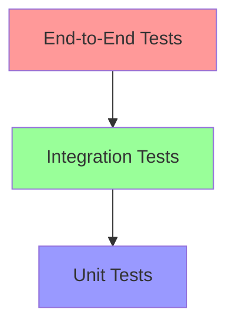

# Testing Strategies

## Table of Contents
- [Introduction](#introduction)
- [Testing Pyramid](#testing-pyramid)
- [Types of Tests](#types-of-tests)
- [Test-Driven Development](#test-driven-development)
- [Testing Best Practices](#testing-best-practices)
- [Mocking and Stubbing](#mocking-and-stubbing)
- [Test Coverage](#test-coverage)
- [Testing Tools](#testing-tools)

## Introduction

Effective testing is crucial for maintaining code quality and preventing regressions. This guide covers various testing strategies and best practices for different types of tests.

## Testing Pyramid

### Overview


### Test Distribution
- **Unit Tests**: ~70% (Base of pyramid)
- **Integration Tests**: ~20% (Middle layer)
- **End-to-End Tests**: ~10% (Top of pyramid)

## Types of Tests

### 1. Unit Tests
- Test individual components in isolation
- Fast and focused
- Easy to maintain

```java
@Test
void shouldCalculateOrderTotal() {
    // Arrange
    Order order = new Order();
    order.addItem(new Item("Book", 10.0));
    order.addItem(new Item("Pen", 5.0));
    
    // Act
    double total = order.calculateTotal();
    
    // Assert
    assertEquals(15.0, total);
}
```

### 2. Integration Tests
- Test component interactions
- Use real dependencies
- More complex setup

```java
@Test
void shouldSaveOrderToDatabase() {
    // Arrange
    OrderRepository repository = new OrderRepository(realDatabase);
    Order order = new Order("123", "customer1");
    
    // Act
    repository.save(order);
    
    // Assert
    Order savedOrder = repository.findById("123");
    assertNotNull(savedOrder);
    assertEquals("customer1", savedOrder.getCustomerId());
}
```

### 3. End-to-End Tests
- Test complete user flows
- Test through UI
- Slower but comprehensive

```java
@Test
void shouldCompleteCheckoutProcess() {
    // Arrange
    WebDriver driver = new ChromeDriver();
    driver.get("http://example.com/shop");
    
    // Act
    driver.findElement(By.id("add-to-cart")).click();
    driver.findElement(By.id("checkout")).click();
    driver.findElement(By.id("pay")).click();
    
    // Assert
    String confirmation = driver.findElement(By.id("confirmation")).getText();
    assertTrue(confirmation.contains("Order Successful"));
}
```

## Test-Driven Development

### TDD Cycle
1. Write failing test
2. Write minimal code to pass
3. Refactor
4. Repeat

```java
// Step 1: Write failing test
@Test
void shouldCalculateDiscount() {
    Order order = new Order(100.0);
    assertEquals(10.0, order.calculateDiscount());
}

// Step 2: Write minimal code
public class Order {
    private double amount;
    
    public Order(double amount) {
        this.amount = amount;
    }
    
    public double calculateDiscount() {
        return amount * 0.1; // 10% discount
    }
}

// Step 3: Refactor
public class Order {
    private static final double DISCOUNT_RATE = 0.1;
    private double amount;
    
    public Order(double amount) {
        this.amount = amount;
    }
    
    public double calculateDiscount() {
        return amount * DISCOUNT_RATE;
    }
}
```

## Testing Best Practices

### 1. Test Structure
```java
@Test
void testName_Scenario_ExpectedBehavior() {
    // Arrange - Set up test data
    User user = new User("john");
    UserService service = new UserService();
    
    // Act - Execute the method being tested
    boolean result = service.validateUser(user);
    
    // Assert - Verify the results
    assertTrue(result);
}
```

### 2. Naming Conventions
```java
// Good test names
@Test
void shouldReturnTrueWhenUserIsValid()
@Test
void shouldThrowExceptionWhenUserIsNull()
@Test
void calculateTotal_WithValidItems_ReturnsSum()

// Bad test names
@Test
void test1()
@Test
void userTest()
@Test
void testCalculate()
```

### 3. Test Independence
```java
public class OrderTest {
    private Order order;
    
    @BeforeEach
    void setUp() {
        order = new Order();
    }
    
    @Test
    void shouldAddItem() {
        order.addItem(new Item("Book", 10.0));
        assertEquals(1, order.getItems().size());
    }
    
    @Test
    void shouldRemoveItem() {
        Item item = new Item("Book", 10.0);
        order.addItem(item);
        order.removeItem(item);
        assertTrue(order.getItems().isEmpty());
    }
}
```

## Mocking and Stubbing

### 1. Mocks
```java
@Test
void shouldSendEmailOnOrderCompletion() {
    // Arrange
    EmailService emailService = mock(EmailService.class);
    OrderService orderService = new OrderService(emailService);
    Order order = new Order("123");
    
    // Act
    orderService.completeOrder(order);
    
    // Assert
    verify(emailService).sendConfirmation(order);
}
```

### 2. Stubs
```java
@Test
void shouldCalculateOrderTotalWithDiscount() {
    // Arrange
    DiscountService discountService = mock(DiscountService.class);
    when(discountService.getDiscountRate()).thenReturn(0.1);
    
    OrderService orderService = new OrderService(discountService);
    Order order = new Order(100.0);
    
    // Act
    double total = orderService.calculateTotal(order);
    
    // Assert
    assertEquals(90.0, total);
}
```

### 3. Test Doubles
```java
// Test spy
@Test
void shouldLogOrderProcessing() {
    OrderLogger logger = spy(new OrderLogger());
    OrderService service = new OrderService(logger);
    
    service.processOrder(new Order());
    
    verify(logger).log(anyString());
}

// Fake object
public class FakeRepository implements UserRepository {
    private Map<String, User> users = new HashMap<>();
    
    @Override
    public User findById(String id) {
        return users.get(id);
    }
    
    @Override
    public void save(User user) {
        users.put(user.getId(), user);
    }
}
```

## Test Coverage

### Coverage Types
1. **Line Coverage**
   - Percentage of code lines executed
   - Basic metric but not sufficient alone

2. **Branch Coverage**
   - Percentage of code branches executed
   - More thorough than line coverage

3. **Path Coverage**
   - Coverage of all possible paths
   - Most comprehensive but harder to achieve

```java
public class CoverageExample {
    public String processValue(int value) {
        // Line coverage
        String result = "";
        
        // Branch coverage
        if (value > 0) {
            result = "positive";
        } else if (value < 0) {
            result = "negative";
        } else {
            result = "zero";
        }
        
        // Path coverage
        if (result.length() > 0) {
            return result.toUpperCase();
        }
        return result;
    }
}
```

## Testing Tools

### Java
- JUnit 5
- Mockito
- TestNG
- AssertJ
- Selenium

```java
// JUnit 5 with Mockito
@ExtendWith(MockitoExtension.class)
class UserServiceTest {
    @Mock
    private UserRepository repository;
    
    @InjectMocks
    private UserService service;
    
    @Test
    void shouldFindUserById() {
        when(repository.findById("123"))
            .thenReturn(Optional.of(new User("123")));
            
        Optional<User> user = service.findUser("123");
        
        assertTrue(user.isPresent());
        assertEquals("123", user.get().getId());
    }
}
```

### JavaScript
- Jest
- Mocha
- Cypress
- React Testing Library

```javascript
// Jest example
describe('UserService', () => {
    let userService;
    let mockRepository;
    
    beforeEach(() => {
        mockRepository = {
            findById: jest.fn()
        };
        userService = new UserService(mockRepository);
    });
    
    test('should find user by id', async () => {
        const mockUser = { id: '123', name: 'John' };
        mockRepository.findById.mockResolvedValue(mockUser);
        
        const user = await userService.findUser('123');
        
        expect(user).toEqual(mockUser);
        expect(mockRepository.findById).toHaveBeenCalledWith('123');
    });
});
```

### Python
- pytest
- unittest
- nose
- behave

```python
# pytest example
import pytest
from user_service import UserService

@pytest.fixture
def user_service():
    return UserService()

def test_user_creation(user_service):
    user = user_service.create_user("john", "john@example.com")
    assert user.name == "john"
    assert user.email == "john@example.com"

def test_invalid_email(user_service):
    with pytest.raises(ValueError):
        user_service.create_user("john", "invalid-email")
```

## Additional Resources
- [JUnit 5 User Guide](https://junit.org/junit5/docs/current/user-guide/)
- [Mockito Documentation](https://site.mockito.org/)
- [Jest Documentation](https://jestjs.io/docs/getting-started)
- [pytest Documentation](https://docs.pytest.org/) 