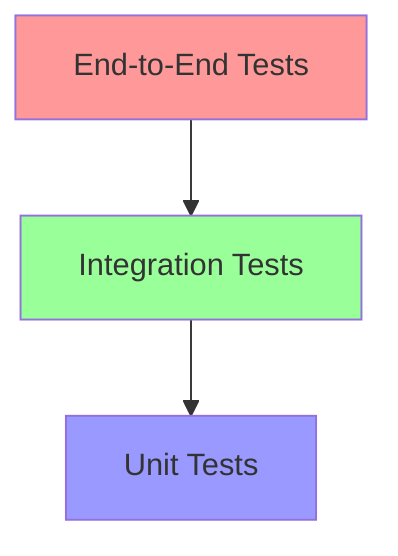

# Testing Strategies

## Table of Contents
- [Introduction](#introduction)
- [Testing Pyramid](#testing-pyramid)
- [Types of Tests](#types-of-tests)
- [Test-Driven Development](#test-driven-development)
- [Testing Best Practices](#testing-best-practices)
- [Mocking and Stubbing](#mocking-and-stubbing)
- [Test Coverage](#test-coverage)
- [Testing Tools](#testing-tools)

## 📚 Prerequisites & Learning Path

### Prerequisites
Before studying Testing, you should understand:
- [Classes & Objects](../ood-basics/classes-and-objects.md) - Units to test
- [Interfaces](../ood-basics/interfaces.md) - Enable mocking
- [Dependency Inversion](../solid-principles/dip.md) - Enables testability
- [Error Handling](error-handling.md) - Testing error scenarios

### Learning Path
Testing knowledge grows with your LLD skills:
1. **With OOD Basics:** Learn unit testing fundamentals
2. **With SOLID:** Understand how DIP enables testing
3. **With Patterns:** Test pattern implementations
4. **With Interview Prep:** Write tests during coding interviews

### Why Testing Matters for Interviews
| Aspect | Why It's Important |
|--------|-------------------|
| Design Quality | Testable code is well-designed |
| DIP Compliance | Shows dependency injection knowledge |
| Edge Cases | Demonstrates thorough thinking |
| Code Confidence | Shows professional practices |

### Related Topics
| Topic | Relationship |
|-------|-------------|
| [Clean Code](clean-code.md) | Clean tests principles |
| [DIP](../solid-principles/dip.md) | Dependency injection for mocks |
| [Interfaces](../ood-basics/interfaces.md) | Creating test doubles |

### How This Fits in the Big Picture
```
OOD Basics → SOLID (DIP) → Testing → Design Patterns
                             ↓
                DIP makes code testable
         Testing validates your implementations
```

## Introduction

Effective testing is crucial for maintaining code quality and preventing regressions. This guide covers various testing strategies and best practices for different types of tests.

## Testing Pyramid

### Overview

```mermaid
graph TD
    E2E[End-to-End Tests] --> Integration[Integration Tests]
    Integration --> Unit[Unit Tests]
    
    style E2E fill:#ff9999
    style Integration fill:#99ff99
    style Unit fill:#9999ff
```

### Test Distribution
- **Unit Tests**: ~70% (Base of pyramid)
- **Integration Tests**: ~20% (Middle layer)
- **End-to-End Tests**: ~10% (Top of pyramid)

## Types of Tests

### 1. Unit Tests
- Test individual components in isolation
- Fast and focused
- Easy to maintain

#### Java
```java
@Test
void shouldCalculateOrderTotal() {
    // Arrange
    Order order = new Order();
    order.addItem(new Item("Book", 10.0));
    order.addItem(new Item("Pen", 5.0));
    
    // Act
    double total = order.calculateTotal();
    
    // Assert
    assertEquals(15.0, total);
}
```

#### Python
```python
def test_should_calculate_order_total():
    # Arrange
    order = Order()
    order.add_item(Item("Book", 10.0))
    order.add_item(Item("Pen", 5.0))
    
    # Act
    total = order.calculate_total()
    
    # Assert
    assert total == 15.0
```

#### C++
```cpp
TEST(OrderTest, ShouldCalculateOrderTotal) {
    // Arrange
    Order order;
    order.addItem(Item("Book", 10.0));
    order.addItem(Item("Pen", 5.0));
    
    // Act
    double total = order.calculateTotal();
    
    // Assert
    EXPECT_DOUBLE_EQ(15.0, total);
}
```

### 2. Integration Tests
- Test component interactions
- Use real dependencies
- More complex setup

#### Java
```java
@Test
void shouldSaveOrderToDatabase() {
    // Arrange
    OrderRepository repository = new OrderRepository(realDatabase);
    Order order = new Order("123", "customer1");
    
    // Act
    repository.save(order);
    
    // Assert
    Order savedOrder = repository.findById("123");
    assertNotNull(savedOrder);
    assertEquals("customer1", savedOrder.getCustomerId());
}
```

#### Python
```python
def test_should_save_order_to_database(real_database):
    # Arrange
    repository = OrderRepository(real_database)
    order = Order("123", "customer1")
    
    # Act
    repository.save(order)
    
    # Assert
    saved_order = repository.find_by_id("123")
    assert saved_order is not None
    assert saved_order.customer_id == "customer1"
```

#### C++
```cpp
TEST_F(IntegrationTest, ShouldSaveOrderToDatabase) {
    // Arrange
    OrderRepository repository(realDatabase);
    Order order("123", "customer1");
    
    // Act
    repository.save(order);
    
    // Assert
    auto savedOrder = repository.findById("123");
    ASSERT_NE(savedOrder, nullptr);
    EXPECT_EQ("customer1", savedOrder->getCustomerId());
}
```

### 3. End-to-End Tests
- Test complete user flows
- Test through UI
- Slower but comprehensive

#### Java (Selenium)
```java
@Test
void shouldCompleteCheckoutProcess() {
    // Arrange
    WebDriver driver = new ChromeDriver();
    driver.get("http://example.com/shop");
    
    // Act
    driver.findElement(By.id("add-to-cart")).click();
    driver.findElement(By.id("checkout")).click();
    driver.findElement(By.id("pay")).click();
    
    // Assert
    String confirmation = driver.findElement(By.id("confirmation")).getText();
    assertTrue(confirmation.contains("Order Successful"));
}
```

#### Python (Selenium)
```python
def test_should_complete_checkout_process():
    # Arrange
    driver = webdriver.Chrome()
    driver.get("http://example.com/shop")
    
    # Act
    driver.find_element(By.ID, "add-to-cart").click()
    driver.find_element(By.ID, "checkout").click()
    driver.find_element(By.ID, "pay").click()
    
    # Assert
    confirmation = driver.find_element(By.ID, "confirmation").text
    assert "Order Successful" in confirmation
    
    driver.quit()
```

#### Python (Playwright)
```python
def test_should_complete_checkout_process(page):
    # Arrange
    page.goto("http://example.com/shop")
    
    # Act
    page.click("#add-to-cart")
    page.click("#checkout")
    page.click("#pay")
    
    # Assert
    confirmation = page.locator("#confirmation").text_content()
    assert "Order Successful" in confirmation
```

## Test-Driven Development

### TDD Cycle
1. Write failing test
2. Write minimal code to pass
3. Refactor
4. Repeat

#### Java
```java
// Step 1: Write failing test
@Test
void shouldCalculateDiscount() {
    Order order = new Order(100.0);
    assertEquals(10.0, order.calculateDiscount());
}

// Step 2: Write minimal code
public class Order {
    private double amount;
    
    public Order(double amount) {
        this.amount = amount;
    }
    
    public double calculateDiscount() {
        return amount * 0.1; // 10% discount
    }
}

// Step 3: Refactor
public class Order {
    private static final double DISCOUNT_RATE = 0.1;
    private double amount;
    
    public Order(double amount) {
        this.amount = amount;
    }
    
    public double calculateDiscount() {
        return amount * DISCOUNT_RATE;
    }
}
```

#### Python
```python
# Step 1: Write failing test
def test_should_calculate_discount():
    order = Order(100.0)
    assert order.calculate_discount() == 10.0

# Step 2: Write minimal code
class Order:
    def __init__(self, amount: float):
        self.amount = amount
    
    def calculate_discount(self) -> float:
        return self.amount * 0.1  # 10% discount

# Step 3: Refactor
class Order:
    DISCOUNT_RATE = 0.1
    
    def __init__(self, amount: float):
        self.amount = amount
    
    def calculate_discount(self) -> float:
        return self.amount * self.DISCOUNT_RATE
```

#### C++
```cpp
// Step 1: Write failing test
TEST(OrderTest, ShouldCalculateDiscount) {
    Order order(100.0);
    EXPECT_DOUBLE_EQ(10.0, order.calculateDiscount());
}

// Step 2: Write minimal code
class Order {
    double amount;
public:
    Order(double amount) : amount(amount) {}
    double calculateDiscount() { return amount * 0.1; }
};

// Step 3: Refactor
class Order {
    static constexpr double DISCOUNT_RATE = 0.1;
    double amount;
public:
    Order(double amount) : amount(amount) {}
    double calculateDiscount() { return amount * DISCOUNT_RATE; }
};
```

## Testing Best Practices

### 1. Test Structure

#### Java
```java
@Test
void testName_Scenario_ExpectedBehavior() {
    // Arrange - Set up test data
    User user = new User("john");
    UserService service = new UserService();
    
    // Act - Execute the method being tested
    boolean result = service.validateUser(user);
    
    // Assert - Verify the results
    assertTrue(result);
}
```

#### Python
```python
def test_name_scenario_expected_behavior():
    # Arrange - Set up test data
    user = User("john")
    service = UserService()
    
    # Act - Execute the method being tested
    result = service.validate_user(user)
    
    # Assert - Verify the results
    assert result is True
```

#### C++
```cpp
TEST(UserServiceTest, TestName_Scenario_ExpectedBehavior) {
    // Arrange - Set up test data
    User user("john");
    UserService service;
    
    // Act - Execute the method being tested
    bool result = service.validateUser(user);
    
    // Assert - Verify the results
    EXPECT_TRUE(result);
}
```

### 2. Naming Conventions

#### Java
```java
// Good test names
@Test
void shouldReturnTrueWhenUserIsValid()
@Test
void shouldThrowExceptionWhenUserIsNull()
@Test
void calculateTotal_WithValidItems_ReturnsSum()

// Bad test names
@Test
void test1()
@Test
void userTest()
@Test
void testCalculate()
```

#### Python
```python
# Good test names
def test_should_return_true_when_user_is_valid(): pass
def test_should_raise_exception_when_user_is_none(): pass
def test_calculate_total_with_valid_items_returns_sum(): pass

# Bad test names
def test1(): pass
def user_test(): pass
def test_calculate(): pass
```

#### C++
```cpp
// Good test names (Google Test)
TEST(UserTest, ShouldReturnTrueWhenUserIsValid)
TEST(UserTest, ShouldThrowExceptionWhenUserIsNull)
TEST(OrderTest, CalculateTotal_WithValidItems_ReturnsSum)

// Bad test names
TEST(Test, Test1)
TEST(Test, UserTest)
TEST(Test, TestCalculate)
```

### 3. Test Independence

#### Java
```java
public class OrderTest {
    private Order order;
    
    @BeforeEach
    void setUp() {
        order = new Order();
    }
    
    @Test
    void shouldAddItem() {
        order.addItem(new Item("Book", 10.0));
        assertEquals(1, order.getItems().size());
    }
    
    @Test
    void shouldRemoveItem() {
        Item item = new Item("Book", 10.0);
        order.addItem(item);
        order.removeItem(item);
        assertTrue(order.getItems().isEmpty());
    }
}
```

#### Python
```python
import pytest

class TestOrder:
    @pytest.fixture(autouse=True)
    def setup(self):
        self.order = Order()
    
    def test_should_add_item(self):
        self.order.add_item(Item("Book", 10.0))
        assert len(self.order.get_items()) == 1
    
    def test_should_remove_item(self):
        item = Item("Book", 10.0)
        self.order.add_item(item)
        self.order.remove_item(item)
        assert len(self.order.get_items()) == 0
```

#### C++
```cpp
class OrderTest : public ::testing::Test {
protected:
    Order order;
    
    void SetUp() override {
        order = Order();
    }
};

TEST_F(OrderTest, ShouldAddItem) {
    order.addItem(Item("Book", 10.0));
    EXPECT_EQ(1, order.getItems().size());
}

TEST_F(OrderTest, ShouldRemoveItem) {
    Item item("Book", 10.0);
    order.addItem(item);
    order.removeItem(item);
    EXPECT_TRUE(order.getItems().empty());
}
```

## Mocking and Stubbing

### 1. Mocks

#### Java (Mockito)
```java
@Test
void shouldSendEmailOnOrderCompletion() {
    // Arrange
    EmailService emailService = mock(EmailService.class);
    OrderService orderService = new OrderService(emailService);
    Order order = new Order("123");
    
    // Act
    orderService.completeOrder(order);
    
    // Assert
    verify(emailService).sendConfirmation(order);
}
```

#### Python (unittest.mock)
```python
from unittest.mock import Mock

def test_should_send_email_on_order_completion():
    # Arrange
    email_service = Mock(spec=EmailService)
    order_service = OrderService(email_service)
    order = Order("123")
    
    # Act
    order_service.complete_order(order)
    
    # Assert
    email_service.send_confirmation.assert_called_once_with(order)
```

#### C++ (Google Mock)
```cpp
TEST(OrderServiceTest, ShouldSendEmailOnOrderCompletion) {
    // Arrange
    MockEmailService emailService;
    OrderService orderService(&emailService);
    Order order("123");
    
    // Expect
    EXPECT_CALL(emailService, sendConfirmation(order))
        .Times(1);
    
    // Act
    orderService.completeOrder(order);
}
```

### 2. Stubs

#### Java (Mockito)
```java
@Test
void shouldCalculateOrderTotalWithDiscount() {
    // Arrange
    DiscountService discountService = mock(DiscountService.class);
    when(discountService.getDiscountRate()).thenReturn(0.1);
    
    OrderService orderService = new OrderService(discountService);
    Order order = new Order(100.0);
    
    // Act
    double total = orderService.calculateTotal(order);
    
    // Assert
    assertEquals(90.0, total);
}
```

#### Python (unittest.mock)
```python
def test_should_calculate_order_total_with_discount():
    # Arrange
    discount_service = Mock(spec=DiscountService)
    discount_service.get_discount_rate.return_value = 0.1
    
    order_service = OrderService(discount_service)
    order = Order(100.0)
    
    # Act
    total = order_service.calculate_total(order)
    
    # Assert
    assert total == 90.0
```

#### C++ (Google Mock)
```cpp
TEST(OrderServiceTest, ShouldCalculateOrderTotalWithDiscount) {
    // Arrange
    MockDiscountService discountService;
    ON_CALL(discountService, getDiscountRate())
        .WillByDefault(Return(0.1));
    
    OrderService orderService(&discountService);
    Order order(100.0);
    
    // Act
    double total = orderService.calculateTotal(order);
    
    // Assert
    EXPECT_DOUBLE_EQ(90.0, total);
}
```

### 3. Test Doubles

#### Java
```java
// Test spy
@Test
void shouldLogOrderProcessing() {
    OrderLogger logger = spy(new OrderLogger());
    OrderService service = new OrderService(logger);
    
    service.processOrder(new Order());
    
    verify(logger).log(anyString());
}

// Fake object
public class FakeRepository implements UserRepository {
    private Map<String, User> users = new HashMap<>();
    
    @Override
    public User findById(String id) {
        return users.get(id);
    }
    
    @Override
    public void save(User user) {
        users.put(user.getId(), user);
    }
}
```

#### Python
```python
from unittest.mock import Mock, patch

# Test spy using wraps
def test_should_log_order_processing():
    real_logger = OrderLogger()
    logger = Mock(wraps=real_logger)
    service = OrderService(logger)
    
    service.process_order(Order())
    
    logger.log.assert_called()

# Fake object
class FakeRepository:
    def __init__(self):
        self._users = {}
    
    def find_by_id(self, id: str) -> User:
        return self._users.get(id)
    
    def save(self, user: User):
        self._users[user.id] = user
```

#### C++
```cpp
// Fake object
class FakeRepository : public UserRepository {
    std::map<std::string, User> users;

public:
    User* findById(const std::string& id) override {
        auto it = users.find(id);
        return it != users.end() ? &it->second : nullptr;
    }
    
    void save(const User& user) override {
        users[user.getId()] = user;
    }
};

// Usage in test
TEST(UserServiceTest, ShouldSaveUser) {
    FakeRepository repository;
    UserService service(&repository);
    
    service.createUser("123", "John");
    
    EXPECT_NE(nullptr, repository.findById("123"));
}
```

## Test Coverage

### Coverage Types
1. **Line Coverage**
   - Percentage of code lines executed
   - Basic metric but not sufficient alone

2. **Branch Coverage**
   - Percentage of code branches executed
   - More thorough than line coverage

3. **Path Coverage**
   - Coverage of all possible paths
   - Most comprehensive but harder to achieve

#### Java
```java
public class CoverageExample {
    public String processValue(int value) {
        // Line coverage
        String result = "";
        
        // Branch coverage
        if (value > 0) {
            result = "positive";
        } else if (value < 0) {
            result = "negative";
        } else {
            result = "zero";
        }
        
        // Path coverage
        if (result.length() > 0) {
            return result.toUpperCase();
        }
        return result;
    }
}
```

#### Python
```python
class CoverageExample:
    def process_value(self, value: int) -> str:
        # Line coverage
        result = ""
        
        # Branch coverage
        if value > 0:
            result = "positive"
        elif value < 0:
            result = "negative"
        else:
            result = "zero"
        
        # Path coverage
        if len(result) > 0:
            return result.upper()
        return result
```

#### C++
```cpp
class CoverageExample {
public:
    std::string processValue(int value) {
        // Line coverage
        std::string result;
        
        // Branch coverage
        if (value > 0) {
            result = "positive";
        } else if (value < 0) {
            result = "negative";
        } else {
            result = "zero";
        }
        
        // Path coverage
        if (!result.empty()) {
            std::transform(result.begin(), result.end(), result.begin(), ::toupper);
            return result;
        }
        return result;
    }
};
```

## Testing Tools

### Java
- JUnit 5
- Mockito
- TestNG
- AssertJ
- Selenium

```java
// JUnit 5 with Mockito
@ExtendWith(MockitoExtension.class)
class UserServiceTest {
    @Mock
    private UserRepository repository;
    
    @InjectMocks
    private UserService service;
    
    @Test
    void shouldFindUserById() {
        when(repository.findById("123"))
            .thenReturn(Optional.of(new User("123")));
            
        Optional<User> user = service.findUser("123");
        
        assertTrue(user.isPresent());
        assertEquals("123", user.get().getId());
    }
}
```

### JavaScript
- Jest
- Mocha
- Cypress
- React Testing Library

```javascript
// Jest example
describe('UserService', () => {
    let userService;
    let mockRepository;
    
    beforeEach(() => {
        mockRepository = {
            findById: jest.fn()
        };
        userService = new UserService(mockRepository);
    });
    
    test('should find user by id', async () => {
        const mockUser = { id: '123', name: 'John' };
        mockRepository.findById.mockResolvedValue(mockUser);
        
        const user = await userService.findUser('123');
        
        expect(user).toEqual(mockUser);
        expect(mockRepository.findById).toHaveBeenCalledWith('123');
    });
});
```

### Python
- pytest
- unittest
- nose
- behave

```python
# pytest example
import pytest
from user_service import UserService

@pytest.fixture
def user_service():
    return UserService()

def test_user_creation(user_service):
    user = user_service.create_user("john", "john@example.com")
    assert user.name == "john"
    assert user.email == "john@example.com"

def test_invalid_email(user_service):
    with pytest.raises(ValueError):
        user_service.create_user("john", "invalid-email")
```

## ❓ Frequently Asked Questions

### Q1: How much test coverage is enough?
**A:** Guidelines:
| Coverage | Quality |
|----------|---------|
| < 60% | Low - increase coverage |
| 60-80% | Acceptable for most projects |
| 80%+ | Good target |
| 100% | Often overkill; focus on critical paths |

**Note:** Coverage doesn't guarantee quality - test behavior, not lines.

### Q2: What's the difference between mocks, stubs, and fakes?
**A:**
| Type | Purpose | Example |
|------|---------|---------|
| Mock | Verify interactions | Check method was called |
| Stub | Provide canned answers | Return fixed value |
| Fake | Simplified implementation | In-memory database |
| Spy | Partial mock | Real object + verification |

### Q3: What should I test in a unit test?
**A:**
- ✅ Business logic
- ✅ Edge cases
- ✅ Error conditions
- ✅ Boundary values
- ❌ Getters/setters (unless logic)
- ❌ Framework code
- ❌ External systems (use integration tests)

### Q4: How do I test private methods?
**A:** Options (in order of preference):
1. **Don't** - Test via public interface
2. **Extract** - Move to separate class if complex
3. **Package-private** - If must test directly
4. **Reflection** - Last resort, breaks encapsulation

### Q5: What is Test-Driven Development (TDD)?
**A:** Red-Green-Refactor cycle:
1. **Red:** Write failing test
2. **Green:** Write minimal code to pass
3. **Refactor:** Improve code, keep tests passing
4. Repeat

Benefits: Better design, full coverage, documentation

### Q6: How do I test asynchronous code?
**A:**
| Language | Approach |
|----------|----------|
| Java | CompletableFuture, CountDownLatch |
| JavaScript | async/await, done callback |
| Python | pytest-asyncio, asyncio.run |
| C++ | std::future::wait_for |

### Q7: When should I use integration vs unit tests?
**A:**
| Unit Tests | Integration Tests |
|------------|------------------|
| Single component | Multiple components |
| Fast (ms) | Slower (seconds) |
| Isolated (mocked deps) | Real dependencies |
| Many of them | Fewer of them |
| Test logic | Test interactions |

### Q8: How do I name my tests?
**A:** Use descriptive names:
```
// Format: methodName_scenario_expectedResult
calculateTotal_withValidItems_returnsSum()
login_withInvalidPassword_throwsAuthException()
findUser_whenNotExists_returnsEmpty()
```

## Additional Resources
- [JUnit 5 User Guide](https://junit.org/junit5/docs/current/user-guide/)
- [Mockito Documentation](https://site.mockito.org/)
- [Jest Documentation](https://jestjs.io/docs/getting-started)
- [pytest Documentation](https://docs.pytest.org/) 