# Design Patterns Guide

## Overview

Design patterns are typical solutions to common problems in software design. Each pattern is like a blueprint that you can customize to solve a particular design problem in your code.

## Pattern Categories

### [🏭 Creational Patterns](creational/README.md)
Provide object creation mechanisms that increase flexibility and reuse of existing code.

- [Factory Method](creational/factory-method.md)
- [Abstract Factory](creational/abstract-factory.md)
- [Builder](creational/builder.md)
- [Prototype](creational/prototype.md)
- [Singleton](creational/singleton.md)

### [🔨 Structural Patterns](structural/README.md)
Explain how to assemble objects and classes into larger structures while keeping these structures flexible and efficient.

- [Adapter](structural/adapter.md)
- [Bridge](structural/bridge.md)
- [Composite](structural/composite.md)
- [Decorator](structural/decorator.md)
- [Facade](structural/facade.md)
- [Flyweight](structural/flyweight.md)
- [Proxy](structural/proxy.md)

### [🎭 Behavioral Patterns](behavioral/README.md)
Take care of effective communication and the assignment of responsibilities between objects.

- [Chain of Responsibility](behavioral/chain-of-responsibility.md)
- [Command](behavioral/command.md)
- [Iterator](behavioral/iterator.md)
- [Mediator](behavioral/mediator.md)
- [Memento](behavioral/memento.md)
- [Observer](behavioral/observer.md)
- [State](behavioral/state.md)
- [Strategy](behavioral/strategy.md)
- [Template Method](behavioral/template-method.md)
- [Visitor](behavioral/visitor.md)

## Pattern Selection Guide

### When to Use Creational Patterns
- Need to create objects without exposing creation logic
- Want to create objects based on certain conditions
- Need to reuse existing objects instead of creating new ones
- Want to create complex objects step by step

### When to Use Structural Patterns
- Need to ensure that classes work together despite incompatible interfaces
- Want to simplify complex subsystem interfaces
- Need to add responsibilities to objects dynamically
- Want to optimize resource usage with shared objects

### When to Use Behavioral Patterns
- Need flexible communication between objects
- Want to define algorithms that can be easily swapped
- Need to implement complex workflows or state transitions
- Want to define a skeleton of an algorithm with customizable parts

## Best Practices

### Pattern Implementation
1. **Understand the Problem**
   - Clearly identify the issue you're trying to solve
   - Consider if a pattern is really needed
   - Evaluate multiple pattern options

2. **Keep It Simple**
   - Don't force patterns where they're not needed
   - Start with the simplest solution
   - Refactor to patterns when complexity justifies it

3. **Consider Maintenance**
   - Document pattern usage clearly
   - Explain the rationale for choosing the pattern
   - Consider the impact on testing

### Common Anti-Patterns to Avoid
1. **Pattern Overuse**
   - Using patterns without clear benefits
   - Overcomplicating simple solutions
   - Mixing too many patterns

2. **Incorrect Pattern Application**
   - Using patterns in wrong contexts
   - Not following pattern principles
   - Partial pattern implementation

3. **Inflexible Implementation**
   - Hard-coding pattern components
   - Not considering future changes
   - Tightly coupling pattern elements

## Pattern Relationships

```mermaid
graph TD
    A[Creational Patterns] --> B[Factory Method]
    A --> C[Abstract Factory]
    A --> D[Builder]
    A --> E[Prototype]
    A --> F[Singleton]
    
    G[Structural Patterns] --> H[Adapter]
    G --> I[Bridge]
    G --> J[Composite]
    G --> K[Decorator]
    G --> L[Facade]
    G --> M[Flyweight]
    G --> N[Proxy]
    
    O[Behavioral Patterns] --> P[Chain of Responsibility]
    O --> Q[Command]
    O --> R[Iterator]
    O --> S[Mediator]
    O --> T[Observer]
    O --> U[State]
    O --> V[Strategy]
    O --> W[Template Method]
    O --> X[Visitor]
```

## Additional Resources
- [Design Patterns: Elements of Reusable Object-Oriented Software](https://www.amazon.com/Design-Patterns-Elements-Reusable-Object-Oriented/dp/0201633612)
- [Head First Design Patterns](https://www.amazon.com/Head-First-Design-Patterns-Brain-Friendly/dp/0596007124)
- [Refactoring Guru: Design Patterns](https://refactoring.guru/design-patterns) 