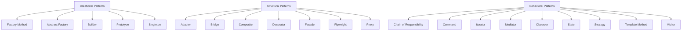

# Design Patterns Guide

## Overview

Design patterns are typical solutions to common problems in software design. Each pattern is like a blueprint that you can customize to solve a particular design problem in your code.

## 📚 Prerequisites & Learning Path

### Prerequisites
Before studying Design Patterns, you should have solid understanding of:
- [OOD Basics](../ood-basics/README.md) - All four pillars of OOP
- [SOLID Principles](../solid-principles/README.md) - All five principles
- [Interfaces](../ood-basics/interfaces.md) - Contract-based design
- [Relationships](../ood-basics/relationships.md) - Composition and Aggregation

### Recommended Learning Order
```
1. Start with OOD Basics (if not already done)
         ↓
2. Master SOLID Principles
         ↓
3. Creational Patterns → Structural Patterns → Behavioral Patterns
         ↓
4. Apply patterns in Interview Questions
```

### Study Strategy
| Category | Start With | Why |
|----------|-----------|-----|
| Creational | Factory Method, Singleton | Most commonly used |
| Structural | Adapter, Decorator | Solve common problems |
| Behavioral | Strategy, Observer | Enable flexible designs |

### After This Section
Apply your knowledge with:
1. [Interview Questions - Easy](../interview-questions/easy/README.md)
2. [Interview Questions - Medium](../interview-questions/medium/README.md)
3. [Interview Questions - Hard](../interview-questions/hard/README.md)

## Pattern Categories

### [🏭 Creational Patterns](creational/README.md)
Provide object creation mechanisms that increase flexibility and reuse of existing code.

- Factory Method
- Abstract Factory
- Builder
- Prototype
- Singleton

### [🔨 Structural Patterns](structural/README.md)
Explain how to assemble objects and classes into larger structures while keeping these structures flexible and efficient.

- Adapter
- Bridge
- Composite
- Decorator
- Facade
- Flyweight
- Proxy

### [🎭 Behavioral Patterns](behavioral/README.md)
Take care of effective communication and the assignment of responsibilities between objects.

- Chain of Responsibility
- Command
- Iterator
- Mediator
- Memento
- Observer
- State
- Strategy
- Template Method
- Visitor

## Pattern Selection Guide

### When to Use Creational Patterns
- Need to create objects without exposing creation logic
- Want to create objects based on certain conditions
- Need to reuse existing objects instead of creating new ones
- Want to create complex objects step by step

### When to Use Structural Patterns
- Need to ensure that classes work together despite incompatible interfaces
- Want to simplify complex subsystem interfaces
- Need to add responsibilities to objects dynamically
- Want to optimize resource usage with shared objects

### When to Use Behavioral Patterns
- Need flexible communication between objects
- Want to define algorithms that can be easily swapped
- Need to implement complex workflows or state transitions
- Want to define a skeleton of an algorithm with customizable parts

## Best Practices

### Pattern Implementation
1. **Understand the Problem**
   - Clearly identify the issue you're trying to solve
   - Consider if a pattern is really needed
   - Evaluate multiple pattern options

2. **Keep It Simple**
   - Don't force patterns where they're not needed
   - Start with the simplest solution
   - Refactor to patterns when complexity justifies it

3. **Consider Maintenance**
   - Document pattern usage clearly
   - Explain the rationale for choosing the pattern
   - Consider the impact on testing

### Common Anti-Patterns to Avoid
1. **Pattern Overuse**
   - Using patterns without clear benefits
   - Overcomplicating simple solutions
   - Mixing too many patterns

2. **Incorrect Pattern Application**
   - Using patterns in wrong contexts
   - Not following pattern principles
   - Partial pattern implementation

3. **Inflexible Implementation**
   - Hard-coding pattern components
   - Not considering future changes
   - Tightly coupling pattern elements

## Pattern Relationships


```mermaid
graph TD
    A[Creational Patterns] --> B[Factory Method]
    A --> C[Abstract Factory]
    A --> D[Builder]
    A --> E[Prototype]
    A --> F[Singleton]
    
    G[Structural Patterns] --> H[Adapter]
    G --> I[Bridge]
    G --> J[Composite]
    G --> K[Decorator]
    G --> L[Facade]
    G --> M[Flyweight]
    G --> N[Proxy]
    
    O[Behavioral Patterns] --> P[Chain of Responsibility]
    O --> Q[Command]
    O --> R[Iterator]
    O --> S[Mediator]
    O --> T[Observer]
    O --> U[State]
    O --> V[Strategy]
    O --> W[Template Method]
    O --> X[Visitor]
```

## ❓ Frequently Asked Questions

### Q1: How many design patterns should I know for interviews?
**A:** Focus on these essentials:
| Must Know | Good to Know | Nice to Know |
|-----------|--------------|--------------|
| Factory, Singleton | Abstract Factory, Prototype | Flyweight |
| Strategy, Observer | Command, State | Visitor, Mediator |
| Adapter, Decorator | Facade, Composite | Bridge, Chain |

### Q2: When should I use a design pattern?
**A:** Use patterns when:
- ✅ You recognize a recurring problem the pattern solves
- ✅ The complexity is justified by flexibility benefits
- ✅ Multiple team members understand the pattern
- ❌ Don't use to show off or add unnecessary abstraction
- ❌ Don't use for simple one-off solutions

### Q3: What's the difference between pattern categories?
**A:**
| Category | Focus | Examples |
|----------|-------|----------|
| **Creational** | Object creation | Factory, Builder, Singleton |
| **Structural** | Object composition | Adapter, Decorator, Facade |
| **Behavioral** | Object interaction | Strategy, Observer, Command |

### Q4: How do I choose between similar patterns?
**A:** Common confusions:
- **Factory vs Builder:** Factory for simple creation, Builder for complex multi-step
- **Strategy vs State:** Strategy for algorithms, State for behavior based on object state
- **Adapter vs Facade:** Adapter makes one interface compatible, Facade simplifies complex subsystem
- **Decorator vs Proxy:** Decorator adds behavior, Proxy controls access

### Q5: Can I combine multiple patterns?
**A:** Yes! Common combinations:
- Factory + Singleton (single factory instance)
- Strategy + Factory (create strategies dynamically)
- Observer + Command (undoable notifications)
- Composite + Visitor (operations on trees)

### Q6: Are design patterns language-specific?
**A:** Core concepts are universal, but implementation varies:
- Some patterns are built into languages (Iterator in Java/Python)
- Some are less needed (Strategy with first-class functions)
- Syntax differs (interfaces in Java vs ABC in Python)
- Always adapt to language idioms

### Q7: How do I practice design patterns?
**A:**
1. Implement each pattern from scratch
2. Identify patterns in existing codebases
3. Solve LLD problems using patterns
4. Refactor your code to use appropriate patterns
5. Explain patterns to others (rubber duck debugging)

## Additional Resources
- [Design Patterns: Elements of Reusable Object-Oriented Software](https://www.amazon.com/Design-Patterns-Elements-Reusable-Object-Oriented/dp/0201633612)
- [Head First Design Patterns](https://www.amazon.com/Head-First-Design-Patterns-Brain-Friendly/dp/0596007124)
- [Refactoring Guru: Design Patterns](https://refactoring.guru/design-patterns) 