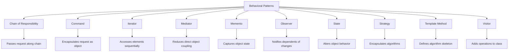

# Behavioral Design Patterns

Behavioral design patterns are concerned with communication between objects, how objects interact and distribute responsibility.

## Overview



## Patterns

### [Chain of Responsibility](chain-of-responsibility.md)
- **Purpose**: Passes requests along a chain of handlers until one handles it
- **Use When**: Multiple objects may handle a request and the handler isn't known beforehand
- **Example**: Logging frameworks, event handling systems

### [Command](command.md)
- **Purpose**: Encapsulates a request as an object
- **Use When**: You want to parameterize objects with operations
- **Example**: GUI buttons, undo functionality

### [Iterator](iterator.md)
- **Purpose**: Provides a way to access elements of a collection sequentially
- **Use When**: You want to traverse a collection without exposing its internal structure
- **Example**: Collection traversal, custom iteration patterns

### [Mediator](mediator.md)
- **Purpose**: Defines an object that encapsulates how a set of objects interact
- **Use When**: A set of objects communicate in well-defined but complex ways
- **Example**: Air traffic control, chat rooms

### [Memento](memento.md)
- **Purpose**: Captures and externalizes an object's internal state
- **Use When**: You need to save and restore an object's state
- **Example**: Undo mechanisms, checkpoints

### [Observer](observer.md)
- **Purpose**: Defines a one-to-many dependency between objects
- **Use When**: A change to one object requires changing others
- **Example**: Event handling, GUI components

### [State](state.md)
- **Purpose**: Allows an object to alter its behavior when its internal state changes
- **Use When**: An object's behavior depends on its state
- **Example**: Vending machines, workflow systems

### [Strategy](strategy.md)
- **Purpose**: Defines a family of algorithms and makes them interchangeable
- **Use When**: You want to use different variants of an algorithm within an object
- **Example**: Sorting algorithms, payment methods

### [Template Method](template-method.md)
- **Purpose**: Defines the skeleton of an algorithm in a method
- **Use When**: You want to define the skeleton of an algorithm and let subclasses override specific steps
- **Example**: Data mining operations, build processes

### [Visitor](visitor.md)
- **Purpose**: Represents an operation to be performed on elements of an object structure
- **Use When**: You want to define operations on a composite structure
- **Example**: Document processing, AST traversal

## Implementation Guidelines

### Chain of Responsibility
```java
public abstract class Handler {
    protected Handler successor;
    
    public void setSuccessor(Handler successor) {
        this.successor = successor;
    }
    
    public abstract void handleRequest(Request request);
}

public class ConcreteHandler extends Handler {
    @Override
    public void handleRequest(Request request) {
        if (canHandle(request)) {
            // Handle the request
        } else if (successor != null) {
            successor.handleRequest(request);
        }
    }
}
```

### Command
```java
public interface Command {
    void execute();
    void undo();
}

public class ConcreteCommand implements Command {
    private Receiver receiver;
    
    public ConcreteCommand(Receiver receiver) {
        this.receiver = receiver;
    }
    
    @Override
    public void execute() {
        receiver.action();
    }
    
    @Override
    public void undo() {
        receiver.undoAction();
    }
}

public class Invoker {
    private Command command;
    
    public void setCommand(Command command) {
        this.command = command;
    }
    
    public void executeCommand() {
        command.execute();
    }
}
```

### Iterator
```java
public interface Iterator<T> {
    boolean hasNext();
    T next();
}

public class ConcreteCollection<T> {
    private List<T> items = new ArrayList<>();
    
    public Iterator<T> getIterator() {
        return new ConcreteIterator();
    }
    
    private class ConcreteIterator implements Iterator<T> {
        private int index = 0;
        
        @Override
        public boolean hasNext() {
            return index < items.size();
        }
        
        @Override
        public T next() {
            if (hasNext()) {
                return items.get(index++);
            }
            throw new NoSuchElementException();
        }
    }
}
```

### Mediator
```java
public interface Mediator {
    void sendMessage(String message, Colleague colleague);
}

public abstract class Colleague {
    protected Mediator mediator;
    
    public Colleague(Mediator mediator) {
        this.mediator = mediator;
    }
    
    public abstract void receive(String message);
}

public class ConcreteMediator implements Mediator {
    private List<Colleague> colleagues = new ArrayList<>();
    
    public void addColleague(Colleague colleague) {
        colleagues.add(colleague);
    }
    
    @Override
    public void sendMessage(String message, Colleague originator) {
        for(Colleague colleague : colleagues) {
            if (colleague != originator) {
                colleague.receive(message);
            }
        }
    }
}
```

### Memento
```java
public class Memento {
    private final String state;
    
    public Memento(String state) {
        this.state = state;
    }
    
    public String getState() {
        return state;
    }
}

public class Originator {
    private String state;
    
    public void setState(String state) {
        this.state = state;
    }
    
    public Memento saveStateToMemento() {
        return new Memento(state);
    }
    
    public void restoreStateFromMemento(Memento memento) {
        state = memento.getState();
    }
}

public class Caretaker {
    private List<Memento> mementoList = new ArrayList<>();
    
    public void add(Memento state) {
        mementoList.add(state);
    }
    
    public Memento get(int index) {
        return mementoList.get(index);
    }
}
```

### Observer
```java
public interface Observer {
    void update(String message);
}

public class Subject {
    private List<Observer> observers = new ArrayList<>();
    private String state;
    
    public void attach(Observer observer) {
        observers.add(observer);
    }
    
    public void setState(String state) {
        this.state = state;
        notifyObservers();
    }
    
    private void notifyObservers() {
        for(Observer observer : observers) {
            observer.update(state);
        }
    }
}
```

### State
```java
public interface State {
    void handle(Context context);
}

public class Context {
    private State state;
    
    public void setState(State state) {
        this.state = state;
    }
    
    public void request() {
        state.handle(this);
    }
}

public class ConcreteStateA implements State {
    @Override
    public void handle(Context context) {
        // Handle the state
        context.setState(new ConcreteStateB());
    }
}
```

### Strategy
```java
public interface Strategy {
    int execute(int a, int b);
}

public class Context {
    private Strategy strategy;
    
    public Context(Strategy strategy) {
        this.strategy = strategy;
    }
    
    public int executeStrategy(int a, int b) {
        return strategy.execute(a, b);
    }
}

public class AddStrategy implements Strategy {
    @Override
    public int execute(int a, int b) {
        return a + b;
    }
}
```

### Template Method
```java
public abstract class AbstractClass {
    public final void templateMethod() {
        step1();
        step2();
        hook();
    }
    
    protected abstract void step1();
    protected abstract void step2();
    
    protected void hook() {} // Optional hook
}

public class ConcreteClass extends AbstractClass {
    @Override
    protected void step1() {
        // Implementation
    }
    
    @Override
    protected void step2() {
        // Implementation
    }
}
```

### Visitor
```java
public interface Visitor {
    void visit(ConcreteElementA element);
    void visit(ConcreteElementB element);
}

public interface Element {
    void accept(Visitor visitor);
}

public class ConcreteElementA implements Element {
    @Override
    public void accept(Visitor visitor) {
        visitor.visit(this);
    }
}

public class ConcreteVisitor implements Visitor {
    @Override
    public void visit(ConcreteElementA element) {
        // Do something with element A
    }
    
    @Override
    public void visit(ConcreteElementB element) {
        // Do something with element B
    }
}
```

## Best Practices

### Do's
1. **Use Chain of Responsibility** when:
   - Multiple objects can handle a request
   - You want to issue a request to one of several objects without specifying the receiver explicitly

2. **Use Command** when:
   - You want to parameterize objects with operations
   - You want to queue operations, schedule their execution, or execute them remotely
   - You need undo/redo capabilities

3. **Use Iterator** when:
   - You want to access a collection's elements without exposing its internal structure
   - You want to support multiple traversal methods for a collection

4. **Use Mediator** when:
   - A set of objects communicate in well-defined but complex ways
   - You want to reduce coupling between objects

5. **Use Memento** when:
   - You need to save and restore an object's state
   - A direct interface to obtaining the state would expose implementation details

6. **Use Observer** when:
   - A change to one object requires changing others
   - You want to establish one-to-many relationships between objects

7. **Use State** when:
   - An object's behavior depends on its state
   - You want to avoid large conditional statements

8. **Use Strategy** when:
   - You want to define a family of algorithms
   - You need to vary an algorithm dynamically

9. **Use Template Method** when:
   - You want to define the skeleton of an algorithm and let subclasses override specific steps
   - You want to avoid code duplication in similar algorithms

10. **Use Visitor** when:
    - You want to define operations on a composite structure
    - You want to add operations without changing the classes of the elements

### Don'ts
1. Don't create overly long chains in Chain of Responsibility
2. Don't make Command objects too complex
3. Don't expose internal collection structure in Iterator
4. Don't create Mediator objects that know too much
5. Don't store unnecessary state in Memento
6. Don't create tight coupling in Observer
7. Don't overuse State for simple state changes
8. Don't create too many Strategy classes
9. Don't make Template Method too rigid
10. Don't use Visitor when structure changes frequently

## Anti-Patterns to Avoid

1. **Broken Chain**
   - Not handling end of chain properly
   - Solution: Always provide default handler

2. **Command Bloat**
   - Too many command classes
   - Solution: Use composite commands

3. **Iterator Pollution**
   - Exposing too much in iterator interface
   - Solution: Keep iterator interface minimal

4. **Mediator Bloat**
   - Mediator knows too much
   - Solution: Split into multiple mediators

5. **Memory Leak in Observer**
   - Not removing observers
   - Solution: Implement proper cleanup

6. **State Explosion**
   - Too many state classes
   - Solution: Combine similar states

7. **Strategy Overkill**
   - Creating strategies for simple variations
   - Solution: Use simpler conditional logic

8. **Rigid Template**
   - Not providing hooks
   - Solution: Add optional hooks

9. **Visitor Violation**
   - Modifying element structure
   - Solution: Keep element structure stable

## Additional Resources
- [Chain of Responsibility Pattern](chain-of-responsibility.md)
- [Command Pattern](command.md)
- [Iterator Pattern](iterator.md)
- [Mediator Pattern](mediator.md)
- [Memento Pattern](memento.md)
- [Observer Pattern](observer.md)
- [State Pattern](state.md)
- [Strategy Pattern](strategy.md)
- [Template Method Pattern](template-method.md)
- [Visitor Pattern](visitor.md) 