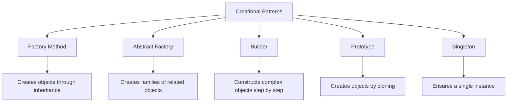

# Creational Design Patterns

Creational design patterns provide various object creation mechanisms, which increase flexibility and reuse of existing code.

## Overview



## Patterns

### [Factory Method](factory-method.md)
- **Purpose**: Defines an interface for creating objects but lets subclasses decide which class to instantiate
- **Use When**: You don't know the exact types and dependencies of the objects your code will work with
- **Example**: Document creation in different formats (PDF, HTML)

### [Abstract Factory](abstract-factory.md)
- **Purpose**: Creates families of related or dependent objects without specifying their concrete classes
- **Use When**: Your system needs to be independent from how its products are created, composed, and represented
- **Example**: UI elements for different operating systems

### [Builder](builder.md)
- **Purpose**: Separates the construction of a complex object from its representation
- **Use When**: You need to create complex objects with lots of optional components and configurations
- **Example**: Custom computer configuration builder

### [Prototype](prototype.md)
- **Purpose**: Creates new objects by cloning an existing object, known as the prototype
- **Use When**: You need to create objects based on an existing object or avoid expensive creation
- **Example**: Creating game objects from templates

### [Singleton](singleton.md)
- **Purpose**: Ensures a class has only one instance and provides a global point of access to it
- **Use When**: Exactly one object is needed to coordinate actions across the system
- **Example**: Database connection pool, logging service

## Comparison

| Pattern | Creation Method | Flexibility | Complexity | Common Use Cases |
|---------|----------------|-------------|------------|------------------|
| Factory Method | Inheritance | High | Low | Framework extensions |
| Abstract Factory | Composition | Very High | Medium | Platform independence |
| Builder | Step-by-step | High | Medium | Complex object creation |
| Prototype | Cloning | Medium | Low | Object copying |
| Singleton | Static | Low | Low | Shared resources |

## Implementation Guidelines

### Factory Method
```java
// Creator
public abstract class DocumentCreator {
    public abstract Document createDocument();
    
    public void processDocument() {
        Document doc = createDocument();
        doc.process();
    }
}

// Concrete Creator
public class PDFDocumentCreator extends DocumentCreator {
    @Override
    public Document createDocument() {
        return new PDFDocument();
    }
}
```

### Abstract Factory
```java
// Abstract Factory
public interface GUIFactory {
    Button createButton();
    Checkbox createCheckbox();
}

// Concrete Factory
public class WindowsFactory implements GUIFactory {
    @Override
    public Button createButton() {
        return new WindowsButton();
    }
    
    @Override
    public Checkbox createCheckbox() {
        return new WindowsCheckbox();
    }
}
```

### Builder
```java
// Builder
public class ComputerBuilder {
    private Computer computer = new Computer();
    
    public ComputerBuilder addProcessor(String processor) {
        computer.setProcessor(processor);
        return this;
    }
    
    public ComputerBuilder addMemory(int memory) {
        computer.setMemory(memory);
        return this;
    }
    
    public Computer build() {
        return computer;
    }
}

// Usage
Computer computer = new ComputerBuilder()
    .addProcessor("Intel i7")
    .addMemory(16)
    .build();
```

### Prototype
```java
// Prototype
public abstract class Shape implements Cloneable {
    private String id;
    protected String type;
    
    @Override
    public Object clone() {
        Object clone = null;
        try {
            clone = super.clone();
        } catch (CloneNotSupportedException e) {
            e.printStackTrace();
        }
        return clone;
    }
}

// Concrete Prototype
public class Rectangle extends Shape {
    public Rectangle() {
        type = "Rectangle";
    }
}
```

### Singleton
```java
// Thread-safe Singleton
public class Singleton {
    private static volatile Singleton instance;
    
    private Singleton() {}
    
    public static Singleton getInstance() {
        if (instance == null) {
            synchronized (Singleton.class) {
                if (instance == null) {
                    instance = new Singleton();
                }
            }
        }
        return instance;
    }
}
```

## Best Practices

### Do's
1. **Use Factory Method** when:
   - You don't know the exact types of objects you need
   - You want to delegate object creation to subclasses
   - You want to provide hooks for subclasses

2. **Use Abstract Factory** when:
   - You need to ensure compatibility between created objects
   - You want to create families of related objects
   - You need to enforce certain combinations of objects

3. **Use Builder** when:
   - You need to create complex objects step by step
   - You want to prevent "telescoping constructor" problem
   - You need different representations of the same construction process

4. **Use Prototype** when:
   - You need to create objects based on existing instances
   - You want to avoid subclassing in object creation
   - You need to create objects with varying configurations

5. **Use Singleton** when:
   - You need exactly one instance of a class
   - You need strict control over global state
   - You need to coordinate actions across the system

### Don'ts
1. Don't use Singleton as a global state container
2. Don't create complex hierarchies with Factory Method
3. Don't overuse Abstract Factory for simple object creation
4. Don't make Builder patterns overly complex
5. Don't use Prototype when object copying is expensive

## Anti-Patterns to Avoid

1. **God Object Factory**
   - Creating a single factory for all object types
   - Solution: Use separate factories for related object families

2. **Complex Builder Chains**
   - Creating long chains of builder methods
   - Solution: Break into smaller, focused builders

3. **Mutable Singletons**
   - Creating singletons with mutable state
   - Solution: Make singleton state immutable

4. **Deep Prototype Chains**
   - Creating deep hierarchies of prototype objects
   - Solution: Keep prototype hierarchies shallow

## Additional Resources
- [Factory Method Pattern](factory-method.md)
- [Abstract Factory Pattern](abstract-factory.md)
- [Builder Pattern](builder.md)
- [Prototype Pattern](prototype.md)
- [Singleton Pattern](singleton.md) 