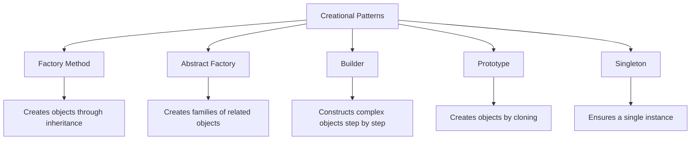

# Creational Design Patterns

Creational design patterns provide various object creation mechanisms, which increase flexibility and reuse of existing code.

## 📚 Prerequisites & Learning Path

### Prerequisites
Before studying Creational Patterns, you should understand:
- [Classes & Objects](../../ood-basics/classes-and-objects.md) - Object creation basics
- [Inheritance](../../ood-basics/inheritance.md) - Class hierarchies
- [Interfaces](../../ood-basics/interfaces.md) - Abstraction and contracts
- [SOLID Principles](../../solid-principles/README.md) - Especially SRP and DIP

### Recommended Study Order
```
1. Factory Method (Most fundamental)
         ↓
2. Abstract Factory (Extension of Factory)
         ↓
3. Builder (Complex object construction)
         ↓
4. Singleton (Global access pattern)
         ↓
5. Prototype (Clone-based creation)
```

### Learning Path
After Creational Patterns, continue with:
1. **Next:** [Structural Patterns](../structural/README.md) - Object composition
2. **Then:** [Behavioral Patterns](../behavioral/README.md) - Object interaction
3. **Apply:** [Medium Interview Questions](../../interview-questions/medium/README.md) - Practice problems

### Pattern Selection Guide
| Problem | Pattern | Why |
|---------|---------|-----|
| Need to create objects without specifying class | Factory Method | Encapsulates creation |
| Need families of related objects | Abstract Factory | Ensures compatibility |
| Object has many optional parameters | Builder | Step-by-step construction |
| Need exactly one instance | Singleton | Global access point |
| Creating object is expensive | Prototype | Clone instead of new |

## Overview


```mermaid
graph TD
    A[Creational Patterns] --> B[Factory Method]
    A --> C[Abstract Factory]
    A --> D[Builder]
    A --> E[Prototype]
    A --> F[Singleton]
    
    B --> G[Creates objects through inheritance]
    C --> H[Creates families of related objects]
    D --> I[Constructs complex objects step by step]
    E --> J[Creates objects by cloning]
    F --> K[Ensures a single instance]
```

## Patterns

### Factory Method
- **Purpose**: Defines an interface for creating objects but lets subclasses decide which class to instantiate
- **Use When**: You don't know the exact types and dependencies of the objects your code will work with
- **Example**: Document creation in different formats (PDF, HTML)

### Abstract Factory
- **Purpose**: Creates families of related or dependent objects without specifying their concrete classes
- **Use When**: Your system needs to be independent from how its products are created, composed, and represented
- **Example**: UI elements for different operating systems

### Builder
- **Purpose**: Separates the construction of a complex object from its representation
- **Use When**: You need to create complex objects with lots of optional components and configurations
- **Example**: Custom computer configuration builder

### Prototype
- **Purpose**: Creates new objects by cloning an existing object, known as the prototype
- **Use When**: You need to create objects based on an existing object or avoid expensive creation
- **Example**: Creating game objects from templates

### Singleton
- **Purpose**: Ensures a class has only one instance and provides a global point of access to it
- **Use When**: Exactly one object is needed to coordinate actions across the system
- **Example**: Database connection pool, logging service

## Comparison

| Pattern | Creation Method | Flexibility | Complexity | Common Use Cases |
|---------|----------------|-------------|------------|------------------|
| Factory Method | Inheritance | High | Low | Framework extensions |
| Abstract Factory | Composition | Very High | Medium | Platform independence |
| Builder | Step-by-step | High | Medium | Complex object creation |
| Prototype | Cloning | Medium | Low | Object copying |
| Singleton | Static | Low | Low | Shared resources |

## Implementation Guidelines

### Factory Method

#### Java
```java
// Creator
public abstract class DocumentCreator {
    public abstract Document createDocument();
    
    public void processDocument() {
        Document doc = createDocument();
        doc.process();
    }
}

// Concrete Creator
public class PDFDocumentCreator extends DocumentCreator {
    @Override
    public Document createDocument() {
        return new PDFDocument();
    }
}
```

#### Python
```python
from abc import ABC, abstractmethod

# Creator
class DocumentCreator(ABC):
    @abstractmethod
    def create_document(self) -> Document:
        pass
    
    def process_document(self) -> None:
        doc = self.create_document()
        doc.process()

# Concrete Creator
class PDFDocumentCreator(DocumentCreator):
    def create_document(self) -> Document:
        return PDFDocument()
```

#### C++
```cpp
// Creator
class DocumentCreator {
public:
    virtual ~DocumentCreator() = default;
    virtual std::unique_ptr<Document> createDocument() = 0;
    
    void processDocument() {
        auto doc = createDocument();
        doc->process();
    }
};

// Concrete Creator
class PDFDocumentCreator : public DocumentCreator {
public:
    std::unique_ptr<Document> createDocument() override {
        return std::make_unique<PDFDocument>();
    }
};
```

### Abstract Factory

#### Java
```java
// Abstract Factory
public interface GUIFactory {
    Button createButton();
    Checkbox createCheckbox();
}

// Concrete Factory
public class WindowsFactory implements GUIFactory {
    @Override
    public Button createButton() {
        return new WindowsButton();
    }
    
    @Override
    public Checkbox createCheckbox() {
        return new WindowsCheckbox();
    }
}
```

#### Python
```python
from abc import ABC, abstractmethod

# Abstract Factory
class GUIFactory(ABC):
    @abstractmethod
    def create_button(self) -> Button: pass
    
    @abstractmethod
    def create_checkbox(self) -> Checkbox: pass

# Concrete Factory
class WindowsFactory(GUIFactory):
    def create_button(self) -> Button:
        return WindowsButton()
    
    def create_checkbox(self) -> Checkbox:
        return WindowsCheckbox()
```

#### C++
```cpp
// Abstract Factory
class GUIFactory {
public:
    virtual ~GUIFactory() = default;
    virtual std::unique_ptr<Button> createButton() = 0;
    virtual std::unique_ptr<Checkbox> createCheckbox() = 0;
};

// Concrete Factory
class WindowsFactory : public GUIFactory {
public:
    std::unique_ptr<Button> createButton() override {
        return std::make_unique<WindowsButton>();
    }
    
    std::unique_ptr<Checkbox> createCheckbox() override {
        return std::make_unique<WindowsCheckbox>();
    }
};
```

### Builder

#### Java
```java
// Builder
public class ComputerBuilder {
    private Computer computer = new Computer();
    
    public ComputerBuilder addProcessor(String processor) {
        computer.setProcessor(processor);
        return this;
    }
    
    public ComputerBuilder addMemory(int memory) {
        computer.setMemory(memory);
        return this;
    }
    
    public Computer build() {
        return computer;
    }
}

// Usage
Computer computer = new ComputerBuilder()
    .addProcessor("Intel i7")
    .addMemory(16)
    .build();
```

#### Python
```python
class ComputerBuilder:
    def __init__(self):
        self._computer = Computer()
    
    def add_processor(self, processor: str) -> 'ComputerBuilder':
        self._computer.processor = processor
        return self
    
    def add_memory(self, memory: int) -> 'ComputerBuilder':
        self._computer.memory = memory
        return self
    
    def build(self) -> Computer:
        return self._computer

# Usage
computer = (ComputerBuilder()
    .add_processor("Intel i7")
    .add_memory(16)
    .build())
```

#### C++
```cpp
class ComputerBuilder {
private:
    std::unique_ptr<Computer> computer = std::make_unique<Computer>();
public:
    ComputerBuilder& addProcessor(const std::string& processor) {
        computer->setProcessor(processor);
        return *this;
    }
    
    ComputerBuilder& addMemory(int memory) {
        computer->setMemory(memory);
        return *this;
    }
    
    std::unique_ptr<Computer> build() {
        return std::move(computer);
    }
};

// Usage
auto computer = ComputerBuilder()
    .addProcessor("Intel i7")
    .addMemory(16)
    .build();
```

### Prototype
```java
// Prototype
public abstract class Shape implements Cloneable {
    private String id;
    protected String type;
    
    @Override
    public Object clone() {
        Object clone = null;
        try {
            clone = super.clone();
        } catch (CloneNotSupportedException e) {
            e.printStackTrace();
        }
        return clone;
    }
}

// Concrete Prototype
public class Rectangle extends Shape {
    public Rectangle() {
        type = "Rectangle";
    }
}
```

### Singleton

#### Java
```java
// Thread-safe Singleton
public class Singleton {
    private static volatile Singleton instance;
    
    private Singleton() {}
    
    public static Singleton getInstance() {
        if (instance == null) {
            synchronized (Singleton.class) {
                if (instance == null) {
                    instance = new Singleton();
                }
            }
        }
        return instance;
    }
}
```

#### Python
```python
import threading

class Singleton:
    _instance = None
    _lock = threading.Lock()
    
    def __new__(cls):
        if cls._instance is None:
            with cls._lock:
                if cls._instance is None:
                    cls._instance = super().__new__(cls)
        return cls._instance

# Alternative using decorator
def singleton(cls):
    instances = {}
    def get_instance(*args, **kwargs):
        if cls not in instances:
            instances[cls] = cls(*args, **kwargs)
        return instances[cls]
    return get_instance
```

#### C++
```cpp
#include <mutex>

// Thread-safe Singleton
class Singleton {
private:
    static std::unique_ptr<Singleton> instance;
    static std::mutex mutex;
    
    Singleton() = default;
    
public:
    Singleton(const Singleton&) = delete;
    Singleton& operator=(const Singleton&) = delete;
    
    static Singleton* getInstance() {
        std::lock_guard<std::mutex> lock(mutex);
        if (instance == nullptr) {
            instance.reset(new Singleton());
        }
        return instance.get();
    }
};

std::unique_ptr<Singleton> Singleton::instance = nullptr;
std::mutex Singleton::mutex;
```

## Best Practices

### Do's
1. **Use Factory Method** when:
   - You don't know the exact types of objects you need
   - You want to delegate object creation to subclasses
   - You want to provide hooks for subclasses

2. **Use Abstract Factory** when:
   - You need to ensure compatibility between created objects
   - You want to create families of related objects
   - You need to enforce certain combinations of objects

3. **Use Builder** when:
   - You need to create complex objects step by step
   - You want to prevent "telescoping constructor" problem
   - You need different representations of the same construction process

4. **Use Prototype** when:
   - You need to create objects based on existing instances
   - You want to avoid subclassing in object creation
   - You need to create objects with varying configurations

5. **Use Singleton** when:
   - You need exactly one instance of a class
   - You need strict control over global state
   - You need to coordinate actions across the system

### Don'ts
1. Don't use Singleton as a global state container
2. Don't create complex hierarchies with Factory Method
3. Don't overuse Abstract Factory for simple object creation
4. Don't make Builder patterns overly complex
5. Don't use Prototype when object copying is expensive

## Anti-Patterns to Avoid

1. **God Object Factory**
   - Creating a single factory for all object types
   - Solution: Use separate factories for related object families

2. **Complex Builder Chains**
   - Creating long chains of builder methods
   - Solution: Break into smaller, focused builders

3. **Mutable Singletons**
   - Creating singletons with mutable state
   - Solution: Make singleton state immutable

4. **Deep Prototype Chains**
   - Creating deep hierarchies of prototype objects
   - Solution: Keep prototype hierarchies shallow

## ❓ Frequently Asked Questions

### Q1: When should I use Factory Method vs Abstract Factory?
**A:**
| Factory Method | Abstract Factory |
|---------------|-----------------|
| Creates ONE product type | Creates FAMILIES of products |
| Single method for creation | Multiple factory methods |
| Subclasses decide type | Client chooses factory |
| Simpler, one product | Complex, related products |

### Q2: Is Singleton an anti-pattern?
**A:** It depends on usage:
- ❌ **Anti-pattern when:** Used as global state, makes testing hard, hides dependencies
- ✅ **Appropriate when:** Resource management (connection pools), configuration, logging
- **Alternative:** Dependency injection for better testability

### Q3: When does Builder make sense over a constructor?
**A:** Use Builder when:
- More than 4-5 constructor parameters
- Many optional parameters
- Want to make objects immutable
- Need to validate before building
- Construction involves multiple steps

### Q4: What's the difference between Factory and Builder?
**A:**
| Factory | Builder |
|---------|---------|
| Returns complete object | Constructs step by step |
| Hides concrete class | Exposes construction process |
| Usually one method call | Multiple method calls |
| For families/variations | For complex objects |

### Q5: When should I use Prototype pattern?
**A:** Use when:
- Object creation is expensive
- You need copies with slight variations
- Runtime doesn't know concrete types
- Want to avoid subclass explosion
- Example: Game object cloning, document templates

### Q6: How do I make Singleton thread-safe?
**A:** Options (from simple to complex):
1. **Eager initialization:** Create at class load
2. **Double-checked locking:** Check, lock, check again
3. **Holder idiom:** Inner static class holds instance
4. **Enum singleton:** Language-guaranteed uniqueness (Java)

### Q7: Can Factory and Singleton be combined?
**A:** Yes! Common pattern:
```java
public class LoggerFactory {
    private static LoggerFactory instance;
    
    public static LoggerFactory getInstance() { /* singleton */ }
    public Logger createLogger(String name) { /* factory */ }
}
```

## Additional Resources
- [Factory Method Pattern](https://refactoring.guru/design-patterns/factory-method)
- [Abstract Factory Pattern](https://refactoring.guru/design-patterns/abstract-factory)
- [Builder Pattern](https://refactoring.guru/design-patterns/builder)
- [Prototype Pattern](https://refactoring.guru/design-patterns/prototype)
- [Singleton Pattern](https://refactoring.guru/design-patterns/singleton)