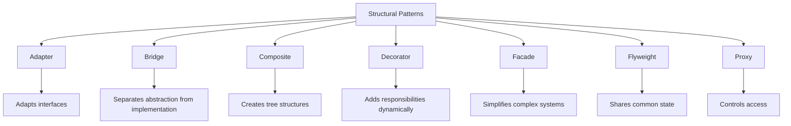

# Structural Design Patterns

Structural patterns explain how to assemble objects and classes into larger structures while keeping these structures flexible and efficient.

## Overview



## Patterns

### Adapter
- **Purpose**: Allows incompatible interfaces to work together by wrapping an object in an adapter to make it compatible with another class
- **Use When**: You want to use an existing class that doesn't fit your interface
- **Example**: Converting data formats between systems

### Bridge
- **Purpose**: Separates an abstraction from its implementation so that both can vary independently
- **Use When**: You want to avoid a permanent binding between an abstraction and its implementation
- **Example**: Cross-platform GUI toolkits

### Composite
- **Purpose**: Composes objects into tree structures to represent part-whole hierarchies
- **Use When**: You want clients to treat individual objects and compositions uniformly
- **Example**: File system structure, GUI components

### Decorator
- **Purpose**: Attaches additional responsibilities to objects dynamically
- **Use When**: You want to add behavior to individual objects without affecting other objects
- **Example**: Adding features to streams, UI components

### Facade
- **Purpose**: Provides a unified interface to a set of interfaces in a subsystem
- **Use When**: You want to provide a simple interface to a complex system
- **Example**: Library management system, complex API wrappers

### Flyweight
- **Purpose**: Uses sharing to support large numbers of fine-grained objects efficiently
- **Use When**: You need a large number of similar objects that are unique in only a few parameters
- **Example**: Character rendering in text editors, game object pools

### Proxy
- **Purpose**: Provides a surrogate or placeholder for another object to control access to it
- **Use When**: You want to control access to an object, or delay its creation until needed
- **Example**: Lazy loading of resources, access control

## Comparison

| Pattern | Purpose | Complexity | Performance Impact | Common Use Cases |
|---------|---------|------------|-------------------|------------------|
| Adapter | Interface conversion | Low | Minimal | Legacy system integration |
| Bridge | Implementation separation | Medium | Low | Platform independence |
| Composite | Hierarchical structures | Medium | Low | UI components, file systems |
| Decorator | Dynamic enhancement | Low | Low | I/O streams, UI features |
| Facade | Simplification | Low | None | API wrappers |
| Flyweight | Resource sharing | High | Positive | Graphics, game objects |
| Proxy | Access control | Medium | Varies | Resource management |

## Implementation Guidelines

### Adapter
```java
// Target interface
public interface MediaPlayer {
    void play(String audioType, String fileName);
}

// Adapter
public class MediaAdapter implements MediaPlayer {
    private AdvancedMediaPlayer advancedMusicPlayer;
    
    public MediaAdapter(String audioType) {
        if(audioType.equalsIgnoreCase("vlc")) {
            advancedMusicPlayer = new VlcPlayer();
        }
    }
    
    @Override
    public void play(String audioType, String fileName) {
        if(audioType.equalsIgnoreCase("vlc")) {
            advancedMusicPlayer.playVlc(fileName);
        }
    }
}
```

### Bridge
```java
// Abstraction
public abstract class Shape {
    protected DrawAPI drawAPI;
    
    protected Shape(DrawAPI drawAPI) {
        this.drawAPI = drawAPI;
    }
    
    public abstract void draw();
}

// Implementation
public interface DrawAPI {
    void drawCircle(int x, int y, int radius);
}

// Concrete Implementation
public class RedCircle implements DrawAPI {
    @Override
    public void drawCircle(int x, int y, int radius) {
        System.out.println("Drawing Circle[ color: red, radius: " + radius + "]");
    }
}
```

### Composite
```java
// Component
public abstract class FileSystemNode {
    protected String name;
    
    public abstract void ls();
    public abstract long getSize();
}

// Leaf
public class File extends FileSystemNode {
    private long size;
    
    @Override
    public void ls() {
        System.out.println(name);
    }
    
    @Override
    public long getSize() {
        return size;
    }
}

// Composite
public class Directory extends FileSystemNode {
    private List<FileSystemNode> children = new ArrayList<>();
    
    public void add(FileSystemNode node) {
        children.add(node);
    }
    
    @Override
    public void ls() {
        System.out.println(name);
        for(FileSystemNode node : children) {
            node.ls();
        }
    }
    
    @Override
    public long getSize() {
        return children.stream()
                      .mapToLong(FileSystemNode::getSize)
                      .sum();
    }
}
```

### Decorator
```java
// Component
public interface Coffee {
    double getCost();
    String getDescription();
}

// Concrete Component
public class SimpleCoffee implements Coffee {
    @Override
    public double getCost() {
        return 1;
    }
    
    @Override
    public String getDescription() {
        return "Simple coffee";
    }
}

// Decorator
public abstract class CoffeeDecorator implements Coffee {
    protected final Coffee decoratedCoffee;
    
    public CoffeeDecorator(Coffee coffee) {
        this.decoratedCoffee = coffee;
    }
    
    @Override
    public double getCost() {
        return decoratedCoffee.getCost();
    }
    
    @Override
    public String getDescription() {
        return decoratedCoffee.getDescription();
    }
}

// Concrete Decorator
public class Milk extends CoffeeDecorator {
    public Milk(Coffee coffee) {
        super(coffee);
    }
    
    @Override
    public double getCost() {
        return super.getCost() + 0.5;
    }
    
    @Override
    public String getDescription() {
        return super.getDescription() + ", milk";
    }
}
```

### Facade
```java
// Subsystem classes
public class CPU {
    public void freeze() { }
    public void jump(long position) { }
    public void execute() { }
}

public class Memory {
    public void load(long position, byte[] data) { }
}

// Facade
public class ComputerFacade {
    private CPU processor;
    private Memory ram;
    
    public ComputerFacade() {
        this.processor = new CPU();
        this.ram = new Memory();
    }
    
    public void start() {
        processor.freeze();
        ram.load(BOOT_ADDRESS, BOOT_DATA);
        processor.jump(BOOT_ADDRESS);
        processor.execute();
    }
}
```

### Flyweight
```java
// Flyweight
public class Character {
    private char symbol;
    private String color;
    private Font font;
    
    // Intrinsic state
    public Character(char symbol) {
        this.symbol = symbol;
    }
    
    // Extrinsic state passed in
    public void draw(String color, Font font) {
        this.color = color;
        this.font = font;
        // Draw the character
    }
}

// Flyweight Factory
public class CharacterFactory {
    private Map<Character, Character> characters = new HashMap<>();
    
    public Character getCharacter(char symbol) {
        Character character = characters.get(symbol);
        
        if(character == null) {
            character = new Character(symbol);
            characters.put(symbol, character);
        }
        return character;
    }
}
```

### Proxy
```java
// Subject
public interface Image {
    void display();
}

// Real Subject
public class RealImage implements Image {
    private String fileName;
    
    public RealImage(String fileName) {
        this.fileName = fileName;
        loadFromDisk();
    }
    
    private void loadFromDisk() {
        System.out.println("Loading " + fileName);
    }
    
    @Override
    public void display() {
        System.out.println("Displaying " + fileName);
    }
}

// Proxy
public class ProxyImage implements Image {
    private RealImage realImage;
    private String fileName;
    
    public ProxyImage(String fileName) {
        this.fileName = fileName;
    }
    
    @Override
    public void display() {
        if(realImage == null) {
            realImage = new RealImage(fileName);
        }
        realImage.display();
    }
}
```

## Best Practices

### Do's
1. **Use Adapter** when:
   - You need to make existing classes work with others without modifying their source code
   - You want to create a reusable class that cooperates with classes that don't have compatible interfaces

2. **Use Bridge** when:
   - You want to avoid a permanent binding between an abstraction and its implementation
   - Both the abstractions and their implementations should be extensible through subclassing

3. **Use Composite** when:
   - You want to represent part-whole hierarchies of objects
   - You want clients to be able to ignore the difference between compositions of objects and individual objects

4. **Use Decorator** when:
   - You want to add responsibilities to objects dynamically and transparently
   - You want to extend an object's functionality without subclassing

5. **Use Facade** when:
   - You want to provide a simple interface to a complex subsystem
   - You want to layer your subsystems

6. **Use Flyweight** when:
   - An application uses a large number of objects
   - Storage costs are high because of the quantity of objects

7. **Use Proxy** when:
   - You want to control access to an object
   - You want to provide a local representative for an object in a different address space

### Don'ts
1. Don't use Adapter when you can modify the source code
2. Don't use Bridge when variations are simple
3. Don't use Composite for simple structures
4. Don't overuse Decorator as it can lead to complex code
5. Don't create Facade when subsystem is simple
6. Don't use Flyweight for small numbers of objects
7. Don't use Proxy when direct access is appropriate

## Anti-Patterns to Avoid

1. **Complex Adapter Chains**
   - Creating chains of adapters
   - Solution: Create direct adapters or refactor interfaces

2. **Deep Bridge Hierarchies**
   - Creating deep inheritance hierarchies in bridge pattern
   - Solution: Keep hierarchies shallow and focused

3. **Bloated Composites**
   - Adding too many methods to composite interface
   - Solution: Keep interface minimal and focused

4. **Decorator Explosion**
   - Creating too many decorator layers
   - Solution: Consider using Builder pattern or configuration objects

5. **Facade as God Object**
   - Making facade too complex
   - Solution: Create multiple focused facades

6. **Premature Flyweight**
   - Using flyweight before it's needed
   - Solution: Start with simple objects, optimize later

7. **Proxy Overuse**
   - Adding proxies unnecessarily
   - Solution: Use proxies only when control or lazy loading is needed

## Additional Resources
- [Adapter Pattern](adapter.md)
- [Bridge Pattern](bridge.md)
- [Composite Pattern](composite.md)
- [Decorator Pattern](decorator.md)
- [Facade Pattern](facade.md)
- [Flyweight Pattern](flyweight.md)
- [Proxy Pattern](proxy.md) 