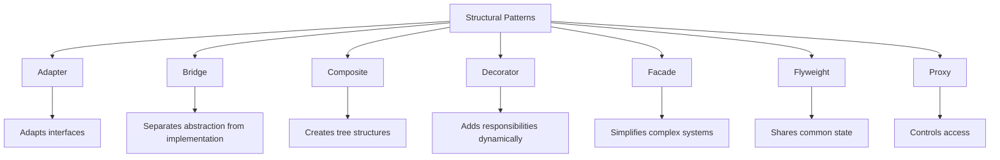

# Structural Design Patterns

Structural patterns explain how to assemble objects and classes into larger structures while keeping these structures flexible and efficient.

## 📚 Prerequisites & Learning Path

### Prerequisites
Before studying Structural Patterns, you should understand:
- [Creational Patterns](../creational/README.md) - Object creation basics
- [Interfaces](../../ood-basics/interfaces.md) - Contract-based design
- [Relationships](../../ood-basics/relationships.md) - Composition & Aggregation
- [SOLID Principles](../../solid-principles/README.md) - Especially OCP and ISP

### Recommended Study Order
```
1. Adapter (Interface compatibility)
         ↓
2. Decorator (Dynamic behavior addition)
         ↓
3. Facade (Simplify complex systems)
         ↓
4. Composite (Tree structures)
         ↓
5. Proxy (Access control)
         ↓
6. Bridge & Flyweight (Advanced)
```

### Learning Path
After Structural Patterns, continue with:
1. **Next:** [Behavioral Patterns](../behavioral/README.md) - Object communication
2. **Apply:** [Medium Interview Questions](../../interview-questions/medium/README.md) - Practice problems
3. **Advanced:** [Hard Interview Questions](../../interview-questions/hard/README.md) - Complex systems

### Pattern Selection Guide
| Problem | Pattern | Why |
|---------|---------|-----|
| Incompatible interfaces | Adapter | Makes them compatible |
| Add behavior without subclassing | Decorator | Runtime composition |
| Complex subsystem | Facade | Simple unified interface |
| Tree/hierarchical structures | Composite | Uniform treatment |
| Control object access | Proxy | Add indirection layer |
| Decouple abstraction from impl | Bridge | Independent variation |
| Many similar objects | Flyweight | Share common state |

## Overview


```mermaid
graph TD
    A[Structural Patterns] --> B[Adapter]
    A --> C[Bridge]
    A --> D[Composite]
    A --> E[Decorator]
    A --> F[Facade]
    A --> G[Flyweight]
    A --> H[Proxy]
    
    B --> I[Adapts interfaces]
    C --> J[Separates abstraction from implementation]
    D --> K[Creates tree structures]
    E --> L[Adds responsibilities dynamically]
    F --> M[Simplifies complex systems]
    G --> N[Shares common state]
    H --> O[Controls access]
```

## Patterns

### Adapter
- **Purpose**: Allows incompatible interfaces to work together by wrapping an object in an adapter to make it compatible with another class
- **Use When**: You want to use an existing class that doesn't fit your interface
- **Example**: Converting data formats between systems

### Bridge
- **Purpose**: Separates an abstraction from its implementation so that both can vary independently
- **Use When**: You want to avoid a permanent binding between an abstraction and its implementation
- **Example**: Cross-platform GUI toolkits

### Composite
- **Purpose**: Composes objects into tree structures to represent part-whole hierarchies
- **Use When**: You want clients to treat individual objects and compositions uniformly
- **Example**: File system structure, GUI components

### Decorator
- **Purpose**: Attaches additional responsibilities to objects dynamically
- **Use When**: You want to add behavior to individual objects without affecting other objects
- **Example**: Adding features to streams, UI components

### Facade
- **Purpose**: Provides a unified interface to a set of interfaces in a subsystem
- **Use When**: You want to provide a simple interface to a complex system
- **Example**: Library management system, complex API wrappers

### Flyweight
- **Purpose**: Uses sharing to support large numbers of fine-grained objects efficiently
- **Use When**: You need a large number of similar objects that are unique in only a few parameters
- **Example**: Character rendering in text editors, game object pools

### Proxy
- **Purpose**: Provides a surrogate or placeholder for another object to control access to it
- **Use When**: You want to control access to an object, or delay its creation until needed
- **Example**: Lazy loading of resources, access control

## Comparison

| Pattern | Purpose | Complexity | Performance Impact | Common Use Cases |
|---------|---------|------------|-------------------|------------------|
| Adapter | Interface conversion | Low | Minimal | Legacy system integration |
| Bridge | Implementation separation | Medium | Low | Platform independence |
| Composite | Hierarchical structures | Medium | Low | UI components, file systems |
| Decorator | Dynamic enhancement | Low | Low | I/O streams, UI features |
| Facade | Simplification | Low | None | API wrappers |
| Flyweight | Resource sharing | High | Positive | Graphics, game objects |
| Proxy | Access control | Medium | Varies | Resource management |

## Implementation Guidelines

### Adapter

#### Java
```java
// Target interface
public interface MediaPlayer {
    void play(String audioType, String fileName);
}

// Adapter
public class MediaAdapter implements MediaPlayer {
    private AdvancedMediaPlayer advancedMusicPlayer;
    
    public MediaAdapter(String audioType) {
        if(audioType.equalsIgnoreCase("vlc")) {
            advancedMusicPlayer = new VlcPlayer();
        }
    }
    
    @Override
    public void play(String audioType, String fileName) {
        if(audioType.equalsIgnoreCase("vlc")) {
            advancedMusicPlayer.playVlc(fileName);
        }
    }
}
```

#### Python
```python
from abc import ABC, abstractmethod

# Target interface
class MediaPlayer(ABC):
    @abstractmethod
    def play(self, audio_type: str, file_name: str) -> None:
        pass

# Adapter
class MediaAdapter(MediaPlayer):
    def __init__(self, audio_type: str):
        if audio_type.lower() == "vlc":
            self._advanced_player = VlcPlayer()
    
    def play(self, audio_type: str, file_name: str) -> None:
        if audio_type.lower() == "vlc":
            self._advanced_player.play_vlc(file_name)
```

#### C++
```cpp
// Target interface
class MediaPlayer {
public:
    virtual ~MediaPlayer() = default;
    virtual void play(const std::string& audioType, const std::string& fileName) = 0;
};

// Adapter
class MediaAdapter : public MediaPlayer {
private:
    std::unique_ptr<AdvancedMediaPlayer> advancedMusicPlayer;
public:
    MediaAdapter(const std::string& audioType) {
        if (audioType == "vlc") {
            advancedMusicPlayer = std::make_unique<VlcPlayer>();
        }
    }
    
    void play(const std::string& audioType, const std::string& fileName) override {
        if (audioType == "vlc") {
            advancedMusicPlayer->playVlc(fileName);
        }
    }
};
```

### Bridge
```java
// Abstraction
public abstract class Shape {
    protected DrawAPI drawAPI;
    
    protected Shape(DrawAPI drawAPI) {
        this.drawAPI = drawAPI;
    }
    
    public abstract void draw();
}

// Implementation
public interface DrawAPI {
    void drawCircle(int x, int y, int radius);
}

// Concrete Implementation
public class RedCircle implements DrawAPI {
    @Override
    public void drawCircle(int x, int y, int radius) {
        System.out.println("Drawing Circle[ color: red, radius: " + radius + "]");
    }
}
```

### Composite
```java
// Component
public abstract class FileSystemNode {
    protected String name;
    
    public abstract void ls();
    public abstract long getSize();
}

// Leaf
public class File extends FileSystemNode {
    private long size;
    
    @Override
    public void ls() {
        System.out.println(name);
    }
    
    @Override
    public long getSize() {
        return size;
    }
}

// Composite
public class Directory extends FileSystemNode {
    private List<FileSystemNode> children = new ArrayList<>();
    
    public void add(FileSystemNode node) {
        children.add(node);
    }
    
    @Override
    public void ls() {
        System.out.println(name);
        for(FileSystemNode node : children) {
            node.ls();
        }
    }
    
    @Override
    public long getSize() {
        return children.stream()
                      .mapToLong(FileSystemNode::getSize)
                      .sum();
    }
}
```

### Decorator

#### Java
```java
// Component
public interface Coffee {
    double getCost();
    String getDescription();
}

// Concrete Component
public class SimpleCoffee implements Coffee {
    @Override
    public double getCost() {
        return 1;
    }
    
    @Override
    public String getDescription() {
        return "Simple coffee";
    }
}

// Decorator
public abstract class CoffeeDecorator implements Coffee {
    protected final Coffee decoratedCoffee;
    
    public CoffeeDecorator(Coffee coffee) {
        this.decoratedCoffee = coffee;
    }
    
    @Override
    public double getCost() {
        return decoratedCoffee.getCost();
    }
    
    @Override
    public String getDescription() {
        return decoratedCoffee.getDescription();
    }
}

// Concrete Decorator
public class Milk extends CoffeeDecorator {
    public Milk(Coffee coffee) {
        super(coffee);
    }
    
    @Override
    public double getCost() {
        return super.getCost() + 0.5;
    }
    
    @Override
    public String getDescription() {
        return super.getDescription() + ", milk";
    }
}
```

#### Python
```python
from abc import ABC, abstractmethod

# Component
class Coffee(ABC):
    @abstractmethod
    def get_cost(self) -> float: pass
    
    @abstractmethod
    def get_description(self) -> str: pass

# Concrete Component
class SimpleCoffee(Coffee):
    def get_cost(self) -> float:
        return 1.0
    
    def get_description(self) -> str:
        return "Simple coffee"

# Decorator
class CoffeeDecorator(Coffee):
    def __init__(self, coffee: Coffee):
        self._decorated_coffee = coffee
    
    def get_cost(self) -> float:
        return self._decorated_coffee.get_cost()
    
    def get_description(self) -> str:
        return self._decorated_coffee.get_description()

# Concrete Decorator
class Milk(CoffeeDecorator):
    def get_cost(self) -> float:
        return super().get_cost() + 0.5
    
    def get_description(self) -> str:
        return super().get_description() + ", milk"
```

#### C++
```cpp
// Component
class Coffee {
public:
    virtual ~Coffee() = default;
    virtual double getCost() const = 0;
    virtual std::string getDescription() const = 0;
};

// Concrete Component
class SimpleCoffee : public Coffee {
public:
    double getCost() const override { return 1.0; }
    std::string getDescription() const override { return "Simple coffee"; }
};

// Decorator
class CoffeeDecorator : public Coffee {
protected:
    std::unique_ptr<Coffee> decoratedCoffee;
public:
    CoffeeDecorator(std::unique_ptr<Coffee> coffee) 
        : decoratedCoffee(std::move(coffee)) {}
    
    double getCost() const override { return decoratedCoffee->getCost(); }
    std::string getDescription() const override { return decoratedCoffee->getDescription(); }
};

// Concrete Decorator
class Milk : public CoffeeDecorator {
public:
    Milk(std::unique_ptr<Coffee> coffee) : CoffeeDecorator(std::move(coffee)) {}
    
    double getCost() const override { return decoratedCoffee->getCost() + 0.5; }
    std::string getDescription() const override { 
        return decoratedCoffee->getDescription() + ", milk"; 
    }
};
```

### Facade
```java
// Subsystem classes
public class CPU {
    public void freeze() { }
    public void jump(long position) { }
    public void execute() { }
}

public class Memory {
    public void load(long position, byte[] data) { }
}

// Facade
public class ComputerFacade {
    private CPU processor;
    private Memory ram;
    
    public ComputerFacade() {
        this.processor = new CPU();
        this.ram = new Memory();
    }
    
    public void start() {
        processor.freeze();
        ram.load(BOOT_ADDRESS, BOOT_DATA);
        processor.jump(BOOT_ADDRESS);
        processor.execute();
    }
}
```

### Flyweight
```java
// Flyweight
public class Character {
    private char symbol;
    private String color;
    private Font font;
    
    // Intrinsic state
    public Character(char symbol) {
        this.symbol = symbol;
    }
    
    // Extrinsic state passed in
    public void draw(String color, Font font) {
        this.color = color;
        this.font = font;
        // Draw the character
    }
}

// Flyweight Factory
public class CharacterFactory {
    private Map<Character, Character> characters = new HashMap<>();
    
    public Character getCharacter(char symbol) {
        Character character = characters.get(symbol);
        
        if(character == null) {
            character = new Character(symbol);
            characters.put(symbol, character);
        }
        return character;
    }
}
```

### Proxy
```java
// Subject
public interface Image {
    void display();
}

// Real Subject
public class RealImage implements Image {
    private String fileName;
    
    public RealImage(String fileName) {
        this.fileName = fileName;
        loadFromDisk();
    }
    
    private void loadFromDisk() {
        System.out.println("Loading " + fileName);
    }
    
    @Override
    public void display() {
        System.out.println("Displaying " + fileName);
    }
}

// Proxy
public class ProxyImage implements Image {
    private RealImage realImage;
    private String fileName;
    
    public ProxyImage(String fileName) {
        this.fileName = fileName;
    }
    
    @Override
    public void display() {
        if(realImage == null) {
            realImage = new RealImage(fileName);
        }
        realImage.display();
    }
}
```

## Best Practices

### Do's
1. **Use Adapter** when:
   - You need to make existing classes work with others without modifying their source code
   - You want to create a reusable class that cooperates with classes that don't have compatible interfaces

2. **Use Bridge** when:
   - You want to avoid a permanent binding between an abstraction and its implementation
   - Both the abstractions and their implementations should be extensible through subclassing

3. **Use Composite** when:
   - You want to represent part-whole hierarchies of objects
   - You want clients to be able to ignore the difference between compositions of objects and individual objects

4. **Use Decorator** when:
   - You want to add responsibilities to objects dynamically and transparently
   - You want to extend an object's functionality without subclassing

5. **Use Facade** when:
   - You want to provide a simple interface to a complex subsystem
   - You want to layer your subsystems

6. **Use Flyweight** when:
   - An application uses a large number of objects
   - Storage costs are high because of the quantity of objects

7. **Use Proxy** when:
   - You want to control access to an object
   - You want to provide a local representative for an object in a different address space

### Don'ts
1. Don't use Adapter when you can modify the source code
2. Don't use Bridge when variations are simple
3. Don't use Composite for simple structures
4. Don't overuse Decorator as it can lead to complex code
5. Don't create Facade when subsystem is simple
6. Don't use Flyweight for small numbers of objects
7. Don't use Proxy when direct access is appropriate

## Anti-Patterns to Avoid

1. **Complex Adapter Chains**
   - Creating chains of adapters
   - Solution: Create direct adapters or refactor interfaces

2. **Deep Bridge Hierarchies**
   - Creating deep inheritance hierarchies in bridge pattern
   - Solution: Keep hierarchies shallow and focused

3. **Bloated Composites**
   - Adding too many methods to composite interface
   - Solution: Keep interface minimal and focused

4. **Decorator Explosion**
   - Creating too many decorator layers
   - Solution: Consider using Builder pattern or configuration objects

5. **Facade as God Object**
   - Making facade too complex
   - Solution: Create multiple focused facades

6. **Premature Flyweight**
   - Using flyweight before it's needed
   - Solution: Start with simple objects, optimize later

7. **Proxy Overuse**
   - Adding proxies unnecessarily
   - Solution: Use proxies only when control or lazy loading is needed

## ❓ Frequently Asked Questions

### Q1: What's the difference between Adapter and Facade?
**A:**
| Adapter | Facade |
|---------|--------|
| Makes ONE interface work with another | Simplifies MANY interfaces |
| Converts interface | Unifies interface |
| Typically wraps one class | Wraps entire subsystem |
| For incompatible interfaces | For simplification |

### Q2: When should I use Decorator vs inheritance?
**A:**
| Use Decorator | Use Inheritance |
|--------------|-----------------|
| Add behavior dynamically | Behavior is fixed at compile time |
| Multiple combinations needed | Single behavior variation |
| Want to avoid subclass explosion | Few subclasses needed |
| Honor single responsibility | Want simpler code |

### Q3: What's the difference between Proxy and Decorator?
**A:**
| Proxy | Decorator |
|-------|-----------|
| Controls access | Adds behavior |
| Same interface, different purpose | Same interface, enhanced behavior |
| Security, lazy loading, caching | Additional functionality |
| Often manages lifecycle | Wraps existing behavior |

### Q4: When is Composite pattern useful?
**A:** Use for tree structures:
- File system (folders contain files and folders)
- UI components (containers contain components)
- Organization hierarchies
- Expression trees
- Menu systems

### Q5: What's the Bridge pattern really about?
**A:** Separating abstraction from implementation:
- **Without Bridge:** Shape subclasses × Color subclasses = explosion
- **With Bridge:** Shape has Color, both vary independently
- Use when both dimensions change independently
- Avoids N×M class combinations

### Q6: When should I use Flyweight?
**A:** When you have:
- Thousands of similar objects
- Objects share intrinsic state
- Extrinsic state can be external
- Memory is a concern
- Examples: Characters in text editor, trees in game

### Q7: What types of Proxy are there?
**A:**
| Type | Purpose | Example |
|------|---------|---------|
| Virtual Proxy | Lazy loading | Load image when displayed |
| Protection Proxy | Access control | Permission checking |
| Remote Proxy | Remote objects | RPC, web services |
| Caching Proxy | Cache results | Database query cache |

## Additional Resources
- [Adapter Pattern](https://refactoring.guru/design-patterns/adapter)
- [Bridge Pattern](https://refactoring.guru/design-patterns/bridge)
- [Composite Pattern](https://refactoring.guru/design-patterns/composite)
- [Decorator Pattern](https://refactoring.guru/design-patterns/decorator)
- [Facade Pattern](https://refactoring.guru/design-patterns/facade)
- [Flyweight Pattern](https://refactoring.guru/design-patterns/flyweight)
- [Proxy Pattern](https://refactoring.guru/design-patterns/proxy)