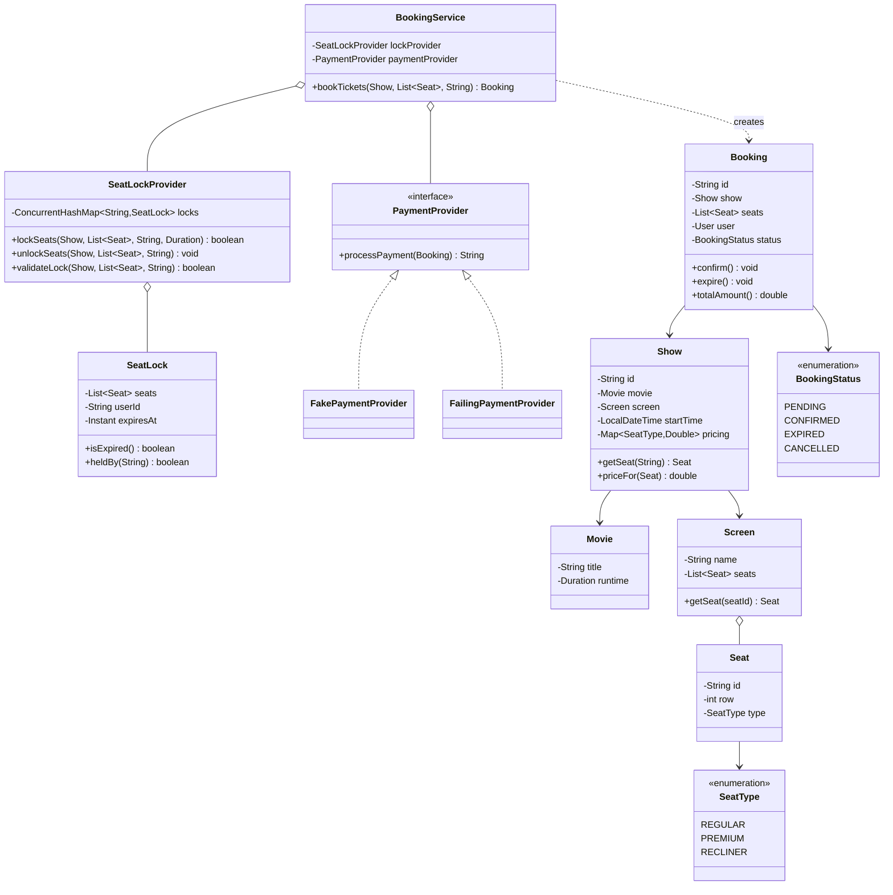

# 🎟️ Design BookMyShow — LLD Solution | Machine Coding Room Booking System (Java)
> **Related reading:** [Concurrency & Error Handling](../best-practices/error-handling.md) · [Testing Strategies](../best-practices/testing.md) · [Design Patterns → Creational (Singleton)](../design-patterns/creational/README.md) · [LLD Cheatsheet](../cheatsheet.md)

---

## 📋 Table of Contents

- [Problem Statement](#-problem-statement)
- [Step 1: Requirements & Clarifying Questions](#-step-1-requirements--clarifying-questions)
- [Step 2: Core Entities](#-step-2-core-entities)
- [Step 3: Design Approach](#-step-3-design-approach)
- [Step 4: Class Diagram](#-step-4-class-diagram)
- [Step 5: Complete Java Implementation](#-step-5-complete-java-implementation)
- [Step 6: Edge Cases & Common Pitfalls](#-step-6-edge-cases--common-pitfalls)
- [Step 7: Follow-up Questions](#-step-7-follow-up-questions)
- [Interview Takeaways](#-interview-takeaways)

---

## 🎯 Problem Statement

Design **BookMyShow**, a movie ticket booking system that supports:

- Browsing movies, theatres, and shows
- Viewing seat maps per show
- **Selecting seats with a temporary hold** (10-minute lock while paying)
- Completing payment and confirming the booking
- **Guaranteeing no double booking** even when thousands of users race for the same seats

This is the definitive **hard** machine coding problem — it is really a concurrency design question wearing a movie-theatre costume. Most of the score comes from the seat-locking flow.

---

## 📋 Step 1: Requirements & Clarifying Questions

| # | Clarifying Question | Typical Answer |
|---|--------------------|----------------|
| 1 | Seat hold duration? | 10 minutes; expires automatically if payment incomplete |
| 2 | Must the solution handle concurrent bookings for the same seat? | Yes — this is the core of the problem |
| 3 | Partial payments / multiple seats per booking? | One booking, many seats, single payment |
| 4 | Payment integration? | Stub interface — the flow must compensate (refund/cancel) on failure |
| 5 | What happens after seats are confirmed? | Irreversible for the demo; cancellation policy is a follow-up |
| 6 | Show seat availability — per theatre or per show? | **Per show** — the same physical seat is sold once per show |

**Out of scope:** auth, notifications, dynamic pricing (follow-up), seat-map UI.

---

## 🧱 Step 2: Core Entities

| Noun | Class | Key Methods |
|------|-------|-------------|
| Movie / Screen / Seat | `Movie`, `Screen`, `Seat` | — |
| Show | `Show` | movie + screen + start time + pricing |
| Seat lock | `SeatLock` | seats, user, expiry |
| Lock manager | `SeatLockProvider` | `lockSeats()`, `unlockSeats()`, `validateLock()` |
| Booking | `Booking` | `confirm()`, `expire()` |
| Booking service | `BookingService` | `bookTickets()` — orchestrates the whole flow |
| Payment | `PaymentProvider` (interface) | `processPayment()` |

---

## 🧩 Step 3: Design Approach

| Decision | Pattern / Principle | Why |
|----------|--------------------|-----|
| Atomic **all-or-nothing** seat locking | CAS on a concurrent map | Two users racing for overlapping seats: exactly one wins |
| Locks carry an **expiry timestamp** | TTL design | Crashed clients auto-release seats; no manual cleanup |
| Booking status enum: PENDING → CONFIRMED / EXPIRED / CANCELLED | **State machine** | Confirm validates locks are still held — payment time is bounded |
| `PaymentProvider` as interface with failure injection | **Strategy + DIP** | The orchestration is testable without real money |
| Compensation on every failure path | Error-handling discipline | Lock released, booking expired, user told *why* |
| `SeatLockProvider` separate from `BookingService` | **SRP** | Locking policy (TTL, atomicity) independent of booking rules |

**The interview-winning sentence:** *"Lock seats atomically with a TTL, create a PENDING booking, take payment, then re-validate the lock before confirming — if the lock expired mid-payment, the confirm fails cleanly and seats go back to the pool."*

---

## 📊 Step 4: Class Diagram



---

## 💻 Step 5: Complete Java Implementation

The demo runs **two threads racing for the same seats** (one must lose cleanly) and an **expired-lock** payment (confirm must fail and free the seats).

```java
import java.time.Duration;
import java.time.Instant;
import java.time.LocalDateTime;
import java.util.*;
import java.util.concurrent.*;
import java.util.concurrent.atomic.AtomicLong;

/* ================= Catalogue entities ================= */

enum SeatType { REGULAR, PREMIUM, RECLINER }

class Seat {
    private final String id;
    private final int row;
    private final SeatType type;

    Seat(String id, int row, SeatType type) {
        this.id = id;
        this.row = row;
        this.type = type;
    }
    String getId() { return id; }
    SeatType getType() { return type; }

    @Override
    public boolean equals(Object o) {
        return o instanceof Seat && id.equals(((Seat) o).id);
    }
    @Override
    public int hashCode() { return id.hashCode(); }
    @Override
    public String toString() { return id; }
}

class Movie {
    private final String title;
    Movie(String title) { this.title = title; }
    String getTitle() { return title; }
}

class Screen {
    private final String name;
    private final List<Seat> seats;

    Screen(String name, List<Seat> seats) {
        this.name = name;
        this.seats = List.copyOf(seats);
    }
    List<Seat> getSeats() { return seats; }
    Seat getSeat(String seatId) {
        return seats.stream().filter(s -> s.getId().equals(seatId)).findFirst()
                .orElseThrow(() -> new IllegalArgumentException("No seat " + seatId + " on " + name));
    }
}

class Show {
    private static final AtomicLong ID_GEN = new AtomicLong();

    private final String id = "S" + ID_GEN.incrementAndGet();
    private final Movie movie;
    private final Screen screen;
    private final LocalDateTime startTime;
    private final Map<SeatType, Double> pricing = Map.of(
            SeatType.REGULAR, 200.0, SeatType.PREMIUM, 350.0, SeatType.RECLINER, 500.0);

    Show(Movie movie, Screen screen, LocalDateTime startTime) {
        this.movie = movie;
        this.screen = screen;
        this.startTime = startTime;
    }
    Movie getMovie() { return movie; }
    Screen getScreen() { return screen; }
    double priceFor(Seat seat) { return pricing.get(seat.getType()); }
    String getId() { return id; }
}

/* ================= Seat locking ================= */

class SeatLock {
    private final List<Seat> seats;
    private final String userId;
    private final Instant expiresAt;

    SeatLock(List<Seat> seats, String userId, Instant expiresAt) {
        this.seats = List.copyOf(seats);
        this.userId = userId;
        this.expiresAt = expiresAt;
    }
    boolean isExpired() { return Instant.now().isAfter(expiresAt); }
    boolean heldBy(String user) { return this.userId.equals(user) && !isExpired(); }
    List<Seat> getSeats() { return seats; }
}

/**
 * Atomic, TTL-based seat lock registry.
 * Key: showId#seatId → the same physical seat can be sold once per show.
 */
class SeatLockProvider {
    private final ConcurrentHashMap<String, SeatLock> locks = new ConcurrentHashMap<>();

    private static String key(Show show, Seat seat) {
        return show.getId() + "#" + seat.getId();
    }

    /** All-or-nothing. Racer either locks every seat or none. */
    boolean lockSeats(Show show, List<Seat> seats, String userId, Duration ttl) {
        // Phase 1: fast pre-check (advisory only)
        for (Seat seat : seats) {
            SeatLock existing = locks.get(key(show, seat));
            if (existing != null && !existing.isExpired()
                    && !existing.heldBy(userId)) {
                return false; // someone else holds it
            }
        }
        SeatLock newLock = new SeatLock(seats, userId, Instant.now().plus(ttl));
        // Phase 2: atomic claim of every seat; roll back on any conflict
        List<String> claimed = new ArrayList<>();
        for (Seat seat : seats) {
            String k = key(show, seat);
            SeatLock prev = locks.putIfAbsent(k, newLock);
            if (prev == null || prev.heldBy(userId)) {
                claimed.add(k);          // fresh lock, or re-locking own seats
                locks.put(k, newLock);   // refresh own lock
            } else {
                claimed.forEach(locks::remove); // roll back partial claim
                return false;
            }
        }
        return true;
    }

    void unlockSeats(Show show, List<Seat> seats, String userId) {
        for (Seat seat : seats) {
            String k = key(show, seat);
            SeatLock lock = locks.get(k);
            if (lock != null && lock.heldBy(userId)) {
                locks.remove(k, lock); // conditional remove — never drop someone else's lock
            }
        }
    }

    boolean validateLock(Show show, List<Seat> seats, String userId) {
        for (Seat seat : seats) {
            SeatLock lock = locks.get(key(show, seat));
            if (lock == null || !lock.heldBy(userId)) return false;
        }
        return true;
    }
}

/* ================= Booking ================= */

enum BookingStatus { PENDING, CONFIRMED, EXPIRED, CANCELLED }

class Booking {
    private static final AtomicLong ID_GEN = new AtomicLong();

    private final String id = "B" + ID_GEN.incrementAndGet();
    private final Show show;
    private final List<Seat> seats;
    private final String userId;
    private BookingStatus status = BookingStatus.PENDING;

    Booking(Show show, List<Seat> seats, String userId) {
        this.show = show;
        this.seats = List.copyOf(seats);
        this.userId = userId;
    }

    synchronized void confirm() {
        if (status != BookingStatus.PENDING) {
            throw new IllegalStateException("Cannot confirm booking in state " + status);
        }
        status = BookingStatus.CONFIRMED;
    }

    synchronized void transitionTo(BookingStatus target) {
        if (status != BookingStatus.PENDING) {
            throw new IllegalStateException("Cannot move booking to " + target + " from " + status);
        }
        status = target;
    }

    double totalAmount() {
        return seats.stream().mapToDouble(show::priceFor).sum();
    }
    BookingStatus getStatus() { return status; }
    String getUserId() { return userId; }
    List<Seat> getSeats() { return seats; }
    Show getShow() { return show; }
    String getId() { return id; }
}

/* ================= Payments (stub) ================= */

interface PaymentProvider {
    /** Returns a payment reference. Throws on failure. */
    String processPayment(Booking booking, String userId);
}

class FakePaymentProvider implements PaymentProvider {
    @Override
    public String processPayment(Booking booking, String userId) {
        if (!booking.getUserId().equals(userId)) {
            throw new SecurityException("Payer does not own this booking");
        }
        return "PAY-" + booking.getId();
    }
}

/** Always fails — used to demo the compensation path. */
class FailingPaymentProvider implements PaymentProvider {
    @Override
    public String processPayment(Booking booking, String userId) {
        throw new RuntimeException("Card declined");
    }
}

/* ================= Booking service — the orchestrator ================= */

class BookingService {
    private final SeatLockProvider lockProvider = new SeatLockProvider();
    private final Set<String> confirmedSeatKeys = ConcurrentHashMap.newKeySet();
    private final Duration seatHoldDuration;
    private final PaymentProvider paymentProvider;

    BookingService(Duration seatHoldDuration, PaymentProvider paymentProvider) {
        this.seatHoldDuration = seatHoldDuration;
        this.paymentProvider = paymentProvider;
    }

    private static String confirmedKey(Show show, Seat seat) {
        return show.getId() + "#" + seat.getId();
    }

    boolean isSeatAvailable(Show show, Seat seat) {
        return !confirmedSeatKeys.contains(confirmedKey(show, seat));
    }

    /**
     * The full flow. Every failure path compensates:
     * locks released, booking expired, exception explains what happened.
     */
    public Booking bookTickets(Show show, List<Seat> seats, String userId) {
        if (seats.isEmpty()) throw new IllegalArgumentException("Select at least one seat");
        for (Seat seat : seats) {
            show.getScreen().getSeat(seat.getId()); // validate seat belongs to the screen
            if (!isSeatAvailable(show, seat)) {
                throw new IllegalStateException("Seat " + seat.getId() + " is already sold");
            }
        }

        // 1. Atomic hold
        if (!lockProvider.lockSeats(show, seats, userId, seatHoldDuration)) {
            throw new IllegalStateException("Seats " + seats + " were just taken by another user");
        }

        Booking booking = new Booking(show, seats, userId);
        try {
            // 2. Payment (bounded by the TTL in real life)
            String paymentRef = paymentProvider.processPayment(booking, userId);
            System.out.println("    payment ok: " + paymentRef);

            // 3. Re-validate the lock before confirming — it may have expired mid-payment
            if (!lockProvider.validateLock(show, seats, userId)) {
                booking.transitionTo(BookingStatus.EXPIRED);
                throw new IllegalStateException("Seat hold expired before payment completed — please retry");
            }

            // 4. Commit
            booking.confirm();
            seats.forEach(seat -> confirmedSeatKeys.add(confirmedKey(show, seat)));
            lockProvider.unlockSeats(show, seats, userId); // locks absorbed into confirmed state
            return booking;

        } catch (Exception e) {
            if (booking.getStatus() == BookingStatus.PENDING) {
                booking.transitionTo(BookingStatus.CANCELLED);
            }
            lockProvider.unlockSeats(show, seats, userId); // compensate
            throw e;
        }
    }

}

/* ================= Demo ================= */

public class Main {
    public static void main(String[] args) throws Exception {
        Movie movie = new Movie("Inception");
        List<Seat> screenSeats = new ArrayList<>();
        for (int row = 1; row <= 3; row++) {
            for (int col = 1; col <= 5; col++) {
                screenSeats.add(new Seat("R" + row + "C" + col, row,
                        row == 1 ? SeatType.REGULAR : SeatType.PREMIUM));
            }
        }
        Screen screen = new Screen("Audi 1", screenSeats);
        Show show = new Show(movie, screen, LocalDateTime.now().plusHours(3));

        // ── Scenario 1: two users race for the same seats ──
        System.out.println("── Race: Alice vs Bob for R2C1, R2C2 ──");
        BookingService service = new BookingService(Duration.ofMinutes(10), new FakePaymentProvider());

        List<Seat> contested = List.of(screen.getSeat("R2C1"), screen.getSeat("R2C2"));
        ExecutorService pool = Executors.newFixedThreadPool(2);
        Callable<String> alice = () -> {
            try {
                Booking b = service.bookTickets(show, contested, "alice");
                return "Alice CONFIRMED " + b.getId() + " for Rs." + b.totalAmount();
            } catch (Exception e) {
                return "Alice failed: " + e.getMessage();
            }
        };
        Callable<String> bob = () -> {
            try {
                Booking b = service.bookTickets(show, contested, "bob");
                return "Bob CONFIRMED " + b.getId();
            } catch (Exception e) {
                return "Bob failed: " + e.getMessage();
            }
        };
        for (Future<String> f : pool.invokeAll(List.of(alice, bob))) {
            System.out.println("  " + f.get());
        }
        pool.shutdown();

        // ── Scenario 2: lock expires mid-payment ──
        System.out.println("\n── Expired hold: 100ms TTL, slow payment ──");
        BookingService twitchy = new BookingService(Duration.ofMillis(100), new PaymentProvider() {
            @Override
            public String processPayment(Booking booking, String userId) {
                try { Thread.sleep(200); } catch (InterruptedException ignored) { }
                return "PAY-SLOW";
            }
        });
        try {
            twitchy.bookTickets(show, List.of(screen.getSeat("R1C1")), "carol");
        } catch (Exception e) {
            System.out.println("  Carol failed cleanly: " + e.getMessage());
        }
        System.out.println("  R1C1 available again? "
                + twitchy.isSeatAvailable(show, screen.getSeat("R1C1")));

        // ── Scenario 3: payment fails → compensation ──
        System.out.println("\n── Failed payment: refund path ──");
        BookingService flaky = new BookingService(Duration.ofMinutes(10), new FailingPaymentProvider());
        try {
            flaky.bookTickets(show, List.of(screen.getSeat("R3C5")), "dave");
        } catch (Exception e) {
            System.out.println("  Dave failed cleanly: " + e.getMessage());
        }
        System.out.println("  R3C5 available again? "
                + flaky.isSeatAvailable(show, screen.getSeat("R3C5")));
    }
}
```

> All classes live in one file as package-private types so the demo compiles standalone. The `AtomicLong` here refers to `java.util.concurrent.atomic.AtomicLong` — add that import if you split the file.

---

## ⚠️ Step 6: Edge Cases & Common Pitfalls

| Pitfall | Why it matters | Fix shown in code |
|---------|---------------|-------------------|
| Check-then-book without atomicity | Two users both "succeed" → double sale | `ConcurrentHashMap.putIfAbsent` claim + rollback |
| Locks without TTL | Crashed client holds seats forever | `expiresAt` timestamp, expired locks lose protection |
| No re-validation after payment | Payment can outlive the 10-min hold | `validateLock` before `confirm()` |
| Releasing a rival's lock on failure | One user's crash frees another's seats | Conditional remove: only if `heldBy(userId)` |
| Booking confirmed but seats never marked sold | Ghost bookings | Commit step writes `confirmedSeatKeys` atomically after validation |
| Failure leaves PENDING booking + lock held | Seats leak | `catch` → transition to CANCELLED + unlock (compensation) |
| Same seat sold twice across shows | Availability model wrong | Keys are `showId#seatId` — availability is per show |
| Non-thread-safe `Booking` status | Races between confirm/expire | `synchronized` transitions + legal-transition guard |

---

## ❓ Step 7: Follow-up Questions

**1. Distributed deployment (many servers)?**
Replace the in-memory lock map with **Redis `SET key value NX PX ttl`** per seat, or a DB row lock (`SELECT ... FOR UPDATE`) on a `show_seats` table with status = LOCKED/BOOKED. Same flow, different lock provider — the interface already isolates it.

**2. Waitlist when a show sells out?**
`Waitlist` per show (FIFO); on cancellation, the first waiter gets a hold automatically for X minutes. Observer-style: cancellation event → notifier → auto-lock.

**3. Dynamic / surge pricing?**
`PricingStrategy` per show: base price + demand multiplier + time-to-show decay. The `Show.priceFor` delegation point absorbs it.

**4. Idempotent payments (double-click on Pay)?**
Idempotency key = booking id; payment provider deduplicates. A booking can only transition PENDING → CONFIRMED once — the state machine enforces it.

**5. What if the server crashes after payment but before confirm?**
Reconciliation job: bookings PENDING with a successful payment reference but expired locks → auto-confirm + mark seats sold, or auto-refund, per policy. Write-ahead: persist payment reference on the PENDING booking *before* calling the gateway.

**6. Seat map for 500 seats re-rendered per second?**
Cache availability per show, invalidate on commit; serve versioned snapshots; optimistic UI holds. That's the HLD extension — say so and stop.

---

## 🎯 Interview Takeaways

- The **locking flow** *is* the interview: atomic hold → pay → re-validate → commit, with compensation on every failure path. Say the sentence, then code it.
- **Per-show availability** (`showId#seatId` keys) is the modeling insight most candidates miss.
- TTL'd locks + clean expiry handling shows you design for **crashed clients**, not just rival users.
- Demonstrating the race with two threads in `Main` — instead of claiming it works — is the strongest possible close.

---

← [Back to all solutions](README.md) · [Next: Vending Machine →](README.md#-problem-index)
