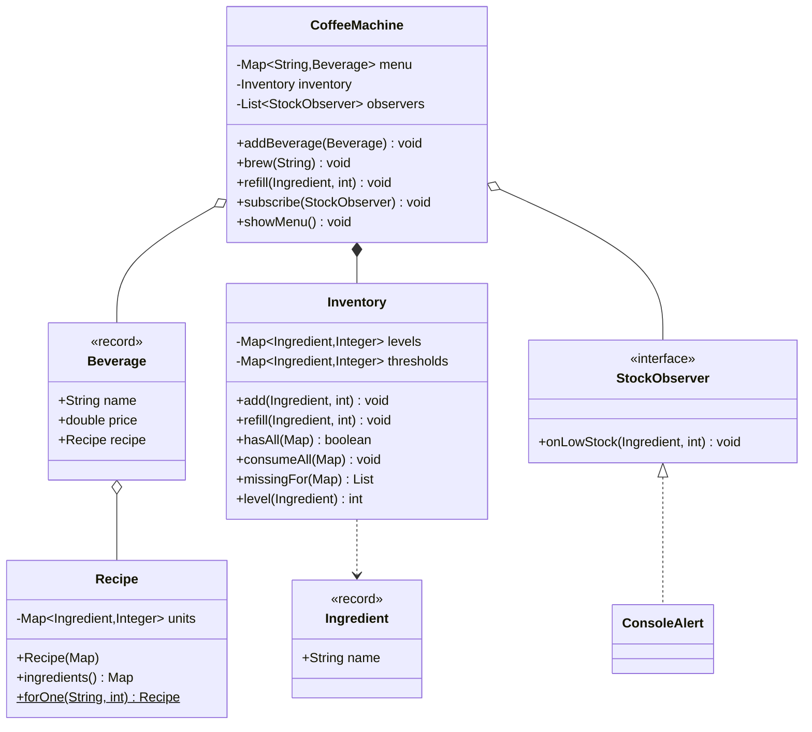

# ☕ Design a Coffee Vending Machine — LLD Solution | Machine Coding Interview Guide (Java)

> **Related reading:** [Observer Pattern — Behavioral Patterns](../design-patterns/behavioral/README.md) · [Strategy Pattern](../design-patterns/behavioral/README.md) · [Error Handling](../best-practices/error-handling.md) · [LLD Cheatsheet](../cheatsheet.md)

---

## 📋 Table of Contents

- [Problem Statement](#-problem-statement)
- [Step 1: Requirements & Clarifying Questions](#-step-1-requirements--clarifying-questions)
- [Step 2: Core Entities](#-step-2-core-entities)
- [Step 3: Design Approach](#-step-3-design-approach)
- [Step 4: Class Diagram](#-step-4-class-diagram)
- [Step 5: Complete Java Implementation](#-step-5-complete-java-implementation)
- [Step 6: Edge Cases & Common Pitfalls](#-step-6-edge-cases--common-pitfalls)
- [Step 7: Follow-up Questions](#-step-7-follow-up-questions)
- [Interview Takeaways](#-interview-takeaways)

---

## 🎯 Problem Statement

Design a **coffee/beverage vending machine** that supports:

- A menu of beverages, each with a **recipe** (multiple ingredients with quantities)
- Brewing a drink only if **every** ingredient is in stock
- **Atomic inventory decrement** — a failed brew leaves ingredients untouched
- **Low-stock alerts** when an ingredient runs low
- Refilling ingredients

This is the Vending Machine's richer cousin — instead of one product per slot, each drink consumes from *shared* ingredient pools. It tests **composition** (recipe as data), **all-or-nothing inventory**, and **Observer** for alerts.

---

## 📋 Step 1: Requirements & Clarifying Questions

| # | Clarifying Question | Typical Answer |
|---|--------------------|----------------|
| 1 | Payment built in? | Separate concern — assume paid at the door; extend like the coin machine if asked |
| 2 | Can two drinks brew at once? | Demo is single-threaded; concurrency is the follow-up |
| 3 | What if one ingredient is missing? | Reject the whole drink — no partial brewing |
| 4 | When do low-stock alerts fire? | After each successful brew, when a level crosses its threshold |
| 5 | Refunds on machine failure mid-brew? | Out of scope; payment failures follow the BookMyShow compensation pattern |

---

## 🧱 Step 2: Core Entities

| Noun | Class | Key Methods |
|------|-------|-------------|
| Ingredient | `Ingredient` (record) | name |
| Stock level | `Inventory` | `has()`, `consume()`, `refill()` |
| Recipe | `Recipe` | map of ingredient → units |
| Beverage | `Beverage` (record) | name, price, recipe |
| Alert | `StockObserver` | `onLowStock()` |
| Machine | `CoffeeMachine` | `brew()`, `refill()`, `showMenu()` |

---

## 🧩 Step 3: Design Approach

| Decision | Pattern / Principle | Why |
|----------|--------------------|-----|
| Recipe as data (Map), not code | Clean modeling | Adding a drink = adding an object, zero code change (**OCP**) |
| Check-then-consume under one lock | Atomic inventory | No partial brews, no double-spend of stock |
| `StockObserver` interface | **Observer** | Display, telemetry, refill service subscribe; machine never knows |
| Per-ingredient low threshold | Configurable policy | Alerts are data, not hardcoded ifs |
| `Beverage`/`Ingredient` as records | Value semantics | Menu items are immutable data |
| Machine delegates, doesn't compute | **SRP** | Inventory math lives in `Inventory` |

---

## 📊 Step 4: Class Diagram



---

## 💻 Step 5: Complete Java Implementation

```java
import java.util.*;

/* ================= Value types ================= */

record Ingredient(String name) {
    Ingredient {
        Objects.requireNonNull(name, "Ingredient name required");
    }
    @Override
    public String toString() { return name; }
}

record Beverage(String name, double price, Recipe recipe) {
    Beverage {
        if (price < 0) throw new IllegalArgumentException("Price must be non-negative");
        Objects.requireNonNull(recipe, "Recipe required");
    }
}

/** Immutable map of ingredient → units per serving. */
final class Recipe {
    private final Map<Ingredient, Integer> units;

    Recipe(Map<Ingredient, Integer> units) {
        if (units == null || units.isEmpty()) {
            throw new IllegalArgumentException("Recipe needs at least one ingredient");
        }
        for (Integer q : units.values()) {
            if (q <= 0) throw new IllegalArgumentException("Quantities must be positive");
        }
        this.units = Map.copyOf(units);
    }

    Map<Ingredient, Integer> ingredients() { return units; }
}

/* ================= Inventory — atomic pools ================= */

class Inventory {
    private final Map<Ingredient, Integer> levels = new HashMap<>();
    private final Map<Ingredient, Integer> thresholds = new HashMap<>();

    void add(Ingredient ingredient, int quantity, int lowStockThreshold) {
        if (quantity < 0 || lowStockThreshold < 0) {
            throw new IllegalArgumentException("Quantities and thresholds are non-negative");
        }
        levels.merge(ingredient, quantity, Integer::sum);
        thresholds.putIfAbsent(ingredient, lowStockThreshold);
    }

    void refill(Ingredient ingredient, int quantity) {
        if (quantity <= 0) throw new IllegalArgumentException("Refill must be positive");
        if (!levels.containsKey(ingredient)) {
            throw new IllegalArgumentException("Unknown ingredient: " + ingredient);
        }
        levels.merge(ingredient, quantity, Integer::sum);
    }

    List<Ingredient> missingFor(Map<Ingredient, Integer> required) {
        List<Ingredient> missing = new ArrayList<>();
        for (Map.Entry<Ingredient, Integer> e : required.entrySet()) {
            if (levels.getOrDefault(e.getKey(), 0) < e.getValue()) {
                missing.add(e.getKey());
            }
        }
        return missing;
    }

    boolean hasAll(Map<Ingredient, Integer> required) {
        return missingFor(required).isEmpty();
    }

    /** All-or-nothing consumption. Caller checks hasAll first. */
    void consumeAll(Map<Ingredient, Integer> required) {
        List<Ingredient> missing = missingFor(required);
        if (!missing.isEmpty()) {
            throw new IllegalStateException("Insufficient: " + missing);
        }
        required.forEach((ingredient, qty) -> levels.merge(ingredient, -qty, Integer::sum));
    }

    int level(Ingredient ingredient) { return levels.getOrDefault(ingredient, 0); }
    int threshold(Ingredient ingredient) { return thresholds.getOrDefault(ingredient, 0); }
    Set<Ingredient> knownIngredients() { return Set.copyOf(levels.keySet()); }
}

/* ================= Observer ================= */

interface StockObserver {
    void onLowStock(Ingredient ingredient, int remaining);
}

class ConsoleAlert implements StockObserver {
    @Override
    public void onLowStock(Ingredient ingredient, int remaining) {
        System.out.println("    🚨 LOW STOCK: " + ingredient + " down to " + remaining);
    }
}

/* ================= Machine ================= */

class CoffeeMachine {
    private final Map<String, Beverage> menu = new LinkedHashMap<>();
    private final Inventory inventory = new Inventory();
    private final List<StockObserver> observers = new ArrayList<>();

    void subscribe(StockObserver observer) {
        observers.add(observer);
    }

    void addBeverage(Beverage beverage) {
        menu.put(beverage.name(), beverage);
    }

    void showMenu() {
        System.out.println("  Menu:");
        menu.forEach((name, beverage) -> System.out.printf(
                "   %-10s Rs.%6.2f  (%s)%n", name, beverage.price(),
                beverage.recipe().ingredients()));
    }

    void brew(String beverageName) {
        Beverage beverage = menu.get(beverageName);
        if (beverage == null) {
            throw new IllegalArgumentException("Unknown beverage: " + beverageName);
        }
        Map<Ingredient, Integer> required = beverage.recipe().ingredients();

        List<Ingredient> missing = inventory.missingFor(required);
        if (!missing.isEmpty()) {
            throw new IllegalStateException(
                    beverageName + " unavailable — out of: " + missing);
        }

        inventory.consumeAll(required);   // atomic
        System.out.println("  ☕ Brewing " + beverageName + " … done");

        notifyLowStock(required);
    }

    private void notifyLowStock(Map<Ingredient, Integer> consumed) {
        for (Ingredient ingredient : consumed.keySet()) {
            int remaining = inventory.level(ingredient);
            if (remaining <= inventory.threshold(ingredient)) {
                observers.forEach(o -> o.onLowStock(ingredient, remaining));
            }
        }
    }

    void refill(String ingredientName, int quantity) {
        inventory.refill(new Ingredient(ingredientName), quantity);
        System.out.println("  ⛽ refilled " + ingredientName + " +" + quantity);
    }

    Inventory getInventory() { return inventory; }
}

/* ================= Demo ================= */

public class Main {
    public static void main(String[] args) {
        CoffeeMachine machine = new CoffeeMachine();
        machine.subscribe(new ConsoleAlert());

        machine.getInventory().add(new Ingredient("water"), 500, 100);
        machine.getInventory().add(new Ingredient("milk"), 300, 80);
        machine.getInventory().add(new Ingredient("coffee"), 100, 20);
        machine.getInventory().add(new Ingredient("sugar"), 80, 15);

        machine.addBeverage(new Beverage("Espresso", 60.0, new Recipe(Map.of(
                new Ingredient("coffee"), 8, new Ingredient("water"), 30))));
        machine.addBeverage(new Beverage("Latte", 90.0, new Recipe(Map.of(
                new Ingredient("coffee"), 8, new Ingredient("water"), 25,
                new Ingredient("milk"), 60))));
        machine.addBeverage(new Beverage("Cold Brew", 110.0, new Recipe(Map.of(
                new Ingredient("coffee"), 12, new Ingredient("water"), 60))));

        machine.showMenu();

        System.out.println("\n── Happy path ──");
        machine.brew("Latte");
        machine.brew("Espresso");

        System.out.println("\n── Ingredient exhaustion ──");
        try {
            machine.brew("Cold Brew");   // needs milk? no — needs coffee+water only, fine
            machine.brew("Latte");       // milk at 240 → fine
            for (int i = 0; i < 3; i++) machine.brew("Latte"); // drives milk down
            machine.brew("Latte");       // finally short on milk
        } catch (IllegalStateException e) {
            System.out.println("  blocked: " + e.getMessage());
        }

        System.out.println("\n── Unknown drink ──");
        try {
            machine.brew("Masala Chai");
        } catch (IllegalArgumentException e) {
            System.out.println("  rejected: " + e.getMessage());
        }

        System.out.println("\n── Refill and retry ──");
        machine.refill("milk", 200);
        machine.brew("Latte");

        System.out.println("\n── Remaining levels ──");
        machine.getInventory().knownIngredients().forEach(i ->
                System.out.println("   " + i + ": " + machine.getInventory().level(i)));
    }
}
```

---

## ⚠️ Step 6: Edge Cases & Common Pitfalls

| Pitfall | Why it matters | Fix shown in code |
|---------|---------------|-------------------|
| Consuming ingredients one-by-one, failing mid-way | Machine left with partial inventory state | `hasAll` gate → `consumeAll` atomic decrement |
| Recipe as if/else per drink | Every new drink edits the machine | Recipe is data; menu is a map (**OCP**) |
| Alerts checked only when level hits exactly 0 | Operators get no lead time | Threshold-per-ingredient, checked after every brew |
| Shared `Ingredient` instances with different names ("Water" vs "water") | Pools fragment silently | Record equality is by name — keep names canonical |
| Mutating a shared `Recipe` map | One drink's recipe changes globally | `Map.copyOf` immutability in the record |
| Refilling an unknown ingredient | Typo creates a phantom pool | `refill` rejects unknown names |
| Machine computes inventory math inline | Untestable, mixed concerns | All math in `Inventory` (**SRP**) |

---

## ❓ Step 7: Follow-up Questions

**1. Concurrent brewing?** Guard `brew` with a per-machine lock, or finer: per-ingredient `Semaphore`s/locks since ingredients are independent pools. Deadlock note: always acquire in a deterministic order (e.g., ingredient name) — classic dining-philosophers avoidance.

**2. Payment integration?** Insert a `PaymentProvider` before `brew`, exactly the BookMyShow flow: hold → pay → verify → consume. On payment failure, nothing was consumed — order the steps so the free path stays free.

**3. Optimized ingredient warnings at scale (the famous Flipkart variant)?** With N outlets and parallel requests, per-outlet `Inventory` under its own lock; a central `AnalyticsService` subscribes to all outlets (Observer) and aggregates. Classic writeup: " beverage machine with concurrent requests" — mention thread-safe decrement (AtomicInteger per ingredient) + atomic `hasAll`-check via a single machine-level lock for cross-ingredient consistency.

**4. Dispensing multiple drinks from one order?** Loop with per-drink failure semantics: either all-or-nothing pre-check across every recipe, or best-effort with a refund for failed lines — ask which policy the interviewer wants; that question itself scores.

**5. Custom recipes per user?** `Recipe` is already data — a user override is just another `Recipe` object passed to `brew`; no class explosion.

**6. How to test?** Inventory is pure → table-driven tests (levels, required, expected missing). Machine tests inject a fake `StockObserver` and assert alert calls. Recipe immutability tests guard against aliasing bugs.

---

## 🎯 Interview Takeaways

- **Recipe-as-data** is the headline: new drinks with zero code changes is the OCP flex this problem exists to test.
- **All-or-nothing inventory** — say "atomic" and "no partial brew" explicitly.
- Observer alerts show production thinking; per-ingredient thresholds make it configurable rather than hardcoded.
- This problem connects to two others in the series: payment flow = BookMyShow's, state handling = Vending Machine's — pointing that out shows systems thinking.

---

← [Back to all solutions](README.md) · [Up next: Chess →](README.md#-problem-index)
