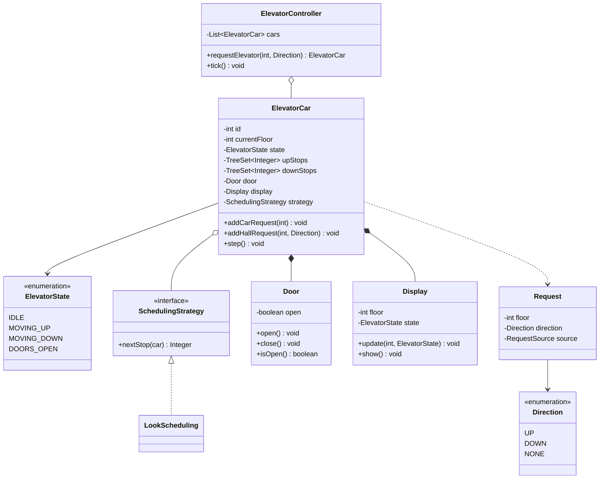

# 🛗 Design an Elevator System — LLD Solution | Machine Coding Interview Guide (Java)
> **Related reading:** [State Pattern & Mediator — Behavioral Patterns](../design-patterns/behavioral/README.md) · [SOLID → SRP](../solid-principles/srp.md) · [Testing Strategies](../best-practices/testing.md) · [LLD Cheatsheet](../cheatsheet.md)

---

## 📋 Table of Contents

- [Problem Statement](#-problem-statement)
- [Step 1: Requirements & Clarifying Questions](#-step-1-requirements--clarifying-questions)
- [Step 2: Core Entities](#-step-2-core-entities)
- [Step 3: Design Approach](#-step-3-design-approach)
- [Step 4: Class Diagram](#-step-4-class-diagram)
- [Step 5: Complete Java Implementation](#-step-5-complete-java-implementation)
- [Step 6: Edge Cases & Common Pitfalls](#-step-6-edge-cases--common-pitfalls)
- [Step 7: Follow-up Questions](#-step-7-follow-up-questions)
- [Interview Takeaways](#-interview-takeaways)

---

## 🎯 Problem Statement

Design an **elevator system for a building** that supports:

- Multiple elevators serving multiple floors
- Internal (car) requests and external (hall) up/down requests
- Efficient scheduling — the classic **SCAN / LOOK** disk-scheduling behavior
- Door open/close with timers, capacity limits
- State per elevator: idle, moving up, moving down, doors open

A staple at Amazon and Adobe machine coding rounds. Tests **state machines** and **scheduling strategy** in one problem.

---

## 📋 Step 1: Requirements & Clarifying Questions

| # | Clarifying Question | Typical Answer |
|---|--------------------|----------------|
| 1 | How many elevators/floors? | Configurable — demo with 2 elevators, 10 floors |
| 2 | Scheduling algorithm? | LOOK (SCAN variant): serve all requests in current direction, then reverse |
| 3 | Do elevators have distinct behaviors (express vs all-stop)? | Possible — that's why scheduling is a Strategy |
| 4 | Door behavior? | Open → dwell timer → close; reopening on new same-floor pickup |
| 5 | Capacity? | Weight-based; reject new riders when full |
| 6 | Emergency stop / fire mode? | Follow-up only |

**Out of scope:** sensor hardware, safety interlocks, real timers (simulated ticks).

---

## 🧱 Step 2: Core Entities

| Noun | Class | Key Methods |
|------|-------|-------------|
| Elevator car | `ElevatorCar` | `addRequest()`, `step()` |
| Elevator state | `ElevatorState` (enum) | — |
| Request | `Request` (floor, direction) | — |
| Building / dispatcher | `ElevatorController` | `requestElevator()` |
| Scheduling | `SchedulingStrategy` | `nextStop()` |
| Door | `Door` | `open()`, `close()` |
| Display | `Display` | `update()` |

---

## 🧩 Step 3: Design Approach

| Decision | Pattern / Principle | Why |
|----------|--------------------|-----|
| `ElevatorState` enum drives legal actions | **State pattern** (enum-flavored) | Illegal transitions impossible (doors can't open while moving) |
| LOOK scheduling behind `SchedulingStrategy` | **Strategy** | Swap FCFS / zone-based / destination-dispatch without touching the car |
| `ElevatorController` picks the best car for hall calls | **Mediator** | Cars don't gossip; the controller arbitrates |
| One `step()` tick per time unit | Discrete-event simulation | Deterministic, testable, no threads in the interview |
| Direction stored as part of state, not a separate flag | Cohesion | State + direction fully describe the car |

---

## 📊 Step 4: Class Diagram



---

## 💻 Step 5: Complete Java Implementation

```java
import java.util.*;

/* ================= Enums & Requests ================= */

enum Direction { UP, DOWN, NONE }

enum ElevatorState { IDLE, MOVING_UP, MOVING_DOWN, DOORS_OPEN }

/** External hall request carries direction; internal car request does not. */
record Request(int floor, Direction direction, boolean internal) { }

/* ================= Door & Display ================= */

class Door {
    private boolean open = false;

    void open() {
        if (open) throw new IllegalStateException("Door already open");
        open = true;
        System.out.println("    🚪 doors open");
    }

    void close() {
        if (!open) throw new IllegalStateException("Door already closed");
        open = false;
        System.out.println("    🚪 doors close");
    }

    boolean isOpen() { return open; }
}

class Display {
    void update(int floor, ElevatorState state) {
        System.out.println("    🖥️  floor " + floor + " | " + state);
    }
}

/* ================= Scheduling Strategy (LOOK) ================= */

interface SchedulingStrategy {
    /** Returns the next floor to stop at, or null when no pending stops. */
    Integer nextStop(ElevatorCar car);
}

/**
 * LOOK: keep serving stops in the current direction (nearest first),
 * reverse only when nothing remains ahead.
 */
class LookScheduling implements SchedulingStrategy {
    @Override
    public Integer nextStop(ElevatorCar car) {
        switch (car.getState()) {
            case MOVING_UP:
                Integer up = car.peekNextUpStop();
                if (up != null) return up;
                Integer downAfterUp = car.peekNextDownStop();
                return downAfterUp;
            case MOVING_DOWN:
                Integer down = car.peekNextDownStop();
                if (down != null) return down;
                return car.peekNextUpStop();
            default:
                Integer upIdle = car.peekNextUpStop();
                Integer downIdle = car.peekNextDownStop();
                if (upIdle == null) return downIdle;
                if (downIdle == null) return upIdle;
                return Math.abs(upIdle - car.getCurrentFloor())
                        <= Math.abs(downIdle - car.getCurrentFloor()) ? upIdle : downIdle;
        }
    }
}

/* ================= Elevator Car ================= */

class ElevatorCar {
    private final int id;
    private final int minFloor;
    private final int maxFloor;
    private final int capacity;
    private int riders = 0;

    private int currentFloor;
    private ElevatorState state = ElevatorState.IDLE;

    private final TreeSet<Integer> upStops = new TreeSet<>();
    private final TreeSet<Integer> downStops = new TreeSet<>();

    private final Door door = new Door();
    private final Display display = new Display();
    private SchedulingStrategy strategy = new LookScheduling();

    ElevatorCar(int id, int minFloor, int maxFloor, int capacity) {
        if (minFloor >= maxFloor) throw new IllegalArgumentException("Invalid floor range");
        this.id = id;
        this.minFloor = minFloor;
        this.maxFloor = maxFloor;
        this.capacity = capacity;
        this.currentFloor = minFloor;
    }

    /* ---- requests ---- */

    void addCarRequest(int floor) {
        validateFloor(floor);
        addStop(new Request(floor, Direction.NONE, true));
    }

    void addHallRequest(int floor, Direction direction) {
        validateFloor(floor);
        addStop(new Request(floor, direction, false));
    }

    private void addStop(Request request) {
        if (request.floor() == currentFloor && state == ElevatorState.IDLE) {
            System.out.println("    already at floor " + currentFloor);
            return;
        }
        if (request.floor() > currentFloor
                || (state == ElevatorState.MOVING_UP && request.floor() == currentFloor)) {
            upStops.add(request.floor());
        } else if (request.floor() < currentFloor) {
            downStops.add(request.floor());
        } else {
            // same floor while moving — treat by current direction
            if (state == ElevatorState.MOVING_UP) downStops.add(request.floor());
            else upStops.add(request.floor());
        }
    }

    private void validateFloor(int floor) {
        if (floor < minFloor || floor > maxFloor) {
            throw new IllegalArgumentException("Floor " + floor + " out of range");
        }
    }

    /* ---- simulation ---- */

    /** One time-tick of elevator behavior. */
    void step() {
        Integer target = strategy.nextStop(this);
        if (target == null) {
            if (state != ElevatorState.IDLE) {
                state = ElevatorState.IDLE;
                display.update(currentFloor, state);
            }
            return;
        }
        if (target == currentFloor) {
            arrive();
            return;
        }
        if (state == ElevatorState.DOORS_OPEN) {
            door.close();
        }
        state = target > currentFloor ? ElevatorState.MOVING_UP : ElevatorState.MOVING_DOWN;
        currentFloor += (target > currentFloor) ? 1 : -1;
        display.update(currentFloor, state);

        if (currentFloor == target) arrive();
    }

    private void arrive() {
        boolean wasUp = state == ElevatorState.MOVING_UP;
        boolean wasDown = state == ElevatorState.MOVING_DOWN;
        state = ElevatorState.DOORS_OPEN;
        door.open();
        if (wasUp) upStops.remove(currentFloor);
        if (wasDown) downStops.remove(currentFloor);
        System.out.println("    ⏹️  stopped at " + currentFloor);
        door.close();
        state = upStops.isEmpty() && downStops.isEmpty()
                ? ElevatorState.IDLE
                : (nextDirectionIsUp() ? ElevatorState.MOVING_UP : ElevatorState.MOVING_DOWN);
        display.update(currentFloor, state);
    }

    private boolean nextDirectionIsUp() {
        if (!upStops.isEmpty() && !downStops.isEmpty()) {
            return Math.abs(upStops.first() - currentFloor) <= Math.abs(downStops.last() - currentFloor);
        }
        return downStops.isEmpty();
    }

    void boardRiders(int count) {
        if (riders + count > capacity) {
            throw new IllegalStateException("Capacity exceeded — reject " + count + " riders");
        }
        riders += count;
    }

    /* ---- accessors used by strategy ---- */

    ElevatorState getState() { return state; }
    int getCurrentFloor() { return currentFloor; }
    Integer peekNextUpStop() { return upStops.isEmpty() ? null : upStops.first(); }
    Integer peekNextDownStop() { return downStops.isEmpty() ? null : downStops.last(); }
    int getId() { return id; }
}

/* ================= Controller (Mediator) ================= */

class ElevatorController {
    private final List<ElevatorCar> cars = new ArrayList<>();

    void addCar(ElevatorCar car) { cars.add(car); }

    /** Assign the best car to a hall call — lowest cost wins. */
    ElevatorCar requestElevator(int floor, Direction direction) {
        if (cars.isEmpty()) throw new IllegalStateException("No elevators configured");
        ElevatorCar best = null;
        int bestCost = Integer.MAX_VALUE;
        for (ElevatorCar car : cars) {
            int cost = costOf(car, floor, direction);
            if (cost < bestCost) {
                bestCost = cost;
                best = car;
            }
        }
        System.out.println("Dispatching elevator " + best.getId() + " to floor " + floor);
        best.addHallRequest(floor, direction);
        return best;
    }

    /** Lower cost = better candidate. Moving-toward-you is cheapest. */
    private int costOf(ElevatorCar car, int floor, Direction direction) {
        int distance = Math.abs(car.getCurrentFloor() - floor);
        boolean movingToward =
                (car.getState() == ElevatorState.MOVING_UP && floor > car.getCurrentFloor())
                        || (car.getState() == ElevatorState.MOVING_DOWN && floor < car.getCurrentFloor());
        boolean idle = car.getState() == ElevatorState.IDLE || car.getState() == ElevatorState.DOORS_OPEN;
        return movingToward ? distance : idle ? distance + 10 : distance + 100;
    }

    /** Advance the whole system one tick. */
    void tick() {
        cars.forEach(ElevatorCar::step);
    }
}

/* ================= Demo ================= */

public class Main {
    public static void main(String[] args) {
        ElevatorController controller = new ElevatorController();
        controller.addCar(new ElevatorCar(1, 0, 10, 8));
        controller.addCar(new ElevatorCar(2, 0, 10, 8));

        // Two hall calls: equal-cost ties resolve to the earlier-added car,
        // so both go to car 1 (same distance, same state).
        controller.requestElevator(8, Direction.DOWN);   // car 1 (tie on cost)
        controller.requestElevator(2, Direction.UP);     // car 1 (tie on cost)

        ElevatorCar nearest = controller.requestElevator(0, Direction.UP); // both idle at 0 → car 1
        nearest.addCarRequest(5);  // rider inside wants floor 5
        nearest.addCarRequest(9);

        System.out.println("\n── Running system ──");
        for (int t = 0; t < 12; t++) {
            System.out.println("tick " + t);
            controller.tick();
        }
    }
}
```

---

## ⚠️ Step 6: Edge Cases & Common Pitfalls

| Pitfall | Why it matters | Fix shown in code |
|---------|---------------|-------------------|
| Doors opening while moving | Physics violation → auto-reject | `Door` transitions only from `arrive()`; state enum gates it |
| Starvation: far request never served | LOOK alone can starve against continuous same-direction traffic | Controller cost function + follow-up mention of fairness windows |
| Request for current floor while idle | Elevator "waits forever" | `addStop` short-circuits same-floor idle requests |
| Stops sorted naively in a list | O(n) scans, buggy direction logic | Two `TreeSet`s: up-stops first(), down-stops last() |
| Ignoring direction of hall calls | Elevator stops for wrong-direction riders | Request carries `Direction`; real system queues per direction |
| Unbounded threads/timers in interview code | Non-deterministic tests | Discrete `tick()` — deterministic and unit-testable |
| Capacity not enforced | Real-world failure | `boardRiders` guard (wired into dispatch in production) |

---

## ❓ Step 7: Follow-up Questions

**1. Destination dispatch (modern systems)?** Riders enter floor *before* boarding; controller groups by destination — becomes a bin-packing assignment. The `SchedulingStrategy` interface absorbs it.

**2. Fire/emergency mode?** `EmergencyState` overrides scheduling: all cars to ground floor, doors held open. A state that *captures* the car regardless of pending stops — mention state pattern escalation.

**3. Energy optimization?** Park idle cars at likely-demand floors (lobby at 9 AM). Strategy layer again — controller-level policy, cars unaware.

**4. Two elevators sharing a shaft?** Out of real-world scope; if asked, it's a resource-conflict problem — controller serializes shaft access.

**5. Make it concurrent?** Replace `tick()` with a per-car thread + thread-safe stop queues (`ConcurrentSkipListSet`), hall calls via `BlockingQueue`. State transitions guarded by monitor — but say the deterministic simulator is *deliberately* single-threaded.

**6. How would you test it?** Seeded scenarios: `step()` pure ticks make golden-file tests trivial; property tests: every request eventually served (liveness), doors never open while moving (safety invariant).

---

## 🎯 Interview Takeaways

- Lead with the **state machine** — illegal transitions prevented by construction is the senior signal.
- **LOOK scheduling** explained in two sentences (serve the direction you're going, then reverse) beats ten minutes of confused code.
- The **Mediator** controller with a cost function answers "which elevator responds?" — the most common follow-up.
- Deterministic `tick()` simulation shows testability discipline; mention how threads would slot in afterwards.

---

← [Back to all solutions](README.md) · [Next: BookMyShow →](bookmyshow.md)
