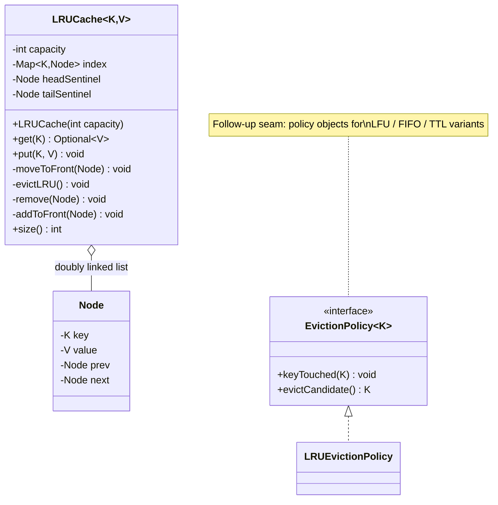

# 🗃️ Design LRU Cache — LLD Solution | O(1) Get and Put Machine Coding Guide (Java)

> **Related reading:** [Classes & Objects](../ood-basics/classes-and-objects.md) · [Encapsulation](../ood-basics/encapsulation.md) · [LLD Cheatsheet](../cheatsheet.md)

---

## 📋 Table of Contents

- [Problem Statement](#-problem-statement)
- [Step 1: Requirements & Clarifying Questions](#-step-1-requirements--clarifying-questions)
- [Step 2: Core Entities](#-step-2-core-entities)
- [Step 3: Design Approach](#-step-3-design-approach)
- [Step 4: Class Diagram](#-step-4-class-diagram)
- [Step 5: Complete Java Implementation](#-step-5-complete-java-implementation)
- [Step 6: Edge Cases & Common Pitfalls](#-step-6-edge-cases--common-pitfalls)
- [Step 7: Follow-up Questions](#-step-7-follow-up-questions)
- [Interview Takeaways](#-interview-takeaways)

---

## 🎯 Problem Statement

Design a **Least Recently Used (LRU) cache** with capacity `C` that supports:

- `get(key)` → value, or null/`Optional` if absent — **O(1)**
- `put(key, value)` → insert or update — **O(1)**
- When at capacity, a new insert evicts the **least recently used** entry
- Both `get` and `put` count as "use" (refresh recency)

The highest-frequency data-structure-flavored LLD question — it appears both as a machine coding exercise and as the cache layer inside bigger designs (BookMyShow seat maps, Splitwise user lookups).

---

## 📋 Step 1: Requirements & Clarifying Questions

| # | Clarifying Question | Typical Answer |
|---|--------------------|----------------|
| 1 | Capacity bound — entries or memory bytes? | Entry count; bytes = a wrapper adding size accounting |
| 2 | Null keys or values? | Keys non-null; null values allowed via `Optional` at the API edge |
| 3 | Thread-safe required? | Single-threaded core; concurrent wrapper is the follow-up |
| 4 | TTL/expiry? | Out of scope for core LRU — classic follow-up |
| 5 | Should `put` of an existing key count as a use? | Yes — it refreshes recency |

---

## 🧱 Step 2: Core Entities

| Noun | Class | Key Methods |
|------|-------|-------------|
| Node | `Node` (static nested) | key, value, prev, next |
| Cache | `LRUCache` | `get()`, `put()` |
| Recency list | invariants inside `LRUCache` | head = MRU, tail = LRU |
| Eviction policy | pluggable in follow-ups | `EvictionPolicy` interface |

---

## 🧩 Step 3: Design Approach

| Decision | Pattern / Principle | Why |
|----------|--------------------|-----|
| `HashMap` + doubly linked list | Data-structure composition | O(1) lookup **and** O(1) reorder/evict — the only way to hit both |
| Hand-rolled doubly linked list | Encapsulation of invariants | You must show pointer surgery; `LinkedHashMap` hides the graded skill |
| Head = MRU, tail = LRU | Fixed convention | Every operation is one of two O(1) splices |
| Sentinel head/tail nodes | Cleaner invariants | No null checks at list edges |
| Capacity validated in constructor | Fail-fast | A 0-capacity cache is a bug, not a runtime surprise |
| `EvictionPolicy` seam mentioned for follow-ups | **Strategy-ready** | LFU/FIFO slot in without touching callers |

---

## 📊 Step 4: Class Diagram



---

## 💻 Step 5: Complete Java Implementation

```java
import java.util.*;

/* ================= LRU Cache ================= */

class LRUCache<K, V> {
    private final int capacity;
    private final Map<K, Node> index;
    private final Node head; // sentinel: head.next is MRU
    private final Node tail; // sentinel: tail.prev is LRU

    private class Node {
        final K key;
        V value;
        Node prev, next;

        Node(K key, V value) {
            this.key = key;
            this.value = value;
        }
    }

    LRUCache(int capacity) {
        if (capacity <= 0) throw new IllegalArgumentException("Capacity must be positive");
        this.capacity = capacity;
        this.index = new HashMap<>(capacity * 4 / 3 + 1);
        head = new Node(null, null);
        tail = new Node(null, null);
        head.next = tail;
        tail.prev = head;
    }

    /** O(1): look up, splice to front, return value. */
    Optional<V> get(K key) {
        Node node = index.get(key);
        if (node == null) return Optional.empty();
        moveToFront(node);
        return Optional.of(node.value);
    }

    /** O(1): update in place, or insert + evict if over capacity. */
    void put(K key, V value) {
        if (key == null) throw new IllegalArgumentException("Null keys not allowed");
        Node node = index.get(key);
        if (node != null) {
            node.value = value;
            moveToFront(node);
            return;
        }
        if (index.size() == capacity) {
            evictLRU();
        }
        Node fresh = new Node(key, value);
        index.put(key, fresh);
        addToFront(fresh);
    }

    int size() { return index.size(); }

    /* ---- linked-list surgery: all O(1), all private ---- */

    private void remove(Node node) {
        node.prev.next = node.next;
        node.next.prev = node.prev;
        node.prev = null;
        node.next = null;
    }

    private void addToFront(Node node) {
        node.next = head.next;
        node.prev = head;
        head.next.prev = node;
        head.next = node;
    }

    private void moveToFront(Node node) {
        remove(node);
        addToFront(node);
    }

    private void evictLRU() {
        Node lru = tail.prev;
        if (lru == head) throw new IllegalStateException("Evict on empty cache");
        remove(lru);
        index.remove(lru.key);
        System.out.println("    ♻️ evicted key " + lru.key);
    }
}

/* ================= Demo ================= */

public class Main {
    public static void main(String[] args) {
        System.out.println("── Core flow: capacity 2 ──");
        LRUCache<Integer, String> cache = new LRUCache<>(2);
        cache.put(1, "one");
        cache.put(2, "two");
        cache.get(1);                 // 1 becomes MRU
        cache.put(3, "three");        // evicts 2 (LRU), NOT 1
        System.out.println("get(2) present? " + cache.get(2).isPresent()); // false
        System.out.println("get(1) present? " + cache.get(1).isPresent()); // true
        System.out.println("get(3) = " + cache.get(3).orElse("?"));        // three

        System.out.println("\n── put of existing key refreshes recency ──");
        cache.put(1, "uno");          // refresh 1
        cache.put(4, "four");         // evicts 3
        System.out.println("get(3) present? " + cache.get(3).isPresent()); // false
        System.out.println("get(1) = " + cache.get(1).orElse("?"));        // uno

        System.out.println("\n── Fill → steady-state eviction chain ──");
        LRUCache<Integer, Integer> hot = new LRUCache<>(3);
        for (int i = 1; i <= 6; i++) {
            hot.put(i, i * 10);
            System.out.println("  put(" + i + ") size=" + hot.size());
        }
        // size stays pinned at 3: keys 4, 5, 6 survive

        System.out.println("\n── Guard rails ──");
        try {
            new LRUCache<String, String>(0);
        } catch (IllegalArgumentException e) {
            System.out.println("Rejected: " + e.getMessage());
        }
        try {
            cache.put(null, "oops");
        } catch (IllegalArgumentException e) {
            System.out.println("Rejected: " + e.getMessage());
        }
    }
}
```

---

## ⚠️ Step 6: Edge Cases & Common Pitfalls

| Pitfall | Why it matters | Fix shown in code |
|---------|---------------|-------------------|
| Using only `LinkedHashMap` | Hides the exact skill being graded — say "I can also hand-roll it" and show the pointers | Hand-rolled list + map here |
| Evicting the MRU instead of LRU | Pointer-direction bug | Explicit convention: head.next = MRU, tail.prev = LRU |
| Forgetting to remove the evicted key from the map | Cache leaks "ghost" entries | `index.remove(lru.key)` beside `remove(lru)` |
| `put` existing key appends a second node | Same key, two nodes, stale value | Update value + moveToFront branch first |
| Recency not refreshed on `get` | Wrong eviction order forever after | `moveToFront` inside `get` |
| Sentinels skipped → null checks everywhere | Edge bugs at head/tail | Two sentinel nodes, zero edge cases |
| Capacity 0 accepted | Evict-on-put infinite weirdness | Constructor throws |

---

## ❓ Step 7: Follow-up Questions

**1. Thread-safe LRU?** Coarse: `synchronized` methods (correct, contended). Better: segment the cache (striped locks) like old `ConcurrentHashMap`. Best answer: shard by key hash into N independent LRU caches — contended keys shrink to per-shard. Mention `Caffeine` does buffer-based lock-free recency in production.

**2. LFU?** Same map + a frequency bucket structure (map of frequency → LinkedHashSet of keys, min-frequency pointer) — O(1) LFU. Drop-in behind an `EvictionPolicy` interface.

**3. TTL/expiry?** Store `expiresAt` per entry; lazily drop on access + a background sweeper (or a `DelayQueue`). LRU order and TTL order are independent — keep two structures or accept approximation.

**4. Where does LRU sit in real systems?** BookMyShow's seat-map availability, Splitwise's user/group lookup, DB buffer pools, CDN edge caches. The abstraction is identical; the storage moves off-heap.

**5. Why not just `LinkedHashMap(removeEldestEntry=true)`?** It *is* the right production answer — say that — but for this interview show the doubly linked list, because that's what's being graded. Knowing both is the senior move.

**6. Persisted/oversized cache?** This design is off-heap-bound; at 100 GB you move to LRU-approximating structures (Clock/segmented LRU), Redis LRU approximation, or an LRU around an LRU (leveling).

---

## 🎯 Interview Takeaways

- **HashMap + doubly linked list** — name the composition before writing a line; it's the whole answer.
- State the **sentinel convention** out loud ("head.next is MRU, tail.prev is LRU") — pointer bugs come from fuzzy conventions.
- Volunteer the `LinkedHashMap` production answer *after* showing the hand-rolled one.
- The thread-safety follow-up (sharding) is where you can outshine other candidates — have the 3-tier answer ready.

---

← [Back to all solutions](README.md) · [Next: Coffee Vending Machine →](coffee-vending-machine.md)
