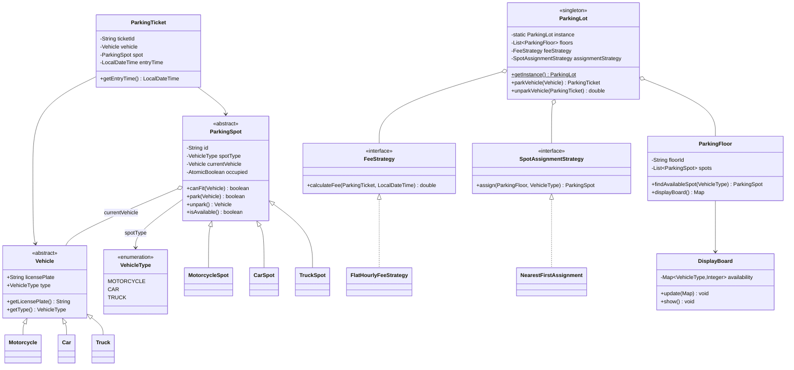

# 🚗 Design a Parking Lot — LLD Solution | Machine Coding Interview Guide (Java)
> **New to LLD interviews?** This solution uses the **Strategy pattern** and **Open/Closed Principle**. Review them first: [Design Patterns → Behavioral](../design-patterns/behavioral/README.md) · [SOLID → OCP](../solid-principles/ocp.md) · [Error Handling Best Practices](../best-practices/error-handling.md). See also: [Easy Interview Questions](../interview-questions/easy/README.md) and the [LLD Cheatsheet](../cheatsheet.md).

---

## 📋 Table of Contents

- [Problem Statement](#-problem-statement)
- [Step 1: Requirements & Clarifying Questions](#-step-1-requirements--clarifying-questions)
- [Step 2: Core Entities](#-step-2-core-entities)
- [Step 3: Design Approach](#-step-3-design-approach)
- [Step 4: Class Diagram](#-step-4-class-diagram)
- [Step 5: Complete Java Implementation](#-step-5-complete-java-implementation)
- [Step 6: Edge Cases & Common Pitfalls](#-step-6-edge-cases--common-pitfalls)
- [Step 7: Follow-up Questions](#-step-7-follow-up-questions)
- [Interview Takeaways](#-interview-takeaways)

---

## 🎯 Problem Statement

Design a **multi-floor parking lot system** that supports:

- Different vehicle types (motorcycle, car, truck) with differently-sized spots
- Parking a vehicle and issuing a parking ticket
- Unparking a vehicle and computing the parking fee
- A display board showing availability
- Support for multiple floors

This is the **most frequently asked LLD problem** and the standard 25-minute opener in machine coding rounds.

---

## 📋 Step 1: Requirements & Clarifying Questions

Ask these questions **before designing** — interviewers explicitly score this:

| # | Clarifying Question | Typical Answer |
|---|--------------------|----------------|
| 1 | How many vehicle types and spot types? | 3 each: motorcycle, car, truck |
| 2 | Can a car park in a truck spot? | Yes, smaller in larger; never larger in smaller |
| 3 | How is the fee computed? | Per-hour flat rate per vehicle type; ceiling of hours |
| 4 | Single entry gate or multiple? | Start single; discuss concurrency in follow-ups |
| 5 | Do we need payment integration? | No — just compute fee; payment is a follow-up |
| 6 | What happens when the lot is full? | Display FULL, reject new vehicles |

**Out of scope (say it explicitly):** payments, reservations, security cameras, multi-entry optimization.

---

## 🧱 Step 2: Core Entities

**Nouns → classes, verbs → methods:**

| Noun | Class | Key Methods (verbs) |
|------|-------|---------------------|
| Vehicle | `Vehicle` (+ subclasses) | — |
| Parking spot | `ParkingSpot` | `park()`, `unpark()`, `isAvailable()` |
| Parking floor | `ParkingFloor` | `findAvailableSpot()`, `displayBoard()` |
| Parking lot | `ParkingLot` | `parkVehicle()`, `unparkVehicle()` |
| Ticket | `ParkingTicket` | — |
| Display board | `DisplayBoard` | `update()` |
| Fee rules | `FeeStrategy` | `calculateFee()` |

---

## 🧩 Step 3: Design Approach

| Decision | Pattern / Principle | Why |
|----------|--------------------|-----|
| One `ParkingLot` instance | **Singleton** | Global registry, exactly one lot |
| Spot assignment policy swappable | **Strategy** | Nearest-first / farthest-first / random without touching callers |
| Fee computation per vehicle type | **Strategy** | New pricing (weekend rates, subscriptions) → new class, zero edits (**OCP**) |
| Motorcycles in car/truck spots | **Liskov Substitution** | Spot hierarchy with type-checking keeps substitutability safe |
| `Vehicle`/`ParkingSpot` type enums | Encapsulation | Type rules live in one place |
| Assigning spots (not the vehicle choosing) | SRP | `ParkingLot` orchestrates; spots don't search |

---

## 📊 Step 4: Class Diagram



---

## 💻 Step 5: Complete Java Implementation

Compiles as-is. `Main` demonstrates park → display → unpark → fee.

```java
import java.time.Duration;
import java.time.LocalDateTime;
import java.util.*;
import java.util.concurrent.ConcurrentHashMap;
import java.util.concurrent.atomic.AtomicBoolean;
import java.util.concurrent.atomic.AtomicLong;

/* ================= Enums ================= */

enum VehicleType { MOTORCYCLE, CAR, TRUCK }

/* ================= Vehicle ================= */

abstract class Vehicle {
    private final String licensePlate;
    private final VehicleType type;

    protected Vehicle(String licensePlate, VehicleType type) {
        if (licensePlate == null || licensePlate.isBlank()) {
            throw new IllegalArgumentException("License plate is required");
        }
        this.licensePlate = licensePlate;
        this.type = type;
    }

    public String getLicensePlate() { return licensePlate; }
    public VehicleType getType() { return type; }

    @Override
    public boolean equals(Object o) {
        if (this == o) return true;
        if (!(o instanceof Vehicle)) return false;
        return licensePlate.equals(((Vehicle) o).licensePlate);
    }

    @Override
    public int hashCode() { return licensePlate.hashCode(); }
}

class Motorcycle extends Vehicle {
    public Motorcycle(String plate) { super(plate, VehicleType.MOTORCYCLE); }
}

class Car extends Vehicle {
    public Car(String plate) { super(plate, VehicleType.CAR); }
}

class Truck extends Vehicle {
    public Truck(String plate) { super(plate, VehicleType.TRUCK); }
}

/* ================= Parking Spot ================= */

abstract class ParkingSpot {
    private static final AtomicLong ID_GEN = new AtomicLong();

    private final String id;
    private final VehicleType spotType;
    private final AtomicBoolean occupied = new AtomicBoolean(false);
    private volatile Vehicle currentVehicle;

    protected ParkingSpot(VehicleType spotType) {
        this.id = spotType.name().charAt(0) + "-" + ID_GEN.incrementAndGet();
        this.spotType = spotType;
    }

    public boolean canFit(Vehicle vehicle) {
        return vehicle.getType().ordinal() <= spotType.ordinal();
    }

    /** Atomic acquire — two threads can never both "win" the same spot. */
    public boolean park(Vehicle vehicle) {
        if (!canFit(vehicle) || !occupied.compareAndSet(false, true)) {
            return false;
        }
        this.currentVehicle = vehicle;
        return true;
    }

    public Vehicle unpark() {
        if (!occupied.compareAndSet(true, false)) {
            throw new IllegalStateException("Spot " + id + " is already empty");
        }
        Vehicle v = currentVehicle;
        currentVehicle = null;
        return v;
    }

    public boolean isAvailable() { return !occupied.get(); }
    public String getId() { return id; }
    public VehicleType getSpotType() { return spotType; }
}

class MotorcycleSpot extends ParkingSpot {
    public MotorcycleSpot() { super(VehicleType.MOTORCYCLE); }
}

class CarSpot extends ParkingSpot {
    public CarSpot() { super(VehicleType.CAR); }
}

class TruckSpot extends ParkingSpot {
    public TruckSpot() { super(VehicleType.TRUCK); }
}

/* ================= Spot Assignment Strategy ================= */

@FunctionalInterface
interface SpotAssignmentStrategy {
    ParkingSpot assign(List<ParkingSpot> spots, VehicleType type);
}

/** First available, smallest-fitting spot (nearest-first behavior). */
class NearestFirstAssignment implements SpotAssignmentStrategy {
    @Override
    public ParkingSpot assign(List<ParkingSpot> spots, VehicleType type) {
        // Smallest spot type that fits (ordinal order: MOTORCYCLE < CAR < TRUCK)
        return spots.stream()
                .filter(s -> s.isAvailable() && s.getSpotType().ordinal() >= type.ordinal())
                .findFirst()
                .orElse(null);
    }
}

/* ================= Fee Strategy ================= */

@FunctionalInterface
interface FeeStrategy {
    double calculateFee(ParkingTicket ticket, LocalDateTime exitTime);
}

/** Flat per-hour rate by vehicle type; partial hours rounded up. */
class FlatHourlyFeeStrategy implements FeeStrategy {
    private final Map<VehicleType, Double> hourlyRates = Map.of(
            VehicleType.MOTORCYCLE, 10.0,
            VehicleType.CAR, 20.0,
            VehicleType.TRUCK, 40.0);

    @Override
    public double calculateFee(ParkingTicket ticket, LocalDateTime exitTime) {
        long minutes = Duration.between(ticket.getEntryTime(), exitTime).toMinutes();
        long hours = Math.max(1, (minutes + 59) / 59); // ceiling, min 1 hour
        return hours * hourlyRates.get(ticket.getVehicle().getType());
    }
}

/* ================= Ticket ================= */

class ParkingTicket {
    private static final AtomicLong ID_GEN = new AtomicLong();

    private final String ticketId;
    private final Vehicle vehicle;
    private final ParkingSpot spot;
    private final LocalDateTime entryTime;

    ParkingTicket(Vehicle vehicle, ParkingSpot spot, LocalDateTime entryTime) {
        this.ticketId = "T" + ID_GEN.incrementAndGet();
        this.vehicle = vehicle;
        this.spot = spot;
        this.entryTime = entryTime;
    }

    public Vehicle getVehicle() { return vehicle; }
    public ParkingSpot getSpot() { return spot; }
    public LocalDateTime getEntryTime() { return entryTime; }
    public String getTicketId() { return ticketId; }
}

/* ================= Display Board ================= */

class DisplayBoard {
    private final Map<VehicleType, Integer> availability = new ConcurrentHashMap<>();

    void update(Map<VehicleType, Integer> counts) {
        availability.clear();
        availability.putAll(counts);
    }

    void show() {
        System.out.println("  ┌── Display Board ──┐");
        availability.forEach((type, count) ->
                System.out.println("  │ " + type + ": " + count + " free"));
    }
}

/* ================= Parking Floor ================= */

class ParkingFloor {
    private final String floorId;
    private final List<ParkingSpot> spots;
    private final DisplayBoard displayBoard = new DisplayBoard();

    ParkingFloor(String floorId, List<ParkingSpot> spots) {
        this.floorId = floorId;
        this.spots = new ArrayList<>(spots);
    }

    ParkingSpot findAvailableSpot(VehicleType type, SpotAssignmentStrategy strategy) {
        return strategy.assign(spots, type);
    }

    void refreshBoard() {
        Map<VehicleType, Integer> counts = new EnumMap<>(VehicleType.class);
        for (VehicleType t : VehicleType.values()) counts.put(t, 0);
        for (ParkingSpot s : spots) {
            if (s.isAvailable()) counts.merge(s.getSpotType(), 1, Integer::sum);
        }
        displayBoard.update(counts);
    }

    void showBoard() {
        System.out.println(" Floor " + floorId);
        displayBoard.show();
    }
}

/* ================= Parking Lot (Singleton) ================= */

class ParkingLot {
    private static ParkingLot instance;

    private final List<ParkingFloor> floors = new ArrayList<>();
    private final Map<String, ParkingTicket> activeTickets = new ConcurrentHashMap<>();
    private FeeStrategy feeStrategy = new FlatHourlyFeeStrategy();
    private SpotAssignmentStrategy assignmentStrategy = new NearestFirstAssignment();

    private ParkingLot() { }

    public static synchronized ParkingLot getInstance() {
        if (instance == null) instance = new ParkingLot();
        return instance;
    }

    public void addFloor(ParkingFloor floor) { floors.add(floor); }

    public ParkingTicket parkVehicle(Vehicle vehicle) {
        if (activeTickets.containsKey(vehicle.getLicensePlate())) {
            throw new IllegalStateException("Vehicle " + vehicle.getLicensePlate()
                    + " is already parked");
        }
        for (ParkingFloor floor : floors) {
            ParkingSpot spot = floor.findAvailableSpot(vehicle.getType(), assignmentStrategy);
            if (spot != null && spot.park(vehicle)) {
                ParkingTicket ticket = new ParkingTicket(vehicle, spot, LocalDateTime.now());
                activeTickets.put(vehicle.getLicensePlate(), ticket);
                floor.refreshBoard();
                return ticket;
            }
        }
        floorBoards(); // show current availability before failing
        throw new IllegalStateException("PARKING FULL: no spot for " + vehicle.getType());
    }

    public double unparkVehicle(ParkingTicket ticket) {
        ParkingTicket active = activeTickets.remove(ticket.getVehicle().getLicensePlate());
        if (active == null) {
            throw new IllegalStateException("Invalid or already-used ticket");
        }
        Vehicle vehicle = ticket.getSpot().unpark();
        double fee = feeStrategy.calculateFee(ticket, LocalDateTime.now());
        System.out.printf("  Vehicle %s (%s) exited. Fee: Rs. %.2f%n",
                vehicle.getLicensePlate(), vehicle.getType(), fee);
        return fee;
    }

    void floorBoards() {
        floors.forEach(ParkingFloor::refreshBoard);
        floors.forEach(ParkingFloor::showBoard);
    }
}

/* ================= Demo ================= */

public class Main {
    public static void main(String[] args) throws InterruptedException {
        ParkingLot lot = ParkingLot.getInstance();

        lot.addFloor(new ParkingFloor("1", Arrays.asList(
                new MotorcycleSpot(), new MotorcycleSpot(),
                new CarSpot(), new CarSpot(), new TruckSpot())));

        Vehicle bike = new Motorcycle("BIKE-1");
        Vehicle car = new Car("CAR-1");
        Vehicle truck = new Truck("TRUCK-1");

        ParkingTicket t1 = lot.parkVehicle(bike);
        ParkingTicket t2 = lot.parkVehicle(car);
        lot.parkVehicle(truck);
        lot.floorBoards();

        Thread.sleep(10); // simulate some parking time
        lot.unparkVehicle(t1);
        lot.unparkVehicle(t2);
        lot.floorBoards();

        // Rejections: duplicate park and truck-into-full-lot
        try {
            lot.parkVehicle(new Car("CAR-1"));
        } catch (IllegalStateException e) {
            System.out.println("Rejected: " + e.getMessage());
        }
    }
}
```

---

## ⚠️ Step 6: Edge Cases & Common Pitfalls

| Pitfall | Why candidates lose points | Fix shown in code |
|---------|---------------------------|-------------------|
| Storing only the *count* of empty spots | Two threads decrement simultaneously → overbooking | Atomic `compareAndSet` on each spot |
| Missing the "smaller vehicle in bigger spot" rule | Truck in motorcycle spot accepted | `canFit` uses type ordinal comparison |
| Fee for exactly 1 hour of 0 minutes | Off-by-one on partial hours | `Math.max(1, ceiling(minutes))` |
| Same vehicle parked twice | Inventory corrupt | License-plate key in `activeTickets` |
| `unpark` on an already-free spot | Silent double-exit | `compareAndSet(true, false)` throws |
| Big-ball-of-mud `ParkingLot` class | Fails SRP; fee/assignment unswappable | Extracted `FeeStrategy`, `SpotAssignmentStrategy` |
| Display board as an afterthought | Interviewer asked for it in requirements | `DisplayBoard` refreshed on every state change |

---

## ❓ Step 7: Follow-up Questions

**1. Multiple entry gates parking simultaneously?**
Make spot allocation atomic — either a DB row-lock / `SELECT ... FOR UPDATE`, or Redis `SETNX` per spot, or in-process a single `Semaphore` + CAS as above. The interviewer wants to hear the words *atomic allocation* and *no double-booking*.

**2. Different fee models (weekend rates, EV charging, monthly passes)?**
New `FeeStrategy` implementations, possibly a composed strategy (base + multiplier). No change to `ParkingLot` — OCP in action.

**3. Find my car feature?**
Ticket stores spot id; add a lookup by ticket/plate. If ticket lost, search occupied spots by plate — O(n); mention indexing.

**4. How does this change for 10,000 spots across 5 cities?**
This becomes a **system design** problem: spots as DB rows, ticketing service, per-lot sharding, event stream for displays. Say "the class model survives; persistence and allocation move to a service."

**5. Reserve spots in advance?**
Add `Reservation` entity with expiry; reserved spot is skipped by assignment strategy until expiry.

---

## 🎯 Interview Takeaways

- **Open with requirements clarification** — 2 minutes that decide the verdict.
- **Name the patterns as you use them**: Singleton (lot), Strategy (fee + assignment), OCP (pricing).
- **Concurrency is the differentiator** — the `AtomicBoolean` spot acquisition is what separates seniors.
- **Leave the design open for follow-ups**: payment, reservations, multi-gate all slot in without rework.

---

← [Back to all solutions](README.md) · [Next: Snake and Ladder →](snake-and-ladder.md)
