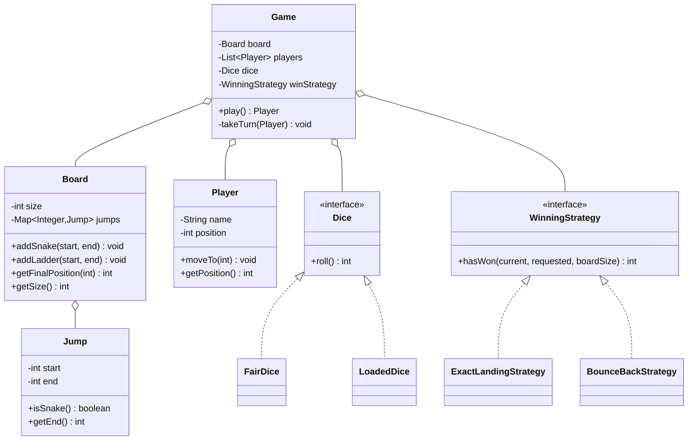

# 🎲 Design Snake and Ladder — LLD Solution | Machine Coding Interview Guide (Java)
> **Related reading:** [OOD Relationships — Association vs Aggregation vs Composition](../ood-basics/relationships.md) · [Easy Interview Questions](../interview-questions/easy/README.md) · [LLD Cheatsheet](../cheatsheet.md)

---

## 📋 Table of Contents

- [Problem Statement](#-problem-statement)
- [Step 1: Requirements & Clarifying Questions](#-step-1-requirements--clarifying-questions)
- [Step 2: Core Entities](#-step-2-core-entities)
- [Step 3: Design Approach](#-step-3-design-approach)
- [Step 4: Class Diagram](#-step-4-class-diagram)
- [Step 5: Complete Java Implementation](#-step-5-complete-java-implementation)
- [Step 6: Edge Cases & Common Pitfalls](#-step-6-edge-cases--common-pitfalls)
- [Step 7: Follow-up Questions](#-step-7-follow-up-questions)
- [Interview Takeaways](#-interview-takeaways)

---

## 🎯 Problem Statement

Design a **Snake and Ladder game** that supports:

- A board of configurable size with snakes and ladders placed on it
- Multiple players taking turns
- A dice with configurable sides
- Win detection when a player reaches the final cell
- Ability to simulate and run a full game from code

A favorite at Flipkart and Walmart machine coding rounds — it tests clean modeling of a *rules engine* rather than patterns knowledge.

---

## 📋 Step 1: Requirements & Clarifying Questions

| # | Clarifying Question | Typical Answer |
|---|--------------------|----------------|
| 1 | Board size? | Configurable, default 100 |
| 2 | Exact landing required to win, or overshoot allowed? | Must land exactly; overshoot = stay (or bounce back — clarify!) |
| 3 | What happens at a snake/ladder? | Auto-slide to destination; snakes and ladders do NOT chain |
| 4 | Can multiple players share a cell? | Yes (classic rules); killing on landing is a variant |
| 5 | Extra turn on a 6? | Common variant — design so it's a pluggable rule |
| 6 | Dice fair or loaded? | Fair N-sided; make `Dice` polymorphic for a loaded variant |

**Out of scope:** UI, animations, persistence.

---

## 🧱 Step 2: Core Entities

| Noun | Class | Key Methods |
|------|-------|-------------|
| Board | `Board` | `getFinalPosition()` (applies snake/ladder jumps) |
| Snake / Ladder | `Jump` (start, end) | — |
| Player | `Player` | — |
| Dice | `Dice` | `roll()` |
| Game | `Game` | `play()`, `nextTurn()` |
| Win rule | `WinningStrategy` | `hasWon(current, requested, boardSize)` |

---

## 🧩 Step 3: Design Approach

| Decision | Pattern / Principle | Why |
|----------|--------------------|-----|
| Snakes and ladders as one `Jump` entity | DRY | Same start→end semantics; direction distinguishes them |
| "Exact landing vs bounce back" as `WinningStrategy` | **Strategy** | Rules change without touching the game loop (OCP) |
| `Dice` as interface | **Strategy** | Fair/loaded/2-dice variants plug in |
| Game loop owns turn rotation only | **SRP** | Jump resolution lives in `Board`, win check in strategy |
| `Random` injected | Testability | Seeded dice makes simulations reproducible |

---

## 📊 Step 4: Class Diagram



---

## 💻 Step 5: Complete Java Implementation

```java
import java.util.*;

/* ================= Dice ================= */

interface Dice {
    int roll();
}

class FairDice implements Dice {
    private final Random random;
    private final int sides;

    FairDice(int sides, long seed) {
        this.sides = sides;
        this.random = new Random(seed); // seeded → reproducible simulations
    }

    @Override
    public int roll() { return random.nextInt(sides) + 1; }
}

/** Demo-only loaded dice that always rolls 6 — proves the strategy is pluggable. */
class LoadedDice implements Dice {
    @Override
    public int roll() { return 6; }
}

/* ================= Winning Strategies ================= */

@FunctionalInterface
interface WinningStrategy {
    /** Returns the player's new position given current and requested cells. */
    int resolve(int current, int requested, int boardSize);
}

/** Must land exactly on the last cell; overshoot = no move. */
class ExactLandingStrategy implements WinningStrategy {
    @Override
    public int resolve(int current, int requested, int boardSize) {
        return requested > boardSize ? current : requested;
    }
}

/** Overshoot bounces back from the last cell (cricket-scoreboard style). */
class BounceBackStrategy implements WinningStrategy {
    @Override
    public int resolve(int current, int requested, int boardSize) {
        return requested <= boardSize
                ? requested
                : boardSize - (requested - boardSize);
    }
}

/* ================= Board ================= */

class Jump {
    private final int start;
    private final int end;

    Jump(int start, int end) {
        if (start <= 0 || end <= 0) {
            throw new IllegalArgumentException("Cells are 1-indexed");
        }
        this.start = start;
        this.end = end;
    }

    boolean isSnake() { return end < start; }
    int getEnd() { return end; }
}

class Board {
    private final int size;
    private final Map<Integer, Jump> jumps = new HashMap<>();

    Board(int size) {
        if (size < 2) throw new IllegalArgumentException("Board too small");
        this.size = size;
    }

    void addSnake(int head, int tail) {
        Jump snake = new Jump(head, tail);
        validate(head, tail);
        jumps.put(head, snake);
    }

    void addLadder(int bottom, int top) {
        Jump ladder = new Jump(bottom, top);
        validate(bottom, top);
        jumps.put(bottom, ladder);
    }

    /** One jump only — snakes and ladders never chain. */
    int getFinalPosition(int cell) {
        Jump jump = jumps.get(cell);
        return jump == null ? cell : jump.getEnd();
    }

    int getSize() { return size; }

    private void validate(int start, int end) {
        if (start >= size || end > size) {
            throw new IllegalArgumentException("Jump outside board");
        }
        if (start == end) {
            throw new IllegalArgumentException("Jump must move the player");
        }
        if (jumps.containsKey(start)) {
            throw new IllegalArgumentException("Cell " + start + " already has a jump");
        }
    }
}

/* ================= Player ================= */

class Player {
    private final String name;
    private int position = 0; // off-board "start"

    Player(String name) {
        if (name == null || name.isBlank()) {
            throw new IllegalArgumentException("Player needs a name");
        }
        this.name = name;
    }

    void moveTo(int cell) { this.position = cell; }
    int getPosition() { return position; }
    String getName() { return name; }
}

/* ================= Game ================= */

class Game {
    private final Board board;
    private final List<Player> players;
    private final Dice dice;
    private final WinningStrategy winStrategy;
    private int turnIndex = 0;

    Game(Board board, List<Player> players, Dice dice, WinningStrategy winStrategy) {
        if (players.size() < 2) {
            throw new IllegalArgumentException("Need at least 2 players");
        }
        this.board = board;
        this.players = new ArrayList<>(players);
        this.dice = dice;
        this.winStrategy = winStrategy;
    }

    Player play() {
        while (true) {
            Player current = players.get(turnIndex);
            int newPos = takeTurn(current);
            if (newPos == board.getSize()) {
                System.out.println("🏆 " + current.getName() + " WINS!");
                return current;
            }
            turnIndex = (turnIndex + 1) % players.size();
        }
    }

    private int takeTurn(Player player) {
        int roll = dice.roll();
        int current = player.getPosition();
        int requested = current + roll;

        int resolved = winStrategy.resolve(current, requested, board.getSize());
        int afterJumps = board.getFinalPosition(resolved);

        StringBuilder log = new StringBuilder(String.format(
                "%s rolled %d: %d -> %d", player.getName(), roll, current, resolved));
        if (afterJumps != resolved) {
            log.append(afterJumps < resolved ? " 🐍 snake down to " : " 🪜 ladder up to ")
               .append(afterJumps);
        }
        System.out.println(log);

        player.moveTo(afterJumps);
        return afterJumps;
    }
}

/* ================= Demo ================= */

public class Main {
    public static void main(String[] args) {
        Board board = new Board(100);
        board.addLadder(3, 22);
        board.addLadder(5, 8);
        board.addSnake(98, 79);
        board.addSnake(95, 56);
        board.addSnake(25, 6);

        Game game = new Game(
                board,
                List.of(new Player("Alice"), new Player("Bob")),
                new FairDice(6, 42L),          // seeded → same result every run
                new ExactLandingStrategy());

        game.play();
    }
}
```

---

## ⚠️ Step 6: Edge Cases & Common Pitfalls

| Pitfall | Why it matters | Fix shown in code |
|---------|---------------|-------------------|
| Snake/ladder chaining (ladder ends on a snake) | Infinite loops or wrong rules | `getFinalPosition` applies exactly one jump |
| Win on overshoot | Wrong ending for exact-landing rule | `WinningStrategy` resolves before jump lookup |
| Jump destination on the last cell via ladder | Instant-win edge case | Handled naturally — final position checked after jump |
| Two jumps on one cell | Corrupt board | `validate` rejects duplicate starts |
| Dice `nextInt(n)` returning 0 | Players "roll a 0" | `nextInt(sides) + 1` |
| Game loop with no termination guarantee | Loaded dice / bad config hangs forever | In real code: max-turns guard; mention it to the interviewer |
| Using `int` cell 0 vs 1 indexing confusion | Off-by-one in jumps | Explicit 1-indexed validation |

---

## ❓ Step 7: Follow-up Questions

**1. Multiple dice?** `Dice` already returns one value — add `SetOfDice` that sums N rolls. Game loop unchanged.

**2. Extra turn on rolling a 6?** In `play()`, don't advance `turnIndex` when roll == 6. Keep a max-consecutive-6s rule (3 sixes voids the turn — classic variant).

**3. Undo/redo of moves?** Store move history as a stack of `Move(player, from, to)` objects — a **Command pattern** application.

**4. Kill rule — landing on an opponent sends them to 0?** After resolving position, check other players on that cell. Pluggable as a `CellRule` if more rules come.

**5. Simulate 1M games to find average game length?** Seeded `FairDice` + pure game loop make this trivially parallelizable — a good remark on testability.

**6. Make it online multiplayer?** Game becomes a state machine + event queue; server broadcasts dice rolls; conflict resolution via single-threaded game actor per match.

---

## 🎯 Interview Takeaways

- This problem rewards **clean modeling**, not pattern fireworks: Board / Player / Dice / Game each do one job.
- Saying *"snakes and ladders never chain — is that right?"* is a scored clarification.
- Making the win rule pluggable (exact vs bounce-back) shows OCP thinking on a "simple" problem.
- Seeded dice demonstrates you design for **testability** unprompted.

---

← [Back to all solutions](README.md) · [Next: Splitwise →](splitwise.md)
