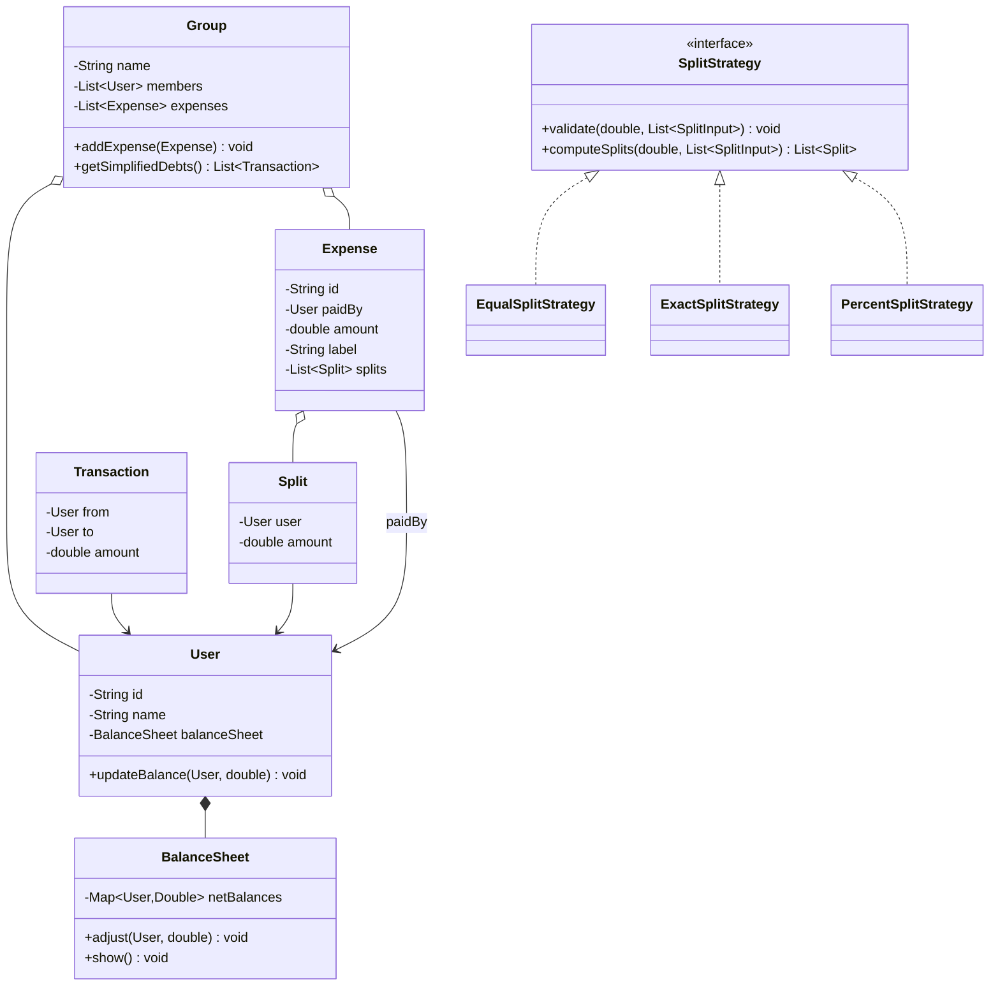

# 💰 Design Splitwise — LLD Solution | Machine Coding Interview Guide (Java)
> **Related reading:** [Strategy Pattern — Behavioral Patterns](../design-patterns/behavioral/README.md) · [SOLID → SRP](../solid-principles/srp.md) · [LLD Cheatsheet](../cheatsheet.md)

---

## 📋 Table of Contents

- [Problem Statement](#-problem-statement)
- [Step 1: Requirements & Clarifying Questions](#-step-1-requirements--clarifying-questions)
- [Step 2: Core Entities](#-step-2-core-entities)
- [Step 3: Design Approach](#-step-3-design-approach)
- [Step 4: Class Diagram](#-step-4-class-diagram)
- [Step 5: Complete Java Implementation](#-step-5-complete-java-implementation)
- [Step 6: Edge Cases & Common Pitfalls](#-step-6-edge-cases--common-pitfalls)
- [Step 7: Follow-up Questions](#-step-7-follow-up-questions)
- [Interview Takeaways](#-interview-takeaways)

---

## 🎯 Problem Statement

Design **Splitwise**, an expense-sharing application that supports:

- Users in groups
- Expenses paid by one user and split among participants — **equally**, **by exact amounts**, **by percentage**, or **by shares**
- Automatic computation of who owes whom and how much
- A simplified debt list (minimal number of transactions)

Asked constantly at Flipkart, Swiggy, Uber, and Microsoft. Tests **data modeling** (the ledger) and **Strategy** for split types.

---

## 📋 Step 1: Requirements & Clarifying Questions

| # | Clarifying Question | Typical Answer |
|---|--------------------|----------------|
| 1 | Expense split types? | EQUAL, EXACT, PERCENT, SHARES — build at least two |
| 2 | Who validates split sums? | Exact must sum to total; percents to 100 — reject otherwise |
| 3 | Multiple payers per expense? | Start single payer; mention multi-payer as extension |
| 4 | Currency handling? | Single currency, double rounded to 2 decimals; real product uses minor units (paise) |
| 5 | What is "show balances"? | Net debt per user: owes X to Y, lent Z from W |
| 6 | Debt simplification needed? | Bonus round — minimize transaction count |

**Out of scope:** auth, notifications, persistence, multi-currency conversion.

---

## 🧱 Step 2: Core Entities

| Noun | Class | Key Methods |
|------|-------|-------------|
| User | `User` | `updateBalance()` |
| Group | `Group` | `addExpense()`, `getSimplifiedDebts()` |
| Expense | `Expense` | — |
| Split rule | `SplitStrategy` | `validateAndComputeSplits()` |
| Split share | `Split` | — |
| Debt pair | `BalanceSheet` (per user) | `show()` |

---

## 🧩 Step 3: Design Approach

| Decision | Pattern / Principle | Why |
|----------|--------------------|-----|
| EQUAL / EXACT / PERCENT behind `SplitStrategy` | **Strategy** | New split type (e.g., ratio) = new class, no edits (**OCP**) |
| Per-user `BalanceSheet` as net ledger | **SRP** | "Show" reads O(1); recomputing from expenses is O(n) |
| Splitwise-level registry of all users | Encapsulation | Balances live in one canonical place |
| Expense metadata (label, timestamp) separated from math | Clean modeling | Money logic testable in isolation |
| Percent validation in strategy, not caller | **Encapsulation** | Invalid splits can never exist |

---

## 📊 Step 4: Class Diagram



---

## 💻 Step 5: Complete Java Implementation

```java
import java.time.LocalDateTime;
import java.util.*;
import java.util.concurrent.ConcurrentHashMap;
import java.util.concurrent.atomic.AtomicLong;

/* ================= User & Balance Sheet ================= */

class User {
    private final String id;
    private final String name;
    private final BalanceSheet balanceSheet = new BalanceSheet();

    User(String id, String name) {
        if (id == null || name == null || name.isBlank()) {
            throw new IllegalArgumentException("User needs id and name");
        }
        this.id = id;
        this.name = name;
    }

    void adjustBalance(User other, double delta) { balanceSheet.adjust(other, delta); }
    void showBalances() { balanceSheet.show(name); }
    BalanceSheet balances() { return balanceSheet; }
    String getId() { return id; }
    String getName() { return name; }

    @Override
    public boolean equals(Object o) {
        return o instanceof User && id.equals(((User) o).id);
    }
    @Override
    public int hashCode() { return id.hashCode(); }
}

/** Net debts of one user against all others. Positive = they owe me. */
class BalanceSheet {
    private final Map<User, Double> netBalances = new ConcurrentHashMap<>();

    void adjust(User other, double delta) {
        netBalances.merge(other, delta, Double::sum);
    }

    void show(String ownerName) {
        boolean any = false;
        for (Map.Entry<User, Double> e : netBalances.entrySet()) {
            double v = Money.round(e.getValue());
            if (Math.abs(v) < 0.005) continue; // ignore dust
            any = true;
            if (v > 0) {
                System.out.printf("%s owes %s: %.2f%n", ownerName, e.getKey().getName(), v);
            } else {
                System.out.printf("%s is owed %.2f by %s%n", ownerName, -v, e.getKey().getName());
            }
        }
        if (!any) System.out.println(ownerName + " is all settled up ✨");
    }

    Map<User, Double> snapshot() { return new HashMap<>(netBalances); }
}

/* ================= Splits ================= */

class Split {
    private final User user;
    private final double amount;

    Split(User user, double amount) {
        this.user = user;
        this.amount = Money.round(amount);
    }
    User getUser() { return user; }
    double getAmount() { return amount; }
}

/** Raw per-user input before validation (exact value or percent). */
class SplitInput {
    final User user;
    final double value;

    public SplitInput(User user, double value) {
        this.user = user;
        this.value = value;
    }
}

/* ================= Split Strategies ================= */

interface SplitStrategy {
    List<Split> computeSplits(double totalAmount, List<SplitInput> inputs);
}

class EqualSplitStrategy implements SplitStrategy {
    @Override
    public List<Split> computeSplits(double totalAmount, List<SplitInput> inputs) {
        if (inputs.isEmpty()) throw new IllegalArgumentException("Need at least one participant");
        double each = Money.round(totalAmount / inputs.size());
        List<Split> splits = new ArrayList<>();
        double assigned = 0;
        for (int i = 0; i < inputs.size(); i++) {
            // last participant absorbs rounding dust so sums always match
            double amt = (i == inputs.size() - 1) ? Money.round(totalAmount - assigned) : each;
            splits.add(new Split(inputs.get(i).user, amt));
            assigned = Money.round(assigned + amt);
        }
        return splits;
    }
}

class ExactSplitStrategy implements SplitStrategy {
    @Override
    public List<Split> computeSplits(double totalAmount, List<SplitInput> inputs) {
        double sum = inputs.stream().mapToDouble(i -> i.value).sum();
        if (Math.abs(Money.round(sum) - Money.round(totalAmount)) > 0.005) {
            throw new IllegalArgumentException(
                    "Exact splits (" + sum + ") must equal expense total (" + totalAmount + ")");
        }
        List<Split> splits = new ArrayList<>();
        for (SplitInput in : inputs) splits.add(new Split(in.user, in.value));
        return splits;
    }
}

class PercentSplitStrategy implements SplitStrategy {
    @Override
    public List<Split> computeSplits(double totalAmount, List<SplitInput> inputs) {
        double pct = inputs.stream().mapToDouble(i -> i.value).sum();
        if (Math.abs(pct - 100.0) > 0.001) {
            throw new IllegalArgumentException("Percentages must sum to 100, got " + pct);
        }
        List<Split> splits = new ArrayList<>();
        double assigned = 0;
        for (int i = 0; i < inputs.size(); i++) {
            double amt = (i == inputs.size() - 1)
                    ? Money.round(totalAmount - assigned)        // dust absorption
                    : Money.round(totalAmount * inputs.get(i).value / 100.0);
            splits.add(new Split(inputs.get(i).user, amt));
            assigned = Money.round(assigned + amt);
        }
        return splits;
    }
}

/* ================= Expense ================= */

class Expense {
    private static final AtomicLong ID_GEN = new AtomicLong();

    private final String id;
    private final String label;
    private final User paidBy;
    private final double amount;
    private final LocalDateTime timestamp;
    private final List<Split> splits;

    Expense(String label, User paidBy, double amount, List<Split> splits) {
        if (amount <= 0) throw new IllegalArgumentException("Expense must be positive");
        this.id = "E" + ID_GEN.incrementAndGet();
        this.label = label;
        this.paidBy = paidBy;
        this.amount = amount;
        this.splits = List.copyOf(splits);
        this.timestamp = LocalDateTime.now();
    }

    double totalSplitAmount() {
        return Money.round(splits.stream().mapToDouble(Split::getAmount).sum());
    }

    void apply() {
        double check = totalSplitAmount();
        if (Math.abs(check - Money.round(amount)) > 0.005) {
            throw new IllegalStateException("Splits do not sum to total: " + check);
        }
        for (Split split : splits) {
            User participant = split.getUser();
            if (participant.equals(paidBy)) continue;
            // participant owes paidBy their share...
            participant.adjustBalance(paidBy, split.getAmount());
            // ...and paidBy lent it out
            paidBy.adjustBalance(participant, -split.getAmount());
        }
    }
}

/* ================= Group ================= */

class Group {
    private final String name;
    private final List<User> members = new ArrayList<>();
    private final List<Expense> expenses = new ArrayList<>();

    Group(String name) { this.name = name; }

    void addMember(User user) { members.add(user); }

    void addExpense(String label, User paidBy, double amount,
                    SplitStrategy strategy, List<SplitInput> inputs) {
        if (!members.contains(paidBy)) {
            throw new IllegalArgumentException("Payer must be a group member");
        }
        for (SplitInput in : inputs) {
            if (!members.contains(in.user)) {
                throw new IllegalArgumentException(in.user.getName() + " is not in the group");
            }
        }
        Expense expense = new Expense(label, paidBy, amount, strategy.computeSplits(amount, inputs));
        expense.apply();
        expenses.add(expense);
    }

    void showBalances() {
        System.out.println("── Balances for group '" + name + "' ──");
        members.forEach(User::showBalances);
    }

    /** Bonus: minimize the number of settle-up transactions (greedy max-min). */
    List<String> getSimplifiedDebts() {
        // Global net position per user: positive = owes the world, negative = world owes them.
        Map<User, Double> net = new HashMap<>();
        for (User m : members) net.put(m, 0.0);
        for (User m : members) {
            for (Map.Entry<User, Double> e : m.balances().snapshot().entrySet()) {
                net.merge(m, e.getValue(), Double::sum);
            }
        }
        PriorityQueue<Map.Entry<User, Double>> debtors =
                new PriorityQueue<>((a, b) -> Double.compare(b.getValue(), a.getValue())); // biggest debt first
        PriorityQueue<Map.Entry<User, Double>> creditors =
                new PriorityQueue<>(Map.Entry.comparingByValue());   // biggest credit (most negative) first
        for (Map.Entry<User, Double> e : net.entrySet()) {
            double v = Money.round(e.getValue());
            if (v > 0.005) debtors.add(Map.entry(e.getKey(), v));
            else if (v < -0.005) creditors.add(Map.entry(e.getKey(), v));
        }
        List<String> result = new ArrayList<>();
        while (!debtors.isEmpty() && !creditors.isEmpty()) {
            var d = debtors.poll();
            var c = creditors.poll();
            double pay = Math.min(d.getValue(), -c.getValue());
            result.add(String.format("%s pays %s %.2f", d.getKey().getName(), c.getKey().getName(), pay));
            double dLeft = Money.round(d.getValue() - pay);
            double cLeft = Money.round(c.getValue() + pay);
            if (dLeft > 0.005) debtors.add(Map.entry(d.getKey(), dLeft));
            if (cLeft < -0.005) creditors.add(Map.entry(c.getKey(), cLeft));
        }
        return result;
    }
}

/* ================= Helpers ================= */

final class Money {
    private Money() { }
    static double round(double v) { return Math.round(v * 100.0) / 100.0; }
}

/* ================= Demo ================= */

public class Main {
    public static void main(String[] args) {
        User alice = new User("u1", "Alice");
        User bob = new User("u2", "Bob");
        User charlie = new User("u3", "Charlie");

        Group trip = new Group("Goa Trip");
        trip.addMember(alice);
        trip.addMember(bob);
        trip.addMember(charlie);

        // Equal split: Alice pays 300 for all three
        trip.addExpense("Dinner", alice, 300,
                new EqualSplitStrategy(),
                List.of(new SplitInput(alice, 0), new SplitInput(bob, 0), new SplitInput(charlie, 0)));

        // Exact split: Bob pays 100 — 60 Alice, 40 Charlie
        trip.addExpense("Cab", bob, 100,
                new ExactSplitStrategy(),
                List.of(new SplitInput(alice, 60), new SplitInput(charlie, 40)));

        // Percent split: Charlie pays 200 — 50/30/20
        trip.addExpense("Hotel", charlie, 200,
                new PercentSplitStrategy(),
                List.of(new SplitInput(alice, 50), new SplitInput(bob, 30), new SplitInput(charlie, 20)));

        trip.showBalances();

        System.out.println("\n── Simplified settle-up ──");
        trip.getSimplifiedDebts().forEach(System.out::println);

        // Invalid expense is rejected:
        try {
            trip.addExpense("Bad exact", alice, 100, new ExactSplitStrategy(),
                    List.of(new SplitInput(bob, 30), new SplitInput(charlie, 30)));
        } catch (IllegalArgumentException e) {
            System.out.println("\nRejected: " + e.getMessage());
        }
    }
}
```

> All classes live in one file as package-private types so the demo compiles standalone. In production, split them into files and put `Money` in a shared `util` package.

---

## ⚠️ Step 6: Edge Cases & Common Pitfalls

| Pitfall | Why it matters | Fix shown in code |
|---------|---------------|-------------------|
| Equal split rounding dust (100/3) | Ledger no longer sums to total | Last participant absorbs remainder |
| Exact splits ≠ total | Silent corruption | Strategy validates before creating the expense |
| Percentages ≠ 100 | Same | Strategy validates |
| Payer or participant not in group | Cross-group money leaks | Membership checked in `Group.addExpense` |
| Payer counted as owing themselves | Self-debt loops | `participant.equals(paidBy)` skip |
| Double-counting paidBy's share in balances | Everyone's net off by share | Only non-payer legs create balance entries |
| Representing both directions (A owes B *and* B lent A) | Show blows up | Single signed entry per pair, opposite signs |

---

## ❓ Step 7: Follow-up Questions

**1. Multi-currency?** Store amounts in minor units with a `Currency` field; conversion at expense-creation time via an injected `ExchangeRateService`. Balances per currency.

**2. Multiple payers?** Decompose into N virtual expenses, each with one payer, sharing one expense id — cleanest modeling answer.

**3. Editing/deleting an expense?** Make `apply()` reversible: store per-participant deltas as immutable `LedgerEntry`s and emit a compensating entry on delete (event-sourcing flavor). Never mutate historical balances.

**4. Comment/activity feed on expenses?** Observer: `ExpenseEvents` publishes to subscribed users' feeds. Decoupled from money math.

**5. Scale to millions of users?** Balance sheet per (user, group) shard in a DB; expense application in a transaction; read replicas for "show"; the class model maps 1:1 to tables.

**6. Why greedy max-min for simplification?** It minimizes transactions in practice (optimal is NP-hard set-cover); say that trade-off sentence and you score the bonus round.

---

## 🎯 Interview Takeaways

- **The ledger is the design.** Get `BalanceSheet` + signed nets right and everything else follows.
- Rounding dust is where most candidates silently fail — volunteer the "last participant absorbs the remainder" rule before the interviewer asks.
- Three `SplitStrategy` implementations demonstrate OCP concretely — the interviewer can see the pattern earning its keep.
- Rejection paths (bad exact sum, non-member payer) signal production thinking.

---

← [Back to all solutions](README.md) · [Next: Elevator System →](elevator-system.md)
