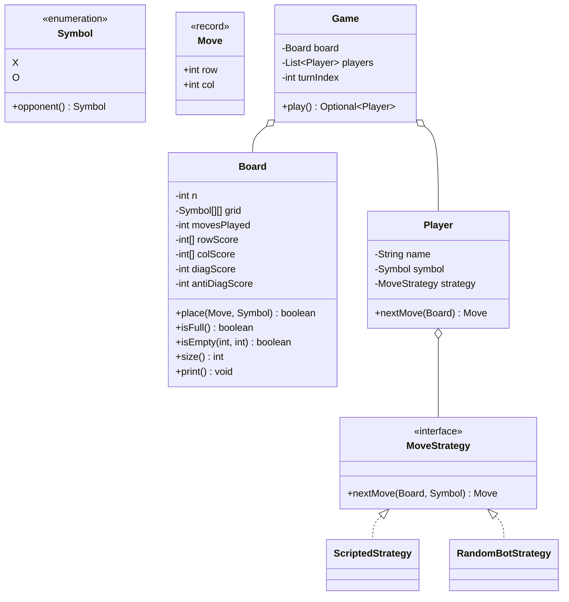

# ⭕ Design Tic-Tac-Toe — LLD Solution | O(1) Win Detection Machine Coding Guide (Java)

> **Related reading:** [Polymorphism](../ood-basics/polymorphism.md) · [OOD Relationships](../ood-basics/relationships.md) · [Easy Interview Questions](../interview-questions/easy/README.md) · [LLD Cheatsheet](../cheatsheet.md)

---

## 📋 Table of Contents

- [Problem Statement](#-problem-statement)
- [Step 1: Requirements & Clarifying Questions](#-step-1-requirements--clarifying-questions)
- [Step 2: Core Entities](#-step-2-core-entities)
- [Step 3: Design Approach](#-step-3-design-approach)
- [Step 4: Class Diagram](#-step-4-class-diagram)
- [Step 5: Complete Java Implementation](#-step-5-complete-java-implementation)
- [Step 6: Edge Cases & Common Pitfalls](#-step-6-edge-cases--common-pitfalls)
- [Step 7: Follow-up Questions](#-step-7-follow-up-questions)
- [Interview Takeaways](#-interview-takeaways)

---

## 🎯 Problem Statement

Design a **Tic-Tac-Toe game** for two players that supports:

- A 3×3 board with alternating turns (X starts)
- Win detection (row, column, or diagonal)
- Draw detection when the board fills
- Rejecting moves on occupied cells or outside the board

Sounds trivial — that's the trap. Interviewers use it to check whether you write **O(1) win detection** or rescan the grid after every move, and whether your design extends to N×N without a rewrite.

---

## 📋 Step 1: Requirements & Clarifying Questions

| # | Clarifying Question | Typical Answer |
|---|--------------------|----------------|
| 1 | Board size — always 3×3? | Start 3×3, but design so N×N is a constructor parameter |
| 2 | Who plays first? | X always, or configurable |
| 3 | Human vs human, or bots too? | Both — make move generation pluggable |
| 4 | What about occupied cells? | Reject with a clear error; re-ask (demo throws) |
| 5 | Draw condition? | Board full with no winner |

**Out of scope:** UI, online multiplayer (follow-up), AI (follow-up).

---

## 🧱 Step 2: Core Entities

| Noun | Class | Key Methods |
|------|-------|-------------|
| Symbol | `Symbol` (enum X, O) | `opponent()` |
| Move | `Move` (record) | row, col |
| Board | `Board` | `place()`, `isFull()`, `print()` |
| Player | `Player` | `nextMove()` via strategy |
| Move generation | `MoveStrategy` | `nextMove(board, symbol)` |
| Game | `Game` | `play()` — turn loop |

---

## 🧩 Step 3: Design Approach

| Decision | Pattern / Principle | Why |
|----------|--------------------|-----|
| Win counters per row/col + 2 diagonals | Algorithmic design | **O(1) win check** — the senior signal on this problem |
| `MoveStrategy` for move generation | **Strategy** | Human / scripted / random-bot / minimax swap in cleanly |
| `Symbol` enum, not `char`/`String` | Type safety | No `==` string bugs, exhaustive switches |
| Counters signed (+1 X, −1 O) | One int per line | Line sum = ±N ⟺ that line is won |
| Board owns all grid invariants | **SRP** | Game loop never touches the array |

---

## 📊 Step 4: Class Diagram



---

## 💻 Step 5: Complete Java Implementation

```java
import java.util.*;

/* ================= Basics ================= */

enum Symbol {
    X, O;

    Symbol opponent() { return this == X ? O : X; }
}

record Move(int row, int col) { }

/* ================= Board — the heart of the design ================= */

class Board {
    private final int n;
    private final Symbol[][] grid;
    private int movesPlayed = 0;

    // O(1) win tracking: +1 per X mark, -1 per O mark.
    // A line's score reaching ±n means that line is fully one player's.
    private final int[] rowScore;
    private final int[] colScore;
    private int diagScore = 0;
    private int antiDiagScore = 0;

    Board(int n) {
        if (n < 3) throw new IllegalArgumentException("Board must be at least 3x3");
        this.n = n;
        this.grid = new Symbol[n][n];
        this.rowScore = new int[n];
        this.colScore = new int[n];
    }

    /** Places a mark. Returns true if this move wins the game. */
    boolean place(Move move, Symbol symbol) {
        int r = move.row(), c = move.col();
        if (r < 0 || r >= n || c < 0 || c >= n) {
            throw new IllegalArgumentException("Move " + move + " is off the board");
        }
        if (grid[r][c] != null) {
            throw new IllegalStateException("Cell " + move + " is already taken by " + grid[r][c]);
        }
        int delta = (symbol == Symbol.X) ? 1 : -1;
        grid[r][c] = symbol;
        movesPlayed++;

        rowScore[r] += delta;
        colScore[c] += delta;
        if (r == c) diagScore += delta;
        if (r + c == n - 1) antiDiagScore += delta;

        return hasWonBy(move, delta);
    }

    private boolean hasWonBy(Move move, int delta) {
        int target = n * delta; // +n for X, -n for O
        return rowScore[move.row()] == target
                || colScore[move.col()] == target
                || (move.row() == move.col() && diagScore == target)
                || (move.row() + move.col() == n - 1 && antiDiagScore == target);
    }

    boolean isFull() { return movesPlayed == n * n; }
    boolean isEmpty(int r, int c) { return grid[r][c] == null; }
    int size() { return n; }

    void print() {
        for (int r = 0; r < n; r++) {
            StringBuilder line = new StringBuilder(" ");
            for (int c = 0; c < n; c++) {
                line.append(grid[r][c] == null ? " " : grid[r][c].toString());
                if (c < n - 1) line.append(" | ");
            }
            System.out.println(line);
            if (r < n - 1) System.out.println("---+".repeat(n - 1) + "---");
        }
        System.out.println();
    }
}

/* ================= Move strategies ================= */

interface MoveStrategy {
    Move nextMove(Board board, Symbol symbol);
}

/** Pre-scripted moves — makes the demo deterministic. */
class ScriptedStrategy implements MoveStrategy {
    private final Deque<Move> script;

    ScriptedStrategy(Move... moves) {
        this.script = new ArrayDeque<>(List.of(moves));
    }

    @Override
    public Move nextMove(Board board, Symbol symbol) {
        Move move = script.poll();
        if (move == null) throw new IllegalStateException("Script exhausted for " + symbol);
        return move;
    }
}

/** Pluggable bot: picks any empty cell at random. */
class RandomBotStrategy implements MoveStrategy {
    private final Random random = new Random();

    @Override
    public Move nextMove(Board board, Symbol symbol) {
        List<Move> free = new ArrayList<>();
        for (int r = 0; r < board.size(); r++) {
            for (int c = 0; c < board.size(); c++) {
                if (board.isEmpty(r, c)) free.add(new Move(r, c));
            }
        }
        if (free.isEmpty()) throw new IllegalStateException("No moves left");
        return free.get(random.nextInt(free.size()));
    }
}

/* ================= Player & Game ================= */

class Player {
    private final String name;
    private final Symbol symbol;
    private final MoveStrategy strategy;

    Player(String name, Symbol symbol, MoveStrategy strategy) {
        if (name == null || name.isBlank()) throw new IllegalArgumentException("Player needs a name");
        this.name = name;
        this.symbol = symbol;
        this.strategy = strategy;
    }

    Move nextMove(Board board) { return strategy.nextMove(board, symbol); }
    Symbol getSymbol() { return symbol; }
    String getName() { return name; }
}

class Game {
    private final Board board;
    private final List<Player> players;
    private int turnIndex = 0;

    Game(Board board, List<Player> players) {
        if (players.size() != 2) throw new IllegalArgumentException("Tic-Tac-Toe needs exactly 2 players");
        if (players.get(0).getSymbol() == players.get(1).getSymbol()) {
            throw new IllegalArgumentException("Players must use different symbols");
        }
        this.board = board;
        this.players = List.copyOf(players);
    }

    /** Runs to completion. Returns the winner, or empty for a draw. */
    Optional<Player> play() {
        while (true) {
            Player current = players.get(turnIndex);
            Move move = current.nextMove(board);
            System.out.println(current.getName() + " (" + current.getSymbol() + ") plays " + move);

            boolean won = board.place(move, current.getSymbol());
            board.print();

            if (won) {
                System.out.println("🏆 " + current.getName() + " wins!");
                return Optional.of(current);
            }
            if (board.isFull()) {
                System.out.println("🤝 Draw — board is full");
                return Optional.empty();
            }
            turnIndex = (turnIndex + 1) % players.size();
        }
    }
}

/* ================= Demo ================= */

public class Main {
    public static void main(String[] args) {
        System.out.println("── Game 1: Alice wins on the top row ──");
        Game game1 = new Game(new Board(3), List.of(
                new Player("Alice", Symbol.X, new ScriptedStrategy(
                        new Move(0, 0), new Move(0, 1), new Move(0, 2))),
                new Player("Bob", Symbol.O, new ScriptedStrategy(
                        new Move(1, 0), new Move(1, 1), new Move(2, 2)))));
        game1.play();

        System.out.println("── Game 2: a perfect draw ──");
        Game game2 = new Game(new Board(3), List.of(
                new Player("Alice", Symbol.X, new ScriptedStrategy(
                        new Move(0, 0), new Move(0, 2), new Move(1, 0), new Move(2, 1), new Move(2, 2))),
                new Player("Bob", Symbol.O, new ScriptedStrategy(
                        new Move(0, 1), new Move(1, 1), new Move(1, 2), new Move(2, 0)))));
        game2.play();

        System.out.println("── Guard rails ──");
        Board board = new Board(3);
        board.place(new Move(1, 1), Symbol.X);
        try {
            board.place(new Move(1, 1), Symbol.O); // occupied
        } catch (IllegalStateException e) {
            System.out.println("Rejected: " + e.getMessage());
        }
        try {
            board.place(new Move(5, 5), Symbol.O); // off board
        } catch (IllegalArgumentException e) {
            System.out.println("Rejected: " + e.getMessage());
        }
    }
}
```

---

## ⚠️ Step 6: Edge Cases & Common Pitfalls

| Pitfall | Why it matters | Fix shown in code |
|---------|---------------|-------------------|
| Rescanning all rows/cols/diagonals after every move | O(n²) per move — the #1 interviewer eyebrow-raiser | Signed line scores, win check is 4 comparisons |
| Win check only after the board is full | Game continues after a win | `place()` returns "won" immediately |
| Draw never detected | Infinite game | `isFull()` checked when nobody won |
| Occupied-cell move accepted | Corrupts the board | `place()` throws with who holds the cell |
| Symbols as `char`/`String` with `==` | Works until it doesn't (string interning) | `Symbol` enum |
| Diagonals checked only on the center move | Corner diag wins missed | Score update guarded by `r == c` / `r + c == n − 1` |
| Game loop reaches into the grid directly | Board invariants leak | All mutation via `Board.place()` |

---

## ❓ Step 7: Follow-up Questions

**1. N×N board with K-in-a-row to win?** The counters generalize directly when K = N. For K < N, keep per-line *window sums* or recompute the K-window containing the last move — still O(1) amortized per move. Say this; it shows you know where the trick stops working.

**2. Undo?** `place()` already knows every number it changed — store the reverse delta on a stack (Command pattern) and pop to undo.

**3. Unbeatable AI?** Minimax with alpha-beta for 3×3 (≈ 250k nodes, instant). For larger boards, Monte Carlo Tree Search. Implement as another `MoveStrategy` — zero changes elsewhere.

**4. Online multiplayer?** Game state moves server-side; `Game.play()` becomes "apply one move" per request; concurrency via per-game actor/lock; board broadcasts via WebSocket.

**5. Observers for scoreboards/spectators?** Publish move/win events from `Game` to registered listeners — Observer pattern, identical to the Coffee Vending Machine low-stock alerts.

**6. Why signed counters instead of two count arrays?** One array instead of two, and the win condition is a single equality — fewer bugs. Either answer is fine if you can defend it.

---

## 🎯 Interview Takeaways

- **O(1) win detection** via signed line scores is the entire interview — walk the math: a line's sum hits ±N exactly when one player owns it.
- Show the design *is* extensible: N is already a constructor argument, bots are already pluggable.
- Guard rails (occupied cell, off-board) demonstrated in code, not promised in prose.
- If time remains, mention the K-in-a-row generalization and where the counter trick breaks.

---

← [Back to all solutions](README.md) · [Next: LRU Cache →](lru-cache.md)
