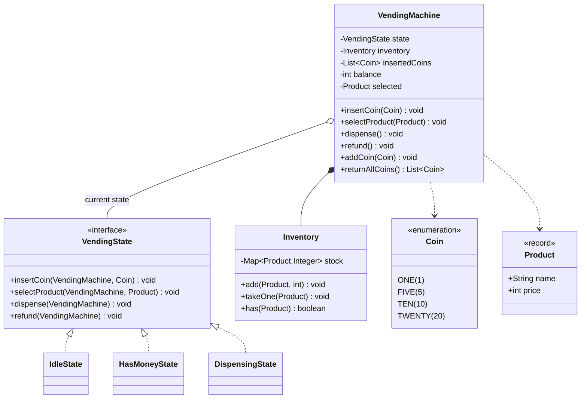

# 🥤 Design a Vending Machine — LLD Solution | State Pattern Machine Coding Guide (Java)

> **Related reading:** [State Pattern — Behavioral Patterns](../design-patterns/behavioral/README.md) · [Error Handling](../best-practices/error-handling.md) · [LLD Cheatsheet](../cheatsheet.md)

---

## 📋 Table of Contents

- [Problem Statement](#-problem-statement)
- [Step 1: Requirements & Clarifying Questions](#-step-1-requirements--clarifying-questions)
- [Step 2: Core Entities](#-step-2-core-entities)
- [Step 3: Design Approach](#-step-3-design-approach)
- [Step 4: Class Diagram](#-step-4-class-diagram)
- [Step 5: Complete Java Implementation](#-step-5-complete-java-implementation)
- [Step 6: Edge Cases & Common Pitfalls](#-step-6-edge-cases--common-pitfalls)
- [Step 7: Follow-up Questions](#-step-7-follow-up-questions)
- [Interview Takeaways](#-interview-takeaways)

---

## 🎯 Problem Statement

Design a **vending machine** that supports:

- Inserting coins and displaying the running balance
- Selecting a product and dispensing it with change
- Refunding inserted money
- Rejecting actions that are illegal in the machine's current state (dispensing with nothing selected, selecting without money)
- Handling sold-out products without losing the customer's money

The canonical **State pattern** problem — asked at Flipkart, Paytm, and countless service companies. The score comes from *state transitions that make illegal states unrepresentable*.

---

## 📋 Step 1: Requirements & Clarifying Questions

| # | Clarifying Question | Typical Answer |
|---|--------------------|----------------|
| 1 | Which states does the machine have? | Idle, HasMoney, Dispensing (add OutOfService as follow-up) |
| 2 | Coin denominations? | Fixed set: 1, 5, 10, 20 |
| 3 | What if the machine can't make exact change? | Reject the sale if change is impossible |
| 4 | What happens if dispensing fails (sold out race)? | Money must be refunded — never eaten |
| 5 | Partial money accepted? | Yes — machine accumulates until the price is covered |
| 6 | Admin/refill mode? | Follow-up — design the hook, don't build it |

**Out of scope:** payment cards/UPI, telemetry, physical sensors.

---

## 🧱 Step 2: Core Entities

| Noun | Class | Key Methods |
|------|-------|-------------|
| Coin | `Coin` (enum) | `getValue()` |
| Product | `Product` (record) | name, price |
| Stock | `Inventory` | `add()`, `takeOne()`, `has()` |
| Machine state | `VendingState` (interface) | `insertCoin()`, `selectProduct()`, `dispense()`, `refund()` |
| Machine | `VendingMachine` | delegates everything to current state |
| Money slot | coins list + balance inside machine | `addCoin()`, `returnAllCoins()` |

---

## 🧩 Step 3: Design Approach

| Decision | Pattern / Principle | Why |
|----------|--------------------|-----|
| One class per state | **State pattern** | Transitions are explicit objects, not `if (state == ...)` spaghetti |
| Illegal actions throw by default | Encapsulation of invariants | Impossible to dispense in `Idle` — the compiler forces every state to choose |
| `Inventory` separate from machine | **SRP** | Stock logic testable without state machine |
| Refund on dispense failure | Compensation | Money is never lost on an error path |
| Greedy change maker | Simple, explained | Denominations 1/5/10/20 are canonical → greedy is exact |

---

## 📊 Step 4: Class Diagram



---

## 💻 Step 5: Complete Java Implementation

```java
import java.util.*;

/* ================= Coins & Products ================= */

enum Coin {
    ONE(1), FIVE(5), TEN(10), TWENTY(20);

    private final int value;
    Coin(int value) { this.value = value; }
    int getValue() { return value; }
}

record Product(String name, int price) {
    Product {
        if (price <= 0) throw new IllegalArgumentException("Price must be positive");
    }
}

/* ================= Inventory ================= */

class Inventory {
    private final Map<Product, Integer> stock = new LinkedHashMap<>();

    void add(Product product, int quantity) {
        if (quantity <= 0) throw new IllegalArgumentException("Quantity must be positive");
        stock.merge(product, quantity, Integer::sum);
    }

    int count(Product product) { return stock.getOrDefault(product, 0); }
    boolean has(Product product) { return count(product) > 0; }

    void takeOne(Product product) {
        int current = stock.getOrDefault(product, 0);
        if (current == 0) throw new IllegalStateException("SOLD OUT: " + product.name());
        stock.put(product, current - 1);
    }
}

/* ================= States ================= */

/**
 * Every method defaults to throwing: a state must explicitly opt in to the
 * actions it allows. Illegal transitions are impossible to forget.
 */
interface VendingState {
    default void insertCoin(VendingMachine m, Coin coin) {
        throw new IllegalStateException("Cannot insert coins in state " + m.getStateName());
    }
    default void selectProduct(VendingMachine m, Product product) {
        throw new IllegalStateException("Cannot select a product in state " + m.getStateName());
    }
    default void dispense(VendingMachine m) {
        throw new IllegalStateException("Nothing to dispense in state " + m.getStateName());
    }
    default void refund(VendingMachine m) {
        throw new IllegalStateException("Nothing to refund in state " + m.getStateName());
    }
}

class IdleState implements VendingState {
    @Override
    public void insertCoin(VendingMachine m, Coin coin) {
        m.addCoin(coin);
        m.setState(new HasMoneyState());
    }

    @Override
    public void selectProduct(VendingMachine m, Product product) {
        System.out.println("  ✋ Insert money first (screen shows price " + product.price() + ")");
    }
}

class HasMoneyState implements VendingState {
    @Override
    public void insertCoin(VendingMachine m, Coin coin) {
        m.addCoin(coin); // stay in HasMoney, balance grows
    }

    @Override
    public void selectProduct(VendingMachine m, Product product) {
        if (!m.getInventory().has(product)) {
            System.out.println("  ✋ " + product.name() + " is sold out — pick another or refund");
            return;
        }
        if (m.getBalance() < product.price()) {
            System.out.println("  ✋ Insert " + (product.price() - m.getBalance())
                    + " more for " + product.name() + " (inserted: " + m.getBalance() + ")");
            return;
        }
        m.select(product);
        m.setState(new DispensingState());
    }

    @Override
    public void refund(VendingMachine m) {
        System.out.println("  🔙 Refunded coins: " + m.returnAllCoins());
        m.setState(new IdleState());
    }
}

class DispensingState implements VendingState {
    @Override
    public void dispense(VendingMachine m) {
        m.dispenseSelected();
    }
}

/* ================= Machine (context) ================= */

class VendingMachine {
    private VendingState state = new IdleState();
    private final Inventory inventory = new Inventory();
    private final List<Coin> insertedCoins = new ArrayList<>();
    private int balance;
    private Product selected;

    void setState(VendingState state) { this.state = state; }
    VendingState getState() { return state; }
    String getStateName() { return state.getClass().getSimpleName(); }
    Inventory getInventory() { return inventory; }
    int getBalance() { return balance; }

    void addCoin(Coin coin) {
        insertedCoins.add(coin);
        balance += coin.getValue();
        System.out.println("  🪙 inserted " + coin + " → balance " + balance);
    }

    void select(Product product) { this.selected = product; }

    List<Coin> returnAllCoins() {
        List<Coin> refund = new ArrayList<>(insertedCoins);
        insertedCoins.clear();
        balance = 0;
        return refund;
    }

    void dispenseSelected() {
        Product product = selected;
        try {
            inventory.takeOne(product);              // may throw if raced to zero
        } catch (IllegalStateException e) {
            System.out.println("  🔙 " + e.getMessage() + " — refunding " + returnAllCoins());
            selected = null;
            setState(new IdleState());
            return;
        }
        int changeDue = balance - product.price();
        returnAllCoins();                            // money slot consumed
        System.out.println("  🥤 dispensing " + product.name());
        if (changeDue > 0) {
            System.out.println("  🪙 change: " + makeChange(changeDue));
        }
        selected = null;
        setState(new IdleState());
    }

    /** Greedy works exactly because denominations are canonical (1, 5, 10, 20). */
    private List<Coin> makeChange(int amount) {
        List<Coin> change = new ArrayList<>();
        Coin[] denominations = {Coin.TWENTY, Coin.TEN, Coin.FIVE, Coin.ONE};
        for (Coin coin : denominations) {
            while (amount >= coin.getValue()) {
                change.add(coin);
                amount -= coin.getValue();
            }
        }
        if (amount != 0) throw new IllegalStateException("Cannot make exact change");
        return change;
    }

    /* ---- public API: everything delegates to the current state ---- */

    public void insertCoin(Coin coin) { state.insertCoin(this, coin); }
    public void selectProduct(Product product) { state.selectProduct(this, product); }
    public void dispense() { state.dispense(this); }
    public void refund() { state.refund(this); }
}

/* ================= Demo ================= */

public class Main {
    public static void main(String[] args) {
        VendingMachine machine = new VendingMachine();
        Product coke = new Product("Coke", 25);
        Product chips = new Product("Chips", 20);
        Product candy = new Product("Candy", 15);
        machine.getInventory().add(coke, 1);
        machine.getInventory().add(chips, 5);
        machine.getInventory().add(candy, 5);

        System.out.println("── 1. Guard rails ──");
        machine.selectProduct(coke);   // Idle: friendly refusal
        try {
            machine.dispense();        // Idle: dispense is illegal → throws
        } catch (IllegalStateException e) {
            System.out.println("  blocked: " + e.getMessage());
        }

        System.out.println("\n── 2. Happy path: exact money ──");
        machine.insertCoin(Coin.TEN);
        machine.insertCoin(Coin.TEN);
        machine.insertCoin(Coin.FIVE); // 25
        machine.selectProduct(coke);
        machine.dispense();            // coke stock 1 → 0

        System.out.println("\n── 3. Partial money, then top-up ──");
        machine.insertCoin(Coin.TEN);
        machine.selectProduct(chips);  // needs 20 → asks for 10 more
        machine.insertCoin(Coin.TEN);
        machine.selectProduct(chips);
        machine.dispense();

        System.out.println("\n── 4. Change making ──");
        machine.insertCoin(Coin.TWENTY);
        machine.insertCoin(Coin.TWENTY); // 40 for a 15 product
        machine.selectProduct(candy);
        machine.dispense();              // change 25 = 20 + 5

        System.out.println("\n── 5. Refund path ──");
        machine.insertCoin(Coin.TEN);
        machine.refund();

        System.out.println("\n── 6. Sold out, money returned ──");
        machine.insertCoin(Coin.TWENTY);
        machine.insertCoin(Coin.FIVE); // 25
        machine.selectProduct(coke);   // stock 0 → refusal, stays HasMoney
        machine.refund();              // get the money back
    }
}
```

---

## ⚠️ Step 6: Edge Cases & Common Pitfalls

| Pitfall | Why it matters | Fix shown in code |
|---------|---------------|-------------------|
| State checks via `if (state == IDLE)` scattered everywhere | Every new action needs edits in N places | State pattern: behavior lives *in* the state classes |
| Dispense failure eats the money | Real-world lawsuit, interview auto-fail | `takeOne` failure → refund + back to Idle |
| Selecting a sold-out product keeps money locked | Customer stuck | Refusal while in `HasMoney`; refund always available |
| Change maker that can't fail | Machine can owe change it doesn't have | `makeChange` throws if exact change impossible |
| No guard for `dispense()` when nothing selected | NPE or phantom sale | Default-throw in `VendingState` |
| Balance kept inside states | Transitions lose money | Money lives in the machine; states only orchestrate |
| Product equality by reference | Two `new Product("Coke", 25)` look different | `record` gives value-based equals/hashCode |

---

## ❓ Step 7: Follow-up Questions

**1. OutOfService / admin mode?** Add a fourth state; `AdminState` allows `inventory.add()` and coin-box emptying. Because transitions are classes, adding a state touches nothing else — OCP.

**2. Change with limited coin inventory?** Greedy breaks. Keep a coin inventory and solve with DP (unbounded knapsack) or backtrack; if impossible, either reject sale or return best-effort + credit remainder.

**3. Refund on idle timeout?** Start a timer on entering `HasMoneyState`; on timeout call `refund()` and return to Idle. Mention `ScheduledExecutorService` — but note hardware machines do this in firmware.

**4. Multiple users?** A physical machine is inherently single-user (one coin slot) — model a per-session lock; the queue concept generalizes to online vending APIs.

**5. Card/UPI payments?** Introduce a `PaymentProvider` interface like BookMyShow's — the state machine doesn't change, only `HasMoneyState` becomes `HasPaymentState` with an async completion callback.

**6. How would you test it?** Every state pair is enumerable — a table-driven test of (start state, action, expected state, expected money) covers the whole machine in ~15 cases.

---

## 🎯 Interview Takeaways

- Say **"default-throw interface"** — making illegal transitions unrepresentable is the cleanest State pattern pitch.
- **Money safety** (refund on every failure path) is what separates a toy from a design.
- Know *why* greedy change works here (canonical denominations) and when it doesn't.
- `record` for `Product` shows modern Java fluency for free.

---

← [Back to all solutions](README.md) · [Next: Tic-Tac-Toe →](tic-tac-toe.md)
